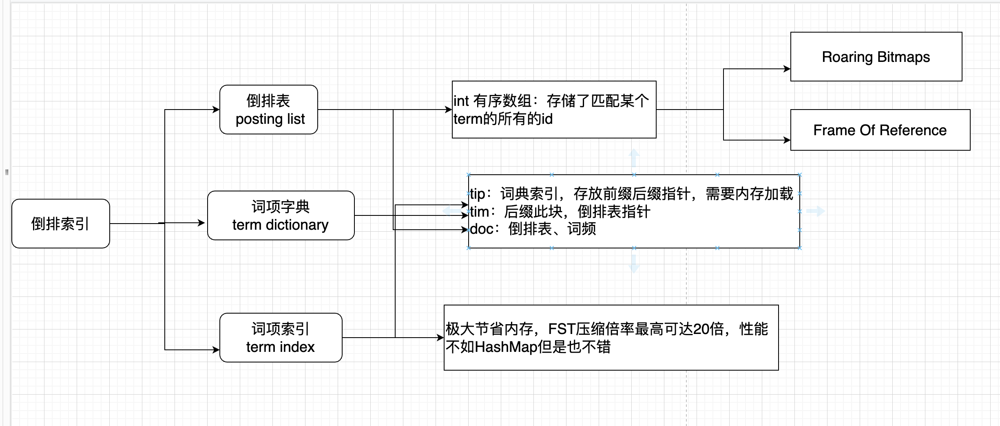
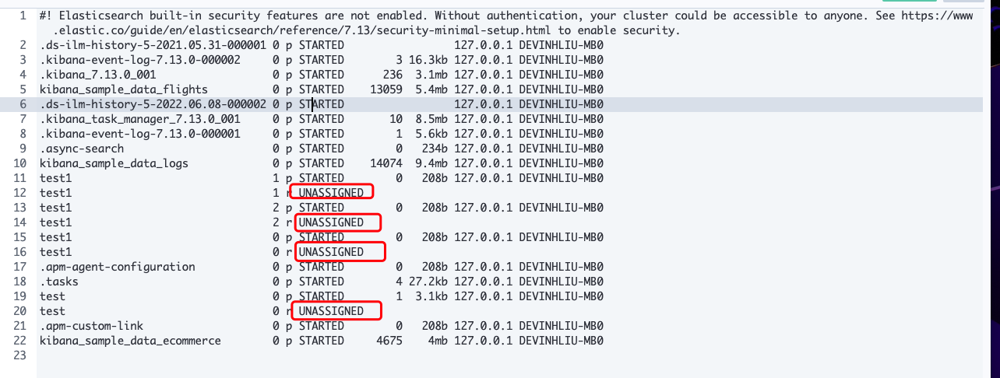

## 核心知识篇

## 简介

#### ElasticStack四大金刚

1. elasticsearch 基于Json的分布式搜索和分析引擎

2. Logstash 动态数据收集管道，生态丰富

3. Kibana 提供数据的可视化页面

4. Beats 轻量级的数据采集器


## 环境安装

兼容性查看：https://www.elastic.co/cn/support/matrix#matrix_os

##### 安装ES

https://www.elastic.co/cn/downloads/past-releases#enterprise-search

#### 集群健康度检查

1. **Green**：所有Primary和Replica均为activate，集群健康
2. **Yellow**：至少有一个Replica不可用，但是所有Primary均为activate，数据仍然可以保证完整性
3. **Red**：至少有一个Primary为不可用状态，数据不完整，集群不可用

#### 查看集群状态

```json
curl -XGET "http://127.0.0.1:9200/_cluster/health"
# 在索引级别上显示异常情况
curl -XGET "http://127.0.0.1:9200/_cluster/health?level=indices"
curl -XGET "http://127.0.0.1:9200/_cluster/allocation/explain"
{
    "cluster_name": "elasticsearch",  # 集群名称
    "status": "yellow",	# 集群状态
    "timed_out": false,	# 是否超时
    "number_of_nodes": 1, # 节点数量
    "number_of_data_nodes": 1,	# 数据节点数量
    "active_primary_shards": 19,	# 活跃的主分片数量
    "active_shards": 19,		# 活跃的分片数量
    "relocating_shards": 0,	# 将要迁往到其他节点的分片
    "initializing_shards": 0, # 正在初始化的分片数量
    "unassigned_shards": 2,	# 未分配的分片数量
    "delayed_unassigned_shards": 0,	# 延时待分配到具体节点上的分片数
    "number_of_pending_tasks": 0,	#主节点创建索引并分配shards等任务数，正常为0
    "number_of_in_flight_fetch": 0, # 在分片中执行的集群更新的数量，比如修改某个字段值，正同步到其他副分片的，未分配分片不统计在内
    "task_max_waiting_in_queue_millis": 0, # 集群任务在队列中等待的最长时长
    "active_shards_percent_as_number": 90.47619047619048  # 活跃分片占比
}
 
```

## 核心概念

#### 倒排索引

> 包含term index，term dectionary，posting List。
>
> 分别表示：词项索引、词项字典、倒排表

| term index | term dictionary | posting list | 标记匹配 |
| ---------- | --------------- | ------------ | -------- |
|            | apple           | 1,2,3,...10w |          |
|            | orange          | 3.4.5        | True     |
|            | banana          | 8            | True     |



#### cluster：集群中的基本元素是节点，节点又分为不同的角色，同一个机器中尽量不部署多个节点。

>master：候选节点，维护集群元数据，节点状态，创建索引，索引主副分片，选主之后其他节点将信息发送到主节点，主节点再分发到其他节点。
>data：数据节点
>data_content：数据内容节点
>data_hot：热节点，可写可更新节点
>data_warm：warm节点，一般用于不再更新的节点，只查询
>data_code：冷节点，只读索引，存放历史数据
>Ingest：预处理节点，作用类似于Logstash中的Filter
>ml(machine learning)：机器学习节点
>remote_cluster_client：候选客户端节点
>transform：转换节点
>voting_only：仅投票节点

#### index：索引

> 类似数据库的概念，以分片为单位，可以设置副本及分片个数
>

#### type：类型

>每一个index中分为不同的type，使用type可以在同一个index里存储多种类型的数据，可以减少index的数量，好处是搜索同一个index 的多个type时不会产生额外的开销，因为遍历的分片数是一样的。
>
>缺点是不同type名称相同的字段要完全保持一致如字段类型等；在某个type有的字段，在其他没有该字段的type也会消耗资源（posting list，doc value）。搜索评分是在index级别计算，多个type会相互影响。
>
>在7.x版本中开始弱化，使用_doc进行统一使用，在8.x版本中彻底删除

#### shard：分片

一个索引中包含一个或者多个分片，在7.0之前默认创建5个分片，每个主分片一个副本；7.0之后默认创建1个主分片。副本可以在索引创建之后修改数量，但是主分片的数量一旦确定之后不能修改，只能删除之后重新创建。主分片挂掉之后副分片升级为主分片。原分片加入之后从当前主分片中同步数据。主分片和副分片不会在同一个节点中。

每个分片都是一个**Lucene**实例，有完整的创建索引和处理请求能力，搜索时所有的分片都会被扫描，最终被ES合并所有的搜索结果。

**ES会在nodes上做分片均衡**：所有的分片尽量均匀的分布在所有的节点上rebalance，分片平衡策略。

一个doc不会存在于多个主分片中，但是当每个主分片的副本数量不唯一时，可以同时存在于多个副本中

每个主分片和副分片不能同时存在于同一个节点中，所以如果设置副本>0时，最少有两个节点，否则分片一直处于无法分配状态，如下图：



#### doc

>文档：es中的数据都是以文档的形式存储，是数据存储的基本单元，每个doc都会有`_id`字段，可以在存储时指定`_id`，或者es会自动生成，es默认根据doc做`routing`，

