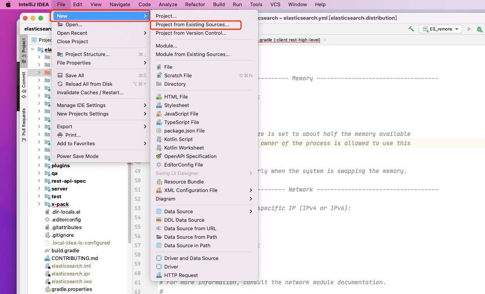
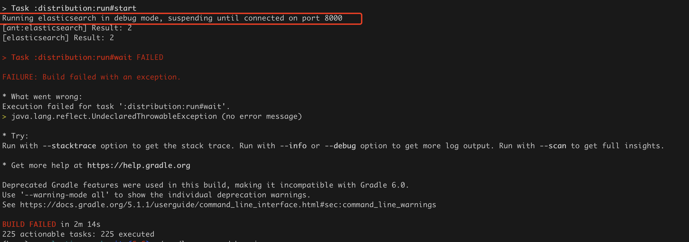
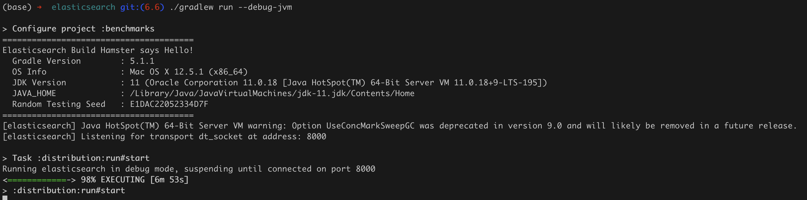
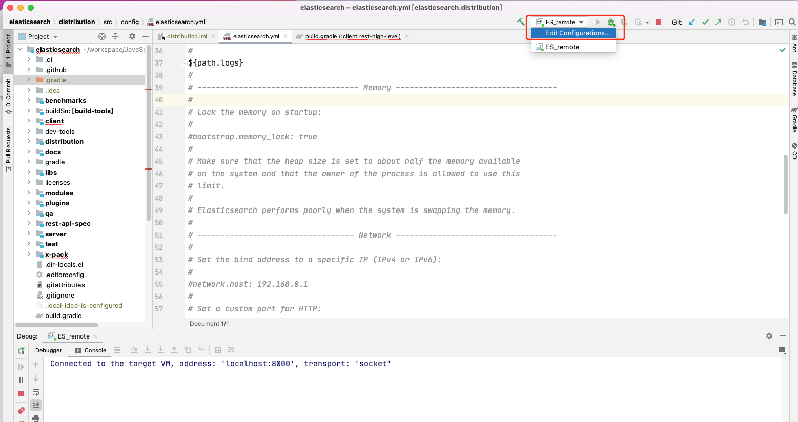
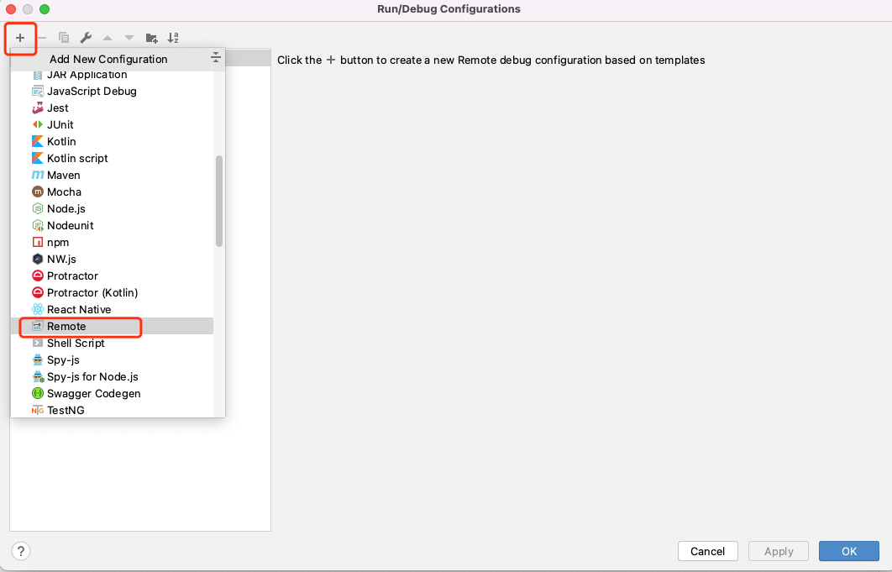
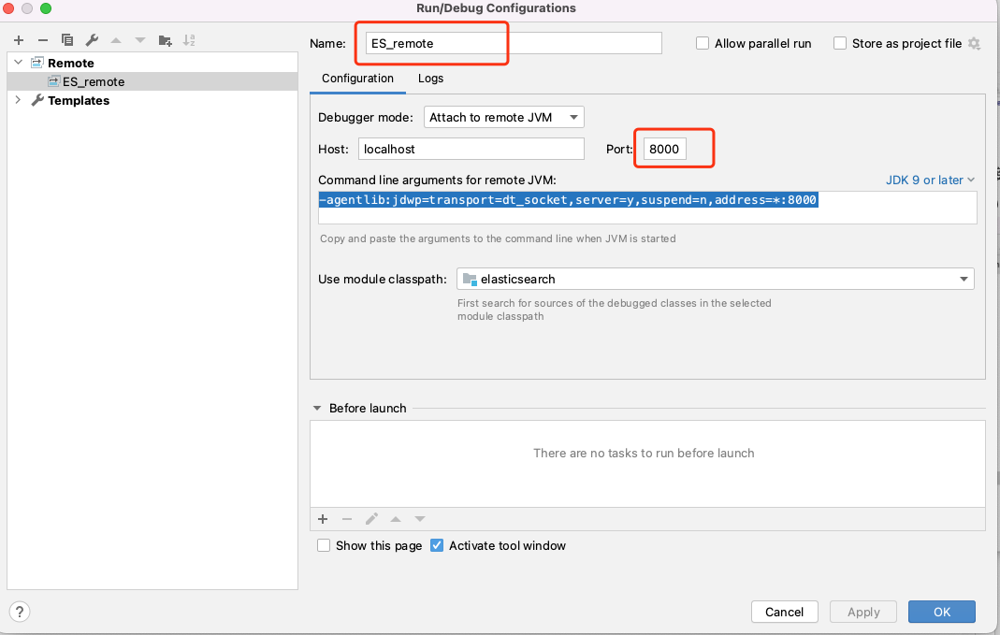
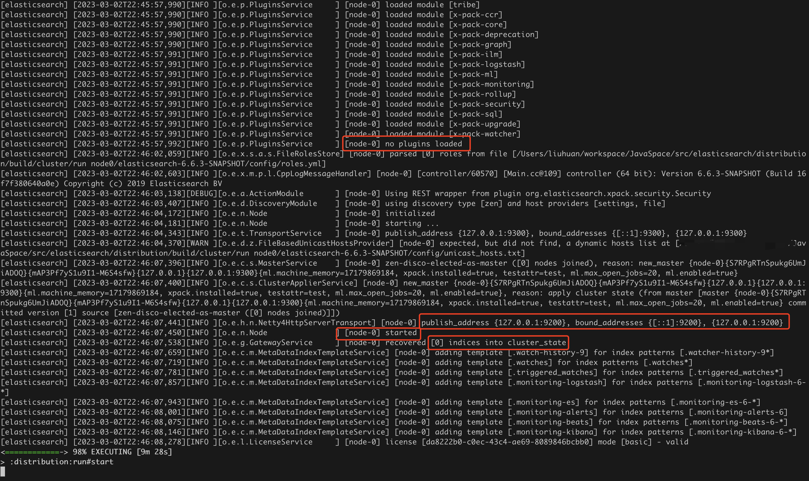
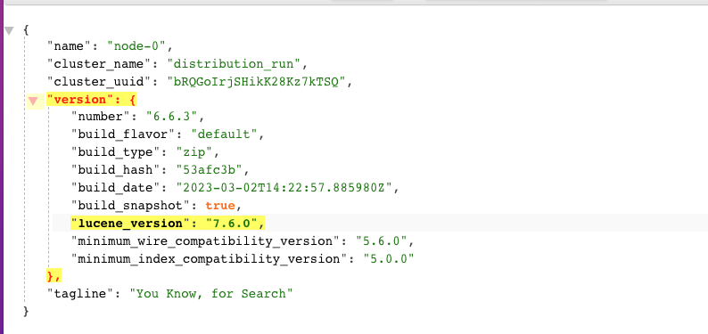

## mac环境运行linux

参考链接：https://www.elastic.co/cn/blog/how-to-debug-elasticsearch-source-code-in-intellij-idea

1. #### 首先clone ElasticSearch源码到本地

   ```
   git clone https://github.com/elastic/elasticsearch.git
   
   cd elasticsearch 
   git checkout --track origin/6.6
   ```

2. #### 安装[IntelliJ IDEA](https://www.jetbrains.com/idea/) 软件

3. #### 安装Java并配置java路径

   1. ##### **elasticsearch6.6 可以基于java11构建，但是也需要java9的部分功能，所以需要安装java9和java11.**

   2. **java9**:https://www.oracle.com/java/technologies/javase/javase9-archive-downloads.html

   3. **java11**:https://www.oracle.com/java/technologies/downloads/#java11

   ```shell
   # 打开文件
   vim ～/.bash_profile
   
   # 加入java安装路径
   JAVA_HOME=/Library/Java/JavaVirtualMachines/jdk-11.0.2.jdk/Contents/Home 
   export JAVA_HOME
   
   JAVA9_HOME=/Library/Java/JavaVirtualMachines/jdk-9.0.4.jdk/Contents/Home 
   export JAVA9_HOME
   
   退出文件然后输入：
   source ～/.bash_profile
   ```

4. #### 使用IntelliJ IDEA 打开elasticsearch源码

   

5. #### 初始化gradlew，详细步骤可以参考es代码中的CONTRIBUTING.md文件

   ```shell
   #在终端中执行
   
   ./gradlew idea
   
   ./gradlew run --debug-jvm
   ```

6. #### 然后等待片刻，如果遇到这个报错，说明**8000**端口被占用，需要开放端口。

   

7. #### 下图表示运行成功	

8. 这时在浏览器上访问http://localhost:9200/并不能访问，需要在idea上配置debug模式

   

   ##### 新建一个remote连接：

   

   ##### 修改名称和端口

9. #### 看到如下日志代表成功

   

10. #### 在浏览器上输入http://localhost:9200/即可访问

11. #### 源码文件说明

    >docs 项目文件
    >
    >distribution 分发
    >
    >libs 用于构建项目其他部分的库。这些是注定的
    >
    >modules 模块
    >
    >plugins 插件
    >
    >qa 	质量保证
    >
    >server	服务器组件，包含所有模块和插件
    >
    >test	测试框架和测试工具
    >
    >x-pack	ES其余部分集成的商业许可码
    >
    >Gradle Build 	使用gradle构建和打包
    >
    >Configurations	Gradle依赖的配置	