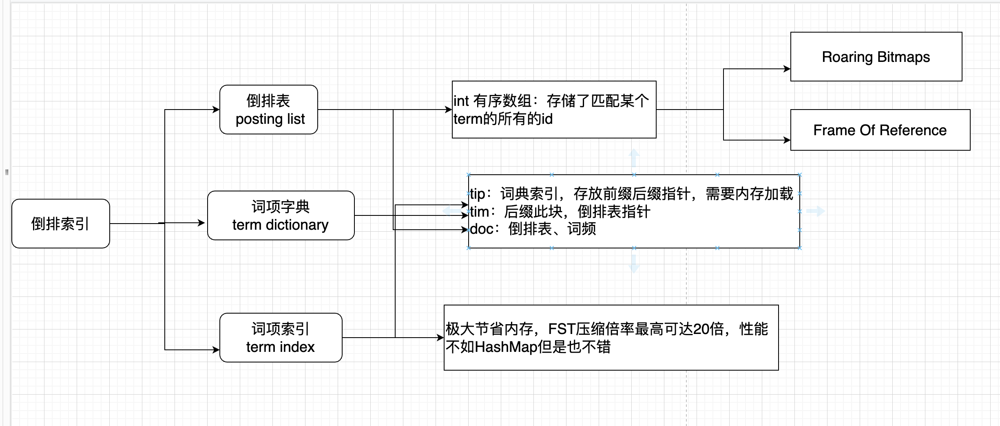
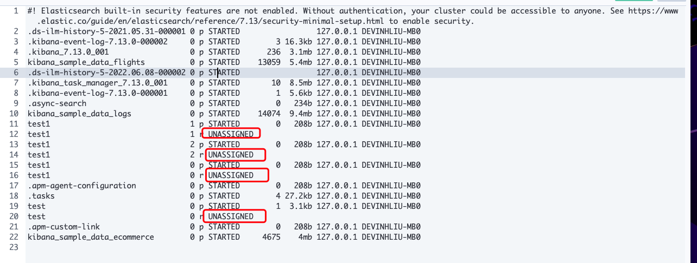

## 核心知识篇

## 简介

#### ElasticStack四大金刚

1. elasticsearch 基于Json的分布式搜索和分析引擎

2. Logstash 动态数据收集管道，生态丰富

3. Kibana 提供数据的可视化页面

4. Beats 轻量级的数据采集器

   

## 环境安装

兼容性查看：https://www.elastic.co/cn/support/matrix#matrix_os

##### 安装ES

https://www.elastic.co/cn/downloads/past-releases#enterprise-search

##### 安装Kibana

##### 安装HEAD

##### 集群健康度检查

1. **Green**：所有Primary和Replica均为activate，集群健康
2. **Yellow**：至少有一个Replica不可用，但是所有Primary均为activate，数据仍然可以保证完整性
3. **Red**：至少有一个Primary为不可用状态，数据不完整，集群不可用

>GET _cat/health
>GET _cluster/health
>
>如果集群状态不为green，则可排查集群不健康原因：
>
>GET /_cluster/allocation/explain

## 核心概念

#### 倒排索引

> 包含term index,term dectionary, posting List。
>
> 分别表示：词项索引、词项字典、倒排表

| term index | term dictionary | posting list | 标记匹配 |
| ---------- | --------------- | ------------ | -------- |
|            | apple           | 1,2,3,...10w |          |
|            | orange          | 3.4.5        | True     |
|            | banana          | 8            | True     |

#### Lucenne简介

#### Elasticsearch是什么

#### cluster：集群中的基本元素是节点，节点又分为不同的角色，同一个机器中尽量不部署多个节点。

>master：候选节点
>data：数据节点
>data_content：数据内容节点
>data_hot：热节点，可写可更新节点
>data_warm：warm节点，一般用于不再更新的节点，只查询
>data_code：冷节点，只读索引，存放历史数据
>Ingest：预处理节点，作用类似于Logstash中的Filter
>ml(machine learning)：机器学习节点
>remote_cluster_client：候选客户端节点
>transform：转换节点
>voting_only：仅投票节点

#### index：索引

> 类似数据库中数据库的概念
>
> 每一个index中分为不同的type，类似于数据表，在7.x版本中开始弱化，使用_doc进行统一使用，在8.x版本中彻底删除

#### shard：分片

> 一个索引中包含一个或者多个分片，在7.0之前默认创建5个分片，每个主分片一个副本；7.0之后默认创建1个主分片。副本可以在索引创建之后修改数量，但是主分片的数量一旦确定之后不能修改，只能删除之后重新创建。主分片挂掉之后副分片升级为主分片。原分片加入之后从当前主分片中同步数据。主分片和副分片不会在同一个节点中。
>
> 每个分片都是一个Lucene实例，有完整的创建索引和处理请求能力
>
> ES会在nodes上做分片均衡：所有的分片尽量均匀的分布在所有的节点上rebalance，分片平衡策略。
>
> 一个doc不会存在于多个主分片中，但是当每个主分片的副本数量不唯一时，可以同时存在于多个副本中
>
> 每个主分片和副分片不能同时存在于同一个节点中，所以如果设置副本>0时，最少有两个节点，否则节点一直处于无法分配状态。

#### doc

>文档：es中的数据都是以文档的形式存储，是数据存储的基本单元。

## mapping

1. ##### 概念

   1. 类似数据库中的表结构，包含一些字段的基本属性，如名称，类型等

2. ##### 查看mapping

   1.  `GET index/_mapping`

3. ##### dynamic mapping：字段默认类型

   - 整数——long
   - 浮点数——float
   - true|| false —— boolean
   - 日期——>date
   - 数组——取决于数组的第一个有效值
   - 对象
   - 字符串 text

4. ##### expllcit mapping

5. ##### mapping数据类型

6. ##### mapping映射参数

7. ##### ES数据类型:

   1. **常见数据类型**
      1. **数字类型**`long` `integer` `short` `byte` `double` `float` `half_float` `caled_float` `nsigned_log`	`text` `keyword`
      2. **keywords**：
         1. **keyword**：适用于索引结构化的字段，可以用于过滤、排序、聚合。keyword类型的字段只能通过精确值(exact value)搜索。ID应该用keyword
         2. constant_keyword：始终包含相同值的关键字字段
         3. wildcard：可针对类似grep的通配符查询优化日支行和类似的关键字值。
         4. 关键字字段通常用于排序、汇总和term查询。
      3. **Dates**
      4. **alias**：为现有字段定义别名
      5. binary（二进制）
      6. range
      7. text
   2. 对象数据类型
      1. **object**：用于单个JSON对象
      2. nested：用于json对象数组
      3. flattened：允许将整个JSON对象索引为单个字段
   3. 结构化类型
      1. **geo-point**：经纬度
      2. geo-shape：用于多边形等复杂形状
   4. 特殊类型

## 搜索

QueryString

Query DSL

Bool query

分页和排序

