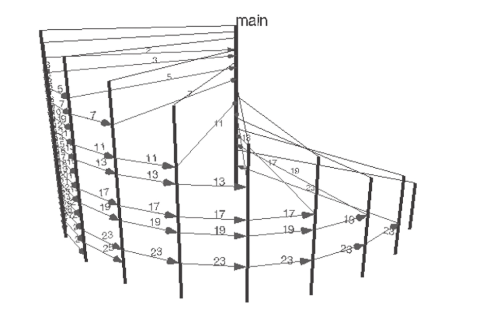
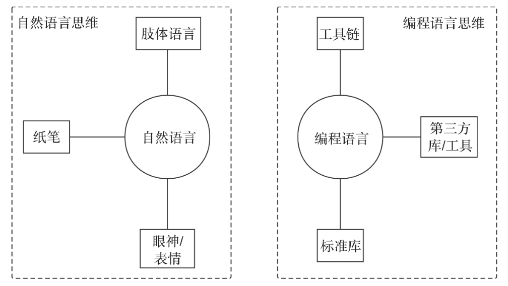

# 第4条：使用Go语言原生编程思维来写Go代码

Go语言上手容易，在转Go的初期大家很快就掌握了Go的语法。但在编写一些Go代码之后，很多人感觉自己写的Go代码很别扭，并且总是尝试在Go语言中寻找自己熟悉的上一门语言中的语法元素。自己的Go代码风格似乎与Go标准库、主流Go开源项目的代码在思考角度和使用方式上存在不小差异，并且每每看到Go核心开发团队的代码时总有一种醍醐灌顶的感觉。出现这种情况的主要原因是大脑中上一门编程语言的思维方式在“作祟”。那么思维与语言之间究竟有什么联系呢？

## 4.1语言与思维 —— 来自大师的观点

在人类自然语言学界有一个很著名的假说——“萨丕尔—沃夫假说”，这个假说的内容是这样的：“语言影响或决定人类的思维方式”。

这里的语言指人的不同语种，如中文与英文，语言不通，可能思维方式也不同。

在编程语言界，有位大师级人物也有着与“萨丕尔-沃夫假说”异曲同工的观点和认知，他就是首届图灵奖得主、著名计算机科学家艾伦·佩利（Alan J. Perlis），他从另外一个角度提出：“不能影响到你的编程思维方式的编程语言不值得学习和使用。”

（个人观点：语言决定人的思维方式，不如说是语言是对某种思维方式的总结和提炼，先有了思维方式才有语言，语言是思维方式的一种呈现）

## 4.2 现实中的投影

Go语言实现”素数筛选“

```go
// chapter1/sources/sieve.go

func Generate(ch chan<- int) {
    for i := 2; ; i++ {
        ch <- i
    }
}

func Filter(in <-chan int, out chan<- int, prime int) {
    for {
        i := <-in
        if i%prime != 0 {
            out <- i
        }
    }
}

func main() {
    ch := make(chan int)
    go Generate(ch)
    for i := 0; i < 10; i++ {
        prime := <-ch
        print(prime, "\n")
        ch1 := make(chan int)
        go Filter(ch, ch1, prime)
        ch = ch1
    }
}
```

Go版本程序实现了一个并发素数筛，它采用的是goroutine的并发组合。程序从素数2开始，依次为每个素数建立一个goroutine，用于作为筛除该素数的倍数。ch指向当前最新输出素数所位于的筛子goroutine的源channel。这段代码来自Rob Pike的一次关于并发的分享。执行过程图：



## 4.3 Go语言原生编程思维

**编程语言影响编程思维，或者说每种编程语言都有属于自己的原生编程思维**

每种语言都有自己的原生编程思维。

如Python语言形成了Pythonic规则来指导Python程序员写出符合Python思维或惯用法的代码。经验告诉我们，但凡属于某个编程语言的高质量范畴的代码，其必定是在这种编程语言原生思维下编写的代码。如果用A语言的思维去编写B语言的代码（比如用OO思维写C代码，用命令式的思维写Haskell代码等），那么写出的代码多半无法被B语言社区所认可，更难以成为高质量代码的典范。

那么Go原生编程思维究竟是什么呢？一门编程语言的编程思维是由语言设计者、语言实现团队、语言社区、语言使用者在长期的演进和实践中形成的一种统一的思维习惯、行为方式、代码惯用法和风格。Go语言从诞生到现在已经有十年多了。经过Go设计哲学熏陶、Go开发团队的引导和教育、Go社区的实践，Go语言渐渐形成属于自己的原生编程思维，或者说形成符合Go语言哲学的Go语言惯用法（idiomatic go）。它们是Go语言的精华。

我们的目标是编写出高质量的Go代码，这就需要我们在学习语言的同时，不断学习Go语言原生的编程思维，时刻用Go编程思维考虑Go代码的设计和实现，这是通往高质量Go代码的必经之路

## 4.3 总结

人类在通过自然语言交流和表达观点的漫长过程中，逐渐形成了固定的语言表述方法。

编程语言也类似，以一门编程语言为中心的，以解决工程问题为目标的编程语言用法、辅助库、工具的固定使用方法称为该门编程语言的原生编程思维。



我们学习和使用一门编程语言，目标是用这门语言的原生思维方式编写高质量代码。学习Go，就要用Go的原生编程思维而不是用其他语言的思维方式写Go代码。掌握Go原生编程思维就是我们通往高质量Go编程的学习方向和必经之路，因此从语言、标准库、工具链、工程实践等方面来全面了解Go原生编程思维，是编写高质量Go代码的基础。