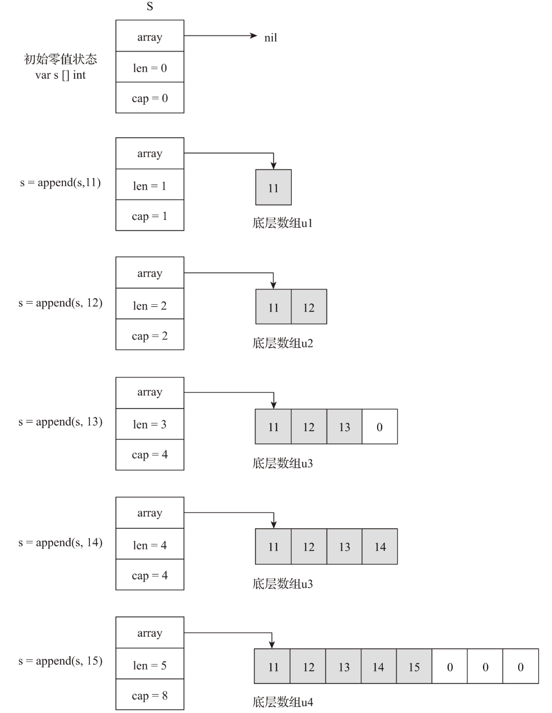

# 第13条 了解切片实现原理并高效使用

每当你花费大量时间使用某种特定工具时，深入了解它并了解如何高效地使用它是很值得的。 — 佚名

slice，中文多译为**切片**，是go语言在数组之上提供的一个重要的抽象数据类型。在go语言中，绝大多数使用数组的场合，切片实现了完美替代。并且和数组相比，切片提供了更灵活、更高效的数据序列访问接口。

```go
// s为数组
var s [3]int
s[2] = 1
fmt.Printf("%T \n", s)
// s1为切片
s1 := s[0:]
s1 = append(s1, 2)
fmt.Printf("%T \n", s1)
```

## 13.1 切片究竟是什么

在go语言中，数组是一个固定长度的、容纳同种类型元素的连续序列，因此Go数组类型具有两个属性：元素类型和数组长度，这两个属性都相同的数组类型是等价的。比如以下变量a、b、c对应的数组类型是3个不同的数组类型：

```go
var a [8]int
var a [8]byte
var a [9]int
```

Go数组是值语义，意味着一个数组变量表示的是整个数组。而在Go语言中，传递数组是纯粹的值拷贝，对于元素类型长度较大或元素个数较多的数组，如果直接以数组类型参数传递到函数中会有不小的性能损耗。这时可以使用数组指针类型定义函数参数，然后传递数组地址，这样可以避免性能损耗，但这是C语言的惯用法，**在Go语言中，更地道的用法是使用切片**。

切片跟数组的关系就像文件描述符跟文件的关系。在Go语言中，数组更多是“退居幕后”，承担的是底层存储空间的角色，而切片则走向“前台”，为底层的存储（数组）打开了一个访问“窗口”。


因此，可以称切片是数组的“描述符”。切片之所以能在函数参数传递时避免较大性能损耗，是因为它是“描述符”的特性，切片描述符是固定大小的，无论底层数组的类型多大。slice的结构体如下：

```go
type slice struct {
	array unsafe.Pointer
	len   int
	cap   int
}
```

每个切片包含三个字段：

- **array**：指向下层数组某元素的指针，该元素也是切片的起始元素。
- **len**：切片的长度，即切片中当前元素的个数
- **cap**：切片的最大容量，cap>=len

运行时，每个切片变量都是一个runtime.slice结构体类型的实例，创建切片的语法：

```go
s := make([]byte, 5)
```


在创建切片时，编译器会自动为切片建立一个底层数组，如果make时候没有指定cap参数，默认cap=len。

(1)可以通过语法u[low:high]创建对已存在数组进行操作的切片，这被称为数组的切片化（**slicing**）：

```go
u := [10]byte{11, 12, 13, 14, 15, 16, 17, 18, 19, 20}
s := u[3:7]
```

切片s的内部示例图如下：


也可以为一个数组创建多个切片：


(2)也可以通过语法s[low:high]基于已有切片创建新的切片，这被称为切片的**reslicing**，新创建的切片与原切片也同样共享底层数组，并且通过新切片对数组的修改也会反映到原切片上。


当切片作为函数参数传递给函数时，实际传递的是切片的内部表示，因此无论切片描述的底层数组多大，切片作为参数传递带来的性能损耗都是很小且固定的，小到可以忽略不计，这就是函数在参数中多使用切片而不用数组指针的原因之一。

另一个原因就是切片可以提供比指针更为强大的功能，比如下标访问，边界移除校验、动态扩容等。

## 13.2 切片的高级特性：动态扩容

Go语言中的切片还支持一个重要的高级特性：**动态扩容**。切片同时也满足零值可用原则，零值切片也可以通过append预定义函数进行元素赋值操作。

```go
var s []byte
s = append(s, 1)
fmt.Println(s)
```

由于初始值为零值，s这个描述符并没有绑定对应的底层数组。而经过append操作后，s才绑定底层数组。s的动态扩容规则如下：



append会根据切片的需要，在当前底层数组容量无法满足的情况下，动态分配新的数组。新数组建立后，append会把旧数组中的数据复制到新数组中，之后新数组便成为切片的底层数组，旧数组后续会被垃圾回收掉。这样的append操作有时会给Gopher带来一些困惑，比如通过语法u[low: high]形式进行数组切片化而创建的切片，一旦切片cap触碰到数组的上界，再对切片进行append操作，切片就会跟原数组解除绑定，此时在操作切片时，不会做用到原数组中。

## 13.3 尽量使用cap参数创建切片

append操作是一件利器，让切片类型部分满足了“零值可用”的理念。但从append原理可以看到如果数组频繁扩容也会产生一些性能问题，一种有效的方法是对切片内容进行预估，并在创建新切片时将预估初的切片容量数据以cap参数形式传递给内置函数make：

```go
s := make([]T, len, cap)
```

## 13.4 总结

切片是go语言提供的重要数据类型，也是日常编码中最常用的类之一。切片是数组的描述符，在大多数场合替代了数组，并减少了数组作为函数参数的使用。

append在切片上的运用让切片类型部分支持了“零值可用”的理念，并且append对切片的动态扩容将Gopher从手工管理底层存储的工作中解放了出来。

在可以预估出元素容量的前提下，使用cap参数创建切片可以提升append的平均操作性能，减少或消除因动态扩容带来的性能损耗。