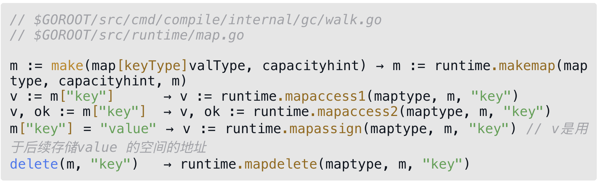
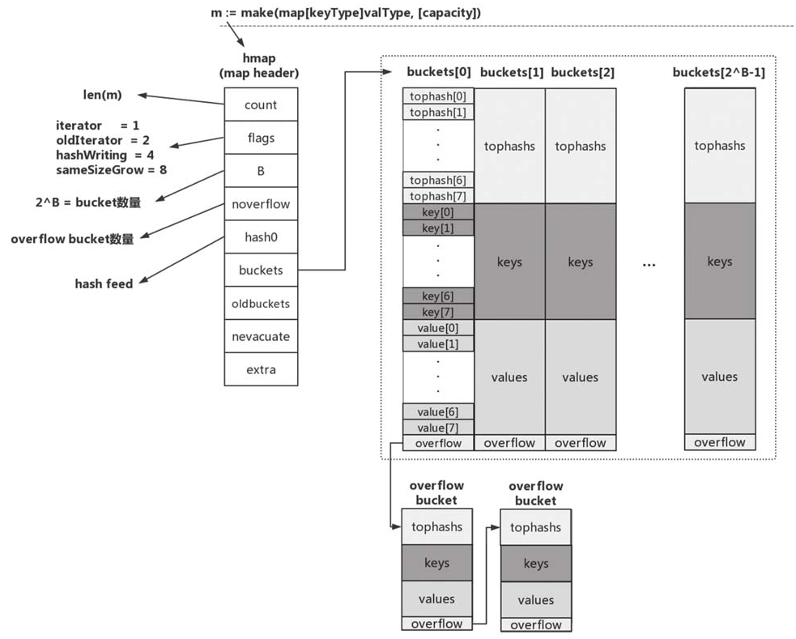
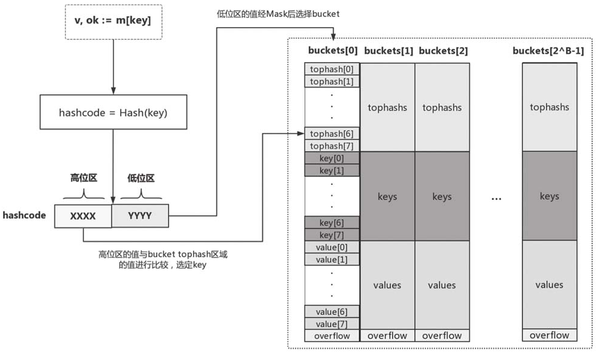
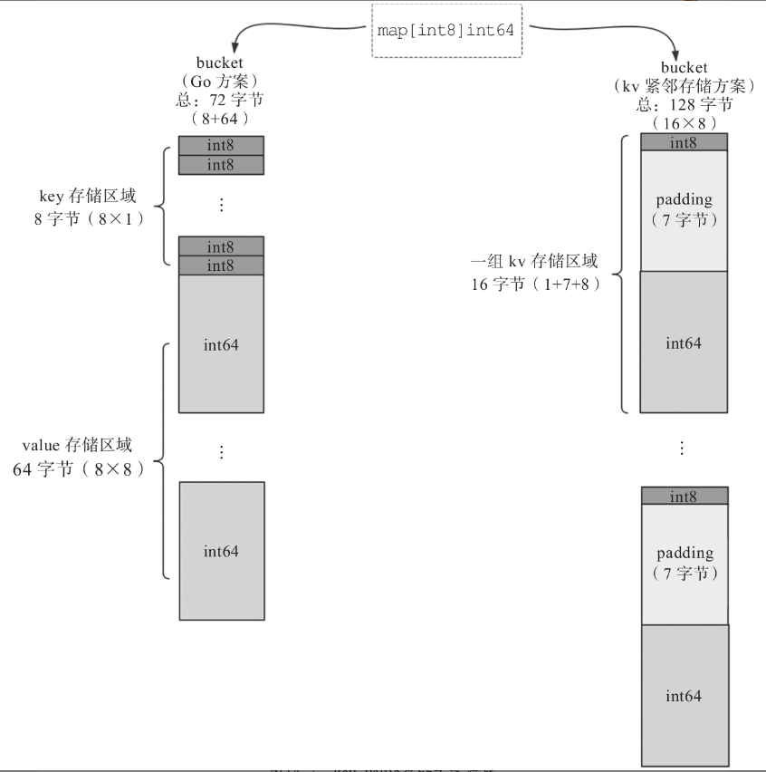
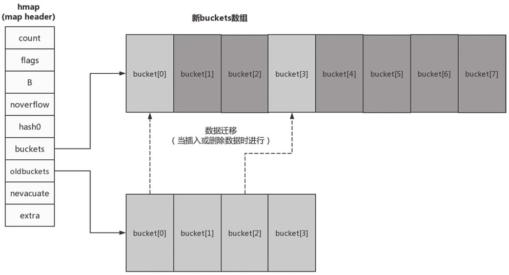

# 第14条 了解map实现原理并高效使用

map类型是和切片、interface一样，是Go语言先进性的重要语法元素。map类型也是Go语言中最常用的数据类型之一。

## 14.1 什么是map

map是Go语言提供的一种抽象数据类型，表示一组无序的健值对（key-value）。

map对value类型没有限制，但是对key类型有严格的要求：**key的类型要严格定义作为"=="和"!="两个操作符的操作数时的行为**，因此函数、map、切片不能作为map的key类型。

并且map不支持"零值可用"，未显式赋值的map类型变量的零值为nil。对处于零值状态的map变量进行操作会导致运行时**panic**：

```go
var m map[string]int
m["key"] = 1 // panic
```

必须对map类型变量进行显式初始化后才能使用。和切片一样，创建map类型变量有两种方式：

1. 使用复合字面值

   ```go
   var status = map[int]string{
   	200: "OK",
   	404: "NOT FOUND"
   }
   ```

2. 使用make这个预声明的内置函数

   ```go
   cookies = make(map[string]string)
   ```

和切片一样，map也是引用类型，将map类型作为函数参数传入不会有很大的性能损耗，并且在函数内部修改变量时，在函数外部也可见。

## 14.2 map的基本操作

1. 插入数据

   对于一个非nil的map类型变量，插入数据时不受限制，只要系统内存够用，就可以一直插入数据：

   ```go
   var m map[string]string
   m = make(map[string]string)
   m["1"] = "1"
   ```

   如果key已经存在map中，插入操作会用新值覆盖旧值：

   ```go
   m := map[string]int{
   		"1": 1,
   		"2": 2,
   		"3": 3,
   	}
   	m["1"] = 2
   ```

2. 获取数据个数

   和切片一样，使用len获取元素个数。

3. 查找和数据读取

   使用"comma ok"惯用法进行查找：

   ```go
   m := map[string]int{
     "1": 1,
     "2": 2,
     "3": 3,
   }
   if v, ok := m["1"]; ok {
     fmt.Println("success", v)
   }
   ```

   如果只用`v := m["k"]`格式读取数据，如果k不在map中时，会返回v的默认零值形式，这时无法区分要`k`在不在`map`中，所以**对`map`取值的最佳实践是使用"comma ok"的形式**。

4. 删除数据

   使用内置函数delete从map中删除数据，即时数据不在map中，也不会引发panic

5. 遍历数据

   可以像遍历切片的方式使用`for...range`语句 遍历map中的数据进行遍历：

   ```go
   m := map[string]int{
     "1": 1,
     "2": 2,
     "3": 3,
   }
   for k, v := range m {
   	fmt.Println(k, v)// 输出结果并不固定
   }
   ```

   go运行时在初始化map迭代器时对起始位置做了随机处理，每次遍历时顺序并不固定。因此**不要依赖遍历map得到的元素次序**。

   如果想得到一个稳定顺序，需要借助切片存储原数据顺序，通过遍历切片的到原map的顺序。

## 14.3 map的内部实现

和切片相比，map类型的内部实现要复杂很多。Go运行时使用一张哈希表来实现抽象的map类型。运行时实现了map操作的所有功能，包括查找、插入、删除、遍历等。在编译阶段，Go编译器会将语法层面的map操作重写成运行时对应的函数调用。



map在运行时层的实现原理如下：

1. 初始状态

   与语法层面map类型变量一一对应的是runtime.hmap类型的实例，hmp时map类型的header，可以理解为map类型的描述符，存储了后续map类型操作所需的所有信息。

   

   map中包含的元素如下：

   1. count：当前map中的元素个数；对map求len时，返回的就是count
   2. flga：当前map所处的状态标志。目前包含4个状态值——iterator、old、terator、hashwriting和sameSizeGrow。
   3. B：B的值是bucket数量的以2为底的对数，即2^B=bucket数量
   4. noverflow：overflow bucket的大约数量
   5. hash0：哈希函数的种子值
   6. buckets：指向bucket数组的指针
   7. oldbuckets：在map扩容阶段指向前一个bucket数组的指针
   8. nevacuate：在map扩容阶段充当扩容进度计数器。所有下标号小于nevacuate的bucket都已完成了数据排空和迁移操作。
   9. extra：可选字段。如果有overflow bucket存在，且key、value都因不包含指针而被内联情况下，该字段存储所有指向overflow bucket的指针，保证overflow bucket是始终可用的。

   真正用来存储健值对数据的是bucket，每个bucket中存储的是hash值低bit位数值相同的元素，默认的元素个数为BUCKETSIZE（值为8）。当某个bucket的8个空槽都已填满且map尚未达到扩容条件时，运行时会建立overflow bucket，并将overflow bucket挂在上面bucket末尾的overflow指针上，两个bucket形成一个链表结构。

   每个bucket由三部分组成：`tophash`区域、`key`存储区域和`value`存储区域

   1. tophash区域：当想map插入一条数据或从map按key查询数据的时候，运行时会使用hash函数对key做hash运算，并获得一个hash值hashcode。运行时将hashcode一分为二地看待，低位区值用于选定bucket，高位区的值用于在某个bucket中确定key的位置。

      

      因此，每个bucket的tophash区域用于快速定位key位置，这样避免了逐个key进行比较，使用空间换时间。

   2. key存储区域

      tophash区域下面是一块连续的内存区域，存储bucket承载的所有key数据。运行时在分配bucket时需要知道key的大小。当在声明一个map类型变量时，如var m map[string]int，Go运行时就会为变量对应的特定map类型生成一个runtime.maptype实例。

      ```go
      // go/src/runtime/type.go
      type maptype struct {
      	typ    _type
      	key    *_type
      	elem   *_type
      	bucket *_type // 表示hash bucket的内部类型
      	// function for hashing keys (ptr to key, seed) -> hash
      	hasher     func(unsafe.Pointer, uintptr) uintptr
      	keysize    uint8  //key的大小
      	elemsize   uint8  // elem的大小
      	bucketsize uint16 // bucket的大小
      	flags      uint32
      }
      ```

   3. value存储区域

      key存储区域下方是另一个连续的内存区域，该区域存储的是key对应的value。Go运行时采用将key和value分开存储而不是采用kv紧邻的方式存储，虽然带来了算法上的复杂性，但减少了内存对齐带来的内存浪费。如map[int8]int64为例：

      

   使用kv紧邻方式存储需要128字节，有效利用率只有72字节。但go的存储方式没有浪费字节空间。

2. map扩容

   在使用过程中，如果对map插入的元素个数超过一定数量后，map需要自动扩容。Go运行时在map中引入了一个LoadFactor（负载因子）。当count>LoadFactor*2^B或voverflow bucket过多时，运行时会对map进行扩容（目前LoadFactor设置为6.5）。

   如果是因为overflow bucket过多导致的“扩容”，实际上运行时会新建一个和现有规模一样的bucket数组，然后在进行assign和delete操作时进行排空和迁移；如果是因为当前数据数量超出LoadFactor指定的水位的情况，那么运行时会建立一个**两倍于现有规模的bucket数组**，但真正的排空和迁移工作也是在进行assign和delete操作时逐步进行的。原bucket数组会挂在hmap的oldbuckets指针下面，直到原buckets数组中所有数据都迁移到新数组，原buckets数组才会被释放。

   

3. map并发

   map实例自身是有状态的，但对状态的读写没有并发保护，因此map实例并不是并发写安全的，不支持并发读写。如果对map实例进行并发读写，程序运行时会发生panic。如果使用并发时可以使用sync.Map。

## 14.4 尽量使用cap参数创建map

如果初值创建map时没有创建足够多可以应付map使用场景的bucket，随着插入map元素数量的增多，map可能会频繁扩容，可能会降低map的访问性能。因此，**最好对map的使用规模作出粗略的估算，并使用cap参数对map实例进行初始化**。使用cap参数的map实例约是不使用cap参数的**2倍**。

```go
var m = make(map[string]int, 20) //使用cap初始化map
```

## 14.5 总结

map为了节省内存，key和value使用了分开存储的方式，有效节省了内存。

map的使用要点：

1. 不要依赖map的元素遍历顺序
2. map不是线程安全的，不支持并发写
3. map中value的地址不可获取
4. 尽量使用cap创建map，以提升map的平均访问性能，减少频繁扩容带来的不必要损耗。