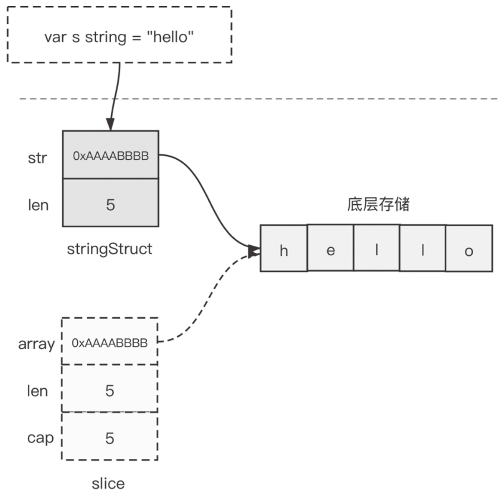

# 第15条 了解string实现原理并高效使用

在c语言中，字符串字面值常量以'\0'结尾的字符类型(char)数组实现。

可能带来一些问题：

- 类型安全性差
- 字符处理时要考虑结束符
- 字符串数据可变
- 获取长度时需要遍历所有数据
- 没有内置ASCII字符处理

在go语言中，修复了这些问题，实现了统一的string类型。

## 15.1 Go语言的字符串类型

go语言中，无论是**字符串常量**、**字符串变量**还是代码中出现的字符串字面量，类型都被统一定义为**string**。go的string类型具有如下功能特点：

1. **string类型的数据是不可变的**

   一旦声明了一个string类型变量，无论是常量还是变量，该标识符所指代的数据在整个程序的生命周期内便无法更改。

2. **零值可用**

   go string遵循零值可用原则，零值为""，长度为0。

3. **获取长度时O(1)时间复杂度**

   go string数据类型不可变，因此一旦有了初始值，其长度也不会改变，go将长度作为一个字段存储在运行时的string类型内部表示结构中。获取长度时可以O(1)获取。

4. **支持通过`+/+=`操作符进行字符串拼接**：对字符传进行拼接

5. **支持各种关系比较符**：==、!=、>=、<=、>和<

6. **对非ASCII字符提供原生支持**

   go语言默认采用unicode字符集，包含中文字符。Go字符串的每个字符都是一个unicode字符，并且这些字符以UTF-8编码格式存储在内存中。

7. **原生支持多行字符串**

   Go使用反引号构造所见即所得的多行字符串方法。

## 15.2 字符串的内部表示

go string在运行时的结构如下：

```go
type stringStruct struct {
	str unsafe.Pointer //指向底层数组的指针
	len int // 字符串长度
}
```

string类型本身也是一个描述符，本身并不真正存储数据。

runtime包中实例化字符串对应的函数如下：

```go
// go/src/runtime/string.go 文件

// rawstring allocates storage for a new string. The returned
// string and byte slice both refer to the same storage.
// The storage is not zeroed. Callers should use
// b to set the string contents and then drop b.
func rawstring(size int) (s string, b []byte) {
	p := mallocgc(uintptr(size), nil, false)

	stringStructOf(&s).str = p
	stringStructOf(&s).len = size

	*(*slice)(unsafe.Pointer(&b)) = slice{p, size, size}

	return
}
```

`rawstring`调用后的string实例状态如下：



每个字符串类型变量/常量对应一个stringStruct实例，经过rawstring实例化后，stringStruct中的str指针指向真正存储字符串数据的底层内存区域，len字段存储的是字符串的长度（这里是5）；rawstring同时还创建了一个临时slice，该slice的array指针也指向存储字符串数据的底层内存区域。注意，rawstring调用后，新申请的内存区域还未被写入数据，该slice就是供后续运行时层向其中写入数据（"hello"）用的。写完数据后，该slice就可以被回收掉了。

根据string在运行时的表示可以得到一个结论：直接将string类型通过函数/方法传入也不会有很多消耗，因为传入的仅仅是一个“描述符”，而不是真正的字符串数据。

## 15.3 字符串的高效构造

go除了原生支持+/+=操作符外，还支持`fmt.Sprintf`、`strings.Join`、`strings.Builder`、`bytes.Buffer`等方法。

**通过测试可以知道**：

在能预估最终字符串长度情况下，使用预设初始化的strings.Builder连接构件字符串效率最高。

strings.Join连接构件字符串的平均性能最稳定，如果输入的多个字符串是以[]string承载的，strings.Join是合适的选择。

使用操作符连接的方式最直观、最自然，在编译器知晓欲连接的字符串个数的情况下，使用此种方式可以得到编译器的优化处理。

fmt.Sprintf虽然效率不高，但也不是一无是处，如果是由多种不同类型变量来构建特定格式的字符串，这种方式是最适合的。

## 15.4 字符串相关的高效转换

想要高效地进行转换，唯一的方法是减少甚至避免额外的内存分配操作。在日常go编码中，会经常遇到将slice临时转变为string的情况。Go编译器为这样的场景提供了优化。在运行时中有一个名为slicebytetostringtmp的函数就是协助实现这一优化的。该函数的“秘诀”在于不为string新开辟内存，而是直接使用slice底层存储。但是这样由一个前提：原slice被修改后，这个string不能再被使用。因此这种优化是针对以下几个特定场景：

1. string(b)用在map类型的key中

   ```go
   b := []byte{'k', 'e', 'y'}
   m := make(map[string]string)
   m[string(b)] = "v1"
   ```

2. string(b)用在字符串连接语句中

   ```go
   b := []byte{'k', 'e', 'y'}
   s := "hello, " + string(b)
   ```

3. string(b)用在字符串比较中

   ```go
   s := "tom"
   b := []byte{'t', 'o', 'n', 'y'}
   fmt.Println(s < string(b))  // true
   ```

## 15.5 总结

go内置了string类型，并提供了强大的内置操作支持，包括+/+=，==、!=、>=、<=、>、<等的比较操作。

go标准库中还提供了strings和strconv包，辅助对string进行更多高级操作。

