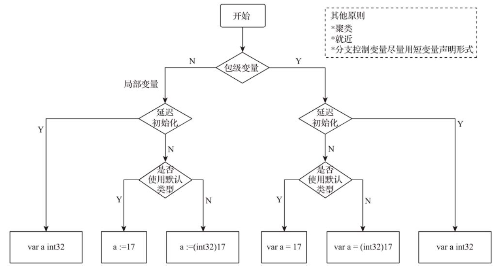

# 第8条 使用一致的变量声明形式

和动态脚本语言不同，Go语言沿袭了静态编译型语言的传统：**使用变量之前需要先进行变量的声明**。

变量声明方式：

```go
var i int
var s string = "hello"
var a = 17
n := 17
var (
  crlf = []byte{'\r', '\n'}
  colonSpace = []byte(":")
)
```

对于以面向工程著称且以解决规模化问题为目标的Go语言，Gopher**在变量声明形式的选择上应尽量保持项目范围内一致**。

Go语言有两类变量：

- **包级变量（package variable）**：在package级别可见的变量。如果是导出变量，则该包级别变量也可以被视为全局变量。
- **局部变量（local variable）**：函数或方法体内声明的变量，仅在函数或方法体内可见。

## 8.1 包级别变量的声明形式

包级别变量只能使用带有var关键字的变量声明形式，但在形式细节上仍有一定的灵活度。根据是否延迟初始化进行区分：

1. **声明同时显式初始化**

   ```go
   var variableName = InitExpression
   ```

   go编译器会自动根据等号右侧的InitExpression表达式求值的类型确定左侧所声明变量的类型。

   如果InitExpression是不带有类型信息的常量表达式，如：

   ```go
   var a = 17
   var f = 3.14
   ```

   则包级别变量会被设置为常量表达式的默认类型：以整型值初始化的变量a，Go编译器会将之设置为默认类型int，而以浮点值初始化的变量f，Go编译器会将之设置为默认人类型float64。

   如果不使用默认类型，可以使用：

   ```go
   var a int32 = 17
   var f float32 = 3.14
   // 或
   var a = int32(17)
   var f = float32(3.14)
   ```

   从声明一致性角度出发，**Go语言官方更推荐后者**，这样统一了接收默认类型和显式指定类型两种声明形式。尤其是多个变量在同一个var块中声明时：

   ```go
   var (
   	a = 17
   	f = float32(3.14)
   )
   ```

   而不是下面这种不一致的声明形式：

   ```go
   var (
   	a = 17
   	f float32 = 3.14
   )
   ```

2. **声明但延迟初始化**

   声明时并不显式初始化的包级别变量，最基本的声明形式为：

   ```go
   var a int32
   var f float64
   ```

   虽然没有显示初始化，但Go语言会让这些变量拥有初始的“零值”。如果自定义类型，保证其零值可用非常有必要。

3. **声明聚类与就近原则**

   Go语言提供var块用于将多个变量语句放在一起，并且在语法上不会限制放在var块中的声明类型。但是一般将**同一种变量声明放在一个var块中**，将**不同类的声明放在不同的var块中**。或者将**延迟初始化的变量声明放在一个var块**，而将**声明并显式初始化的变量放在另一个var块中**。这种称为“**声明聚类**”。例如Go标准库中的代码：

   ```go
   // src/net/http/server.go中
   var (
   	bufioReaderPool   sync.Pool
   	bufioWriter2kPool sync.Pool
   	bufioWriter4kPool sync.Pool
   )
   
   var copyBufPool = sync.Pool{
   	New: func() any {
   		b := make([]byte, 32*1024)
   		return &b
   	},
   }
   
   var aLongTimeAgo = time.Unix(1, 0)
   ```

   我们看到在server.go中，copyBufPool变量没有被放入var块中，因为它的声明带有显式初始化，而var块中的变量声明都是延迟初始化的；aLongTimeAgo也一样。

   是否应当将包级变量的声明全部集中放在源文件头部呢？使用静态编程语言的开发人员都知道，变量声明最佳实践中还有一条：**就近原则**

   **如果一个变量只使用一次，放在跟使用最近的地方，如果会被使用多次，则放在源文件头部声明位置**。

## 8.2 局部变量的声明形式

1. **延迟初始化的局部变量声明，采用带有var关键字的声明形式：例如err**

2. **声明且显示初始化的局部变量，建议使用短变量声明形式**

   ```go
   a := 17
   f := 3.14
   s := "hello, gopher"
   ```

   如果是不接受默认类型的变量，依然可以使用短变量声明形式，只是在":="右侧进行显式转型：

   ```go
   a := int(17)
   f := float32(3.14)
   s := []byte("hello, gopher")
   ```

3. **尽量在分支控制时时应用短变量声明形式**

   例如：

   ```go
   if v,ok:=w.(string); ok{
      // do somthing
   }
   
   for _, b := range *v {
     // do somthing
   }
   
   ```

   这种方式体现出“就近原则”，让变量的作用域最小化了。

## 8.3 总结

使用一致的变量声明是Go语言的一个最佳实践。

要想做好代码中变量声明的一致性，需要明确要声明的变量是包级别变量还是局部变量、是否要延迟初始化、是否接受默认类型、是否为分支控制变量，并结合聚类和就近原则。

