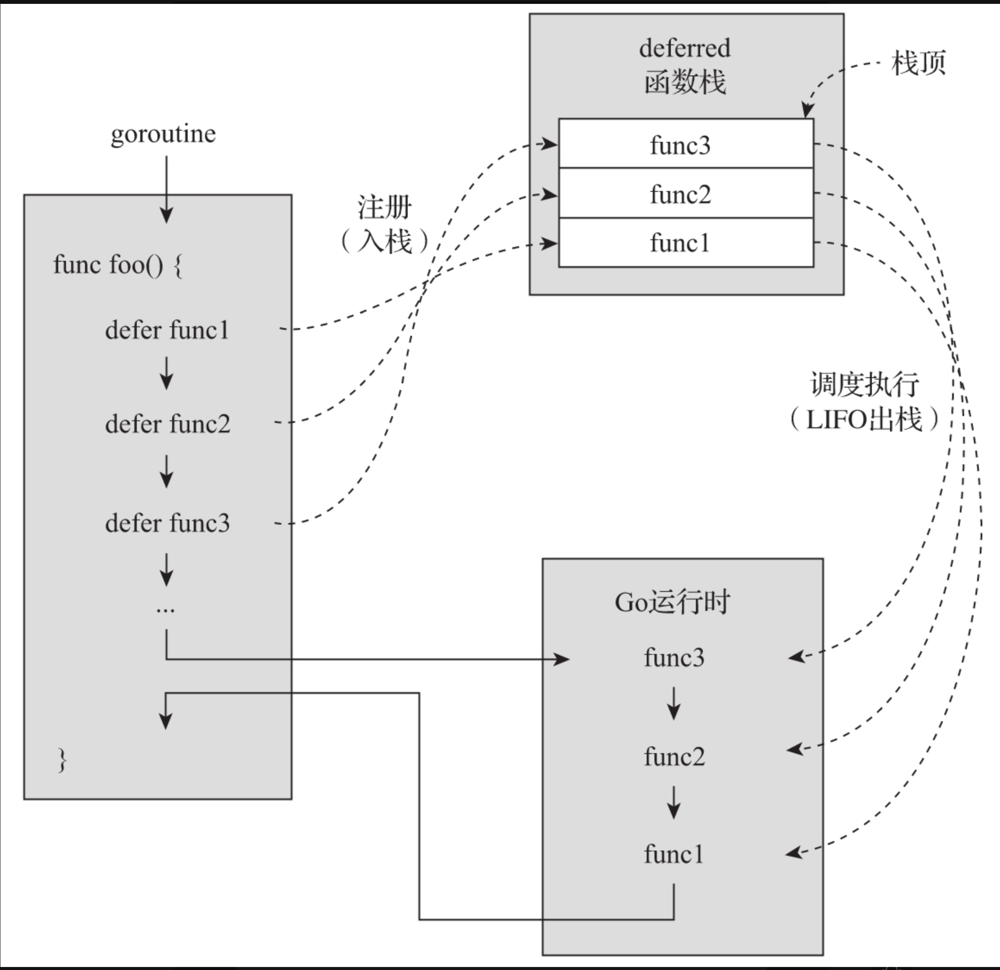

# 第22条 使用defer让函数更简洁、更健壮

在日常代码中在程序出错误时，可能涉及到关闭数据库连接、文件等，需要写很多的关闭判断。Go中引入了defer语法，可以用于在退出程序时执行某些操作。

## 22.1 defer的运作机制

defer的运作离不开函数，包括两层含义：

1. 只有函数和方法内部才能使用defer

2. defer关键字后只能跟函数或方法，这些函数被称为deferred函数。defer将它们注册到其所在goroutine用于存放deferred函数的栈数据结构中，这些deferred函数将在执行defer的函数退出时按后进先出（LIFO）的顺序调度执行

   

无论是执行到函数体尾部返回，还是在某个错误处理分支显式调用return返回，抑或出现panic，已经存储到deferred函数栈中的函数都会被调度执行。因此deferred函数是一个在任何情况下都可以为函数进行**收尾工作**的好场合。

## 22.2 defer的常见用法

1. ##### 拦截panic

   ```go
   // $GOROOT/src/bytes/buffer.go
   func makeSlice(n int) []byte {
       // If the make fails, give a known error.
       defer func() {
           if recover() != nil {
               panic(ErrTooLarge) // 触发一个新panic
           }
       }()
       return make([]byte, n)
   }
   ```

   defer拦截的错误只能是Go运行时错误，如果是C代码中造成的崩溃不能拦截。

2. ##### 修改函数的具名返回值

   ```go
   // chapter4/sources/deferred_func_5.go
   
   func foo(a, b int) (x, y int) {
       defer func() {
           x = x * 5
           y = y * 10
       }()
   
       x = a + 5
       y = b + 6
       return
   }
   
   func main() {
       x, y := foo(1, 2)
       fmt.Println("x=", x, "y=", y)
   }
   ```

   在函数返回之前，将x扩大5倍，y扩大10倍。

3. ##### 输出调试信息

   ```go
   func trace(s string) string {
       fmt.Println("entering:", s)
       return s
   }
   
   func un(s string) {
       fmt.Println("leaving:", s)
   }
   
   func a() {
       defer un(trace("a"))
       fmt.Println("in a")
   }
   
   func b() {
       defer un(trace("b"))
       fmt.Println("in b")
       a()
   }
   
   func main() {
       b()
   }
   /*
   输出结果：
   entering: b
   in b
   entering: a
   in a
   leaving: a
   leaving: b
   */
   ```

4. ##### 还原变量旧值

   ```go
   // $GOROOT/src/syscall/fs_nacl.go
   func init() {
       oldFsinit := fsinit
       defer func() { fsinit = oldFsinit }()
       fsinit = func() {}
       Mkdir("/dev", 0555)
       Mkdir("/tmp", 0777)
       mkdev("/dev/null", 0666, openNull)
       mkdev("/dev/random", 0444, openRandom)
       mkdev("/dev/urandom", 0444, openRandom)
       mkdev("/dev/zero", 0666, openZero)
       chdirEnv()
   }
   ```

   将fsinit先存储在oldFsinit中，函数运行结束之后再还原。

## 22.3 defer的几个关键问题

1. ##### 明确哪些函数可以作为deferred函数

   自定义的函数或方法都可以被defer执行，但是如果带有返回值，返回值会在调度执行时候被自定丢弃。

   在go内置函数中，带有返回值的不能使用defer直接调用，如：

   > append cap close complex copy delete imag len make new panic print println real recover
   >
   > 这些函数中，append、cap、len、make、new不能直接被defer函数调用

2. ##### 把握好defer关键字后表达式的求值时机

   **defer关键字后面的表达式是在讲deferred函数注册到deferred函数栈的时候进行求值的**。

   ```go
   // chapter4/sources/deferred_func_7.go
   
   func foo1() {
       for i := 0; i <= 3; i++ {
           defer fmt.Println(i)
       }
   }
   
   func foo2() {
       for i := 0; i <= 3; i++ {
           defer func(n int) {
                  fmt.Println(n)
           }(i)
       }
   }
   
   func foo3() {
       for i := 0; i <= 3; i++ {
           defer func() {
               fmt.Println(i)
           }()
       }
   }
   
   func main() {
       fmt.Println("foo1 result:")
       foo1()
       fmt.Println("\nfoo2 result:")
       foo2()
       fmt.Println("\nfoo3 result:")
       foo3()
   }
   
   /*
   foo1:
   3
   2
   1
   0
   foo2:
   3
   2
   1
   0
   foo3:
   4
   4
   4
   4
   */
   ```

3. ##### 知晓defer带来的性能损耗

   defer 让进行资源释放（文件描述符、锁）等过程变得优雅，也不易出错，但是defer也可能带来一些性能问题。

   在1.13之前的版本中，使用defer几乎是不使用defer耗时的7倍。

   但在1.14之后，使用defer和不使用defer性能差别不大。

   ```go
   package defer_test
   
   import "testing"
   
   func sum(max int) int {
   	total := 0
   	for i := 0; i < max; i++ {
   		total += i
   	}
   
   	return total
   }
   
   func fooWithDefer() {
   	defer func() {
   		sum(10)
   	}()
   }
   
   func fooWithoutDefer() {
   	sum(10)
   }
   
   func BenchmarkFooWithDefer(b *testing.B) {
   	for i := 0; i < b.N; i++ {
   		fooWithDefer()
   	}
   }
   func BenchmarkFooWithoutDefer(b *testing.B) {
   	for i := 0; i < b.N; i++ {
   		fooWithoutDefer()
   	}
   }
   /*
   goos: darwin
   goarch: arm64
   BenchmarkFooWithDefer-12        237515527                5.004 ns/op
   BenchmarkFooWithoutDefer-12     315366702                3.635 ns/op
   PASS
   ok      command-line-arguments  3.611s
   */
   ```

## 22.4 总结

1. deferred函数按照FILO顺序执行
2. defer常用在资源释放、异常捕捉等场景
3. defer使用时要注意返回值会被丢弃，defer后的表达式在加入deferred栈中时执行