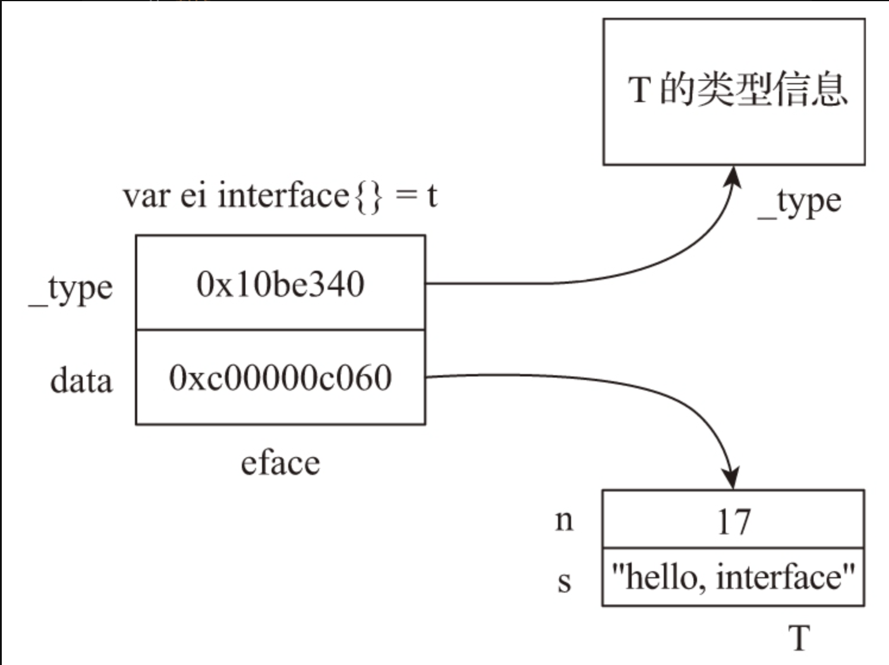
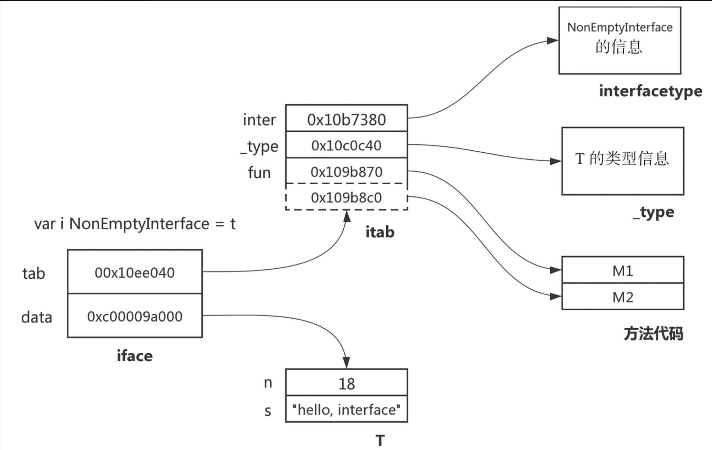

# 第26条 了解接口类型变量的内部表示

如果要从Go语言中挑选出一个语言特性放入其他语言，我会选择接口——Russ Cox，Go核心团队技术负责人

**接口是Go这门静态类型语言中唯一“动静兼备”的语言特性**。

接口的静态特性：

1. 接口类型变量具有静态类型，比如：var e error中变量e的静态类型是error
2. 支持在编译阶段的类型检查：当一个接口类型变量被赋值时，编译器会检查右侧的类型是否支持该接口方法集合中的所有方法。

接口的动态特性：

1. 接口的变量兼具动态类型，在运行时存储在接类型变量中的值的真实类型。
2. 接口类型变量在程序运行时可以背赋值为不同的动态类型变量，从而支持运行时多态

## 26.1 nil error值!=nil

```go
// chapter5/sources/interface-internal-1.go

type MyError struct {
    error
}

var ErrBad = MyError{
    error: errors.New("bad error"),
}

func bad() bool {
    return false
}

func returnsError() error {
    var p *MyError = nil
    if bad() {
        p = &ErrBad
    }
    return p
}

func main() {
    e := returnsError()
    if e != nil {
        fmt.Printf("error: %+v\n", e)
        return
    }
    fmt.Println("ok")
}
```

在这段代码中，真实的输出是：

```go
$go run interface-internal-1.go
error: <nil>
```

并没有输出ok。要弄清为什么没有输出ok，就需要了解接口类型变量的内部表示。

## 26.2 接口类型变量的内部表示

接口类型“动静兼备”的特性决定了它的变量的内部表示绝不像静态类型（如int、float64）变量那样简单。源码中接口的定义：

```go
// $GOROOT/src/runtime/runtime2.go
type iface struct {
    tab  *itab
    data unsafe.Pointer
}

type eface struct {
    _type *_type
    data  unsafe.Pointer
}
```

接口类型变量有两种内部表示——eface和iface，这两种表示分别用于不同接口类型的变量

1. eface：用于表示没有方法的空接口（empty interface）类型变量，即interface{}类型的变量
2. iface：用于表示其余拥有方法的接口（interface）类型变量

这两种结构的共同点是都有两个指针字段，并且第二个指针字段的功用相同，都指向当前赋值给该接口类型变量的动态类型变量的值.

不同点在于eface所表示的空接口类型并无方法列表，因此其第一个指针字段指向一个_type类型结构，该结构为该接口类型变量的动态类型的信息：

```go
// $GOROOT/src/runtime/type.go

type _type struct {
    size       uintptr
    ptrdata    uintptr
    hash       uint32
    tflag      tflag
    align      uint8
    fieldalign uint8
    kind       uint8
    alg        *typeAlg
    gcdata    *byte
    str       nameOff
    ptrToThis typeOff
}
```

而iface除了要存储动态类型信息之外，还要存储接口本身的信息（接口的类型信息、方法列表信息等）以及动态类型所实现的方法的信息，因此iface的第一个字段指向一个itab类型结构

```go
// $GOROOT/src/runtime/runtime2.go

type itab struct {
    inter *interfacetype
    _type *_type
    hash  uint32
    _     [4]byte
    fun   [1]uintptr
}
```

用eface表示空接口类型变量的例子：

```go
type T struct {
    n int
    s string
}

func main() {
    var t = T {
        n: 17,
        s: "hello, interface",
    }
    var ei interface{} = t // Go运行时使用eface结构表示ei
}
```



用iface表示非空接口类型变量的例子：

```go
type T struct {
    n int
    s string
}

func (T) M1() {}
func (T) M2() {}

type NonEmptyInterface interface {
    M1()
    M2()
}

func main() {
    var t = T{
        n: 18,
        s: "hello, interface",
    }
    var i NonEmptyInterface = t
}
```



每个接口类型变量在运行时的表示都是由两部分组成的，这两种接口类型可以分别简记为eface(_type, data)和iface(tab,data)。虽然eface和iface的第一个字段有所差别，但tab和_type可统一看作动态类型的类型信息。Go语言中每种类型都有唯一的_type信息，无论是内置原生类型，还是自定义类型。Go运行时会为程序内的全部类型建立只读的共享_type信息表，因此拥有相同动态类型的同类接口类型变量的_type/tab信息是相同的。而接口类型变量的data部分则指向一个动态分配的内存空间，该内存空间存储的是赋值给接口类型变量的动态类型变量的值。未显式初始化的接口类型变量的值为nil，即该变量的_type/tab和data都为nil。这样，我们要判断两个接口类型变量是否相同，只需判断_type/tab是否相同以及data指针所指向的内存空间所存储的数据值是否相同（注意：不是data指针的值）。

1. nil接口变量

   无论是空接口类型变量还是非空接口类型变量，一旦变量值为nil，那么呢不表示均为(0x0,0x0)，即类型信息和数据信息均为空。

2. 空接口类型变量

   对于非空接口类型变量，只有在_type和data所指数据内容一致情况下，两个空接口类型变量之间才能画等号。

3. 非空接口类型变量

   与空接口类型变量一样，只有在tab和data所指数据内容一致的情况下，两个非空接口类型变量之间才能画等号。

4. 空接口类型变量与非空接口类型变量的等值比较

   ```go
   // chapter5/sources/interface-internal-2.go
   
   func printEmptyInterfaceAndNonEmptyInterface() {
       var eif interface{} = T(5)
       var err error = T(5)
       println("eif:", eif)
       println("err:", err)
       println("eif = err:", eif == err)
   
       err = T(6)
       println("eif:", eif)
       println("err:", err)
       println("eif = err:", eif == err)
   }
   
   // 输出结果
   
   eif: (0x10b3b00,0x10eb4d0)
   err: (0x10ed380,0x10eb4d8)
   eif = err: true
   eif: (0x10b3b00,0x10eb4d0)
   err: (0x10ed380,0x10eb4e0)
   eif = err: false
   ```

## 26.4 接口类型的装箱原理

装箱（boxing）是编程语言领域的一个基础概念，一般是指把值类型转换为引用类型。

在Go语言中，将任意类型赋值给一个接口类型变量都是装箱操作。

接口类型的装箱实则就是创建一个eface或iface的过程。

经过装箱后，箱内的数据（存放在新分配的内存空间中）与原变量便无瓜葛了，除非是指针类型。

## 26.5 总结

1. 接口类型变量在运行时表示为eface和iface，eface用于表示空接口类型变量，iface用于表示非空接口类型变量；
2. 当且仅当两个接口类型变量的类型信息（eface._type/iface.tab._type）相同，且数据指针（eface.data/iface.data）所指数据相同时，两个接口类型才是相等的
3. 通过println可以输出接口类型变量的两部分指针变量的值
4. 可通过复制runtime包eface和iface相关类型源码，自定义输出eface/iface详尽信息的函数；
5. 接口类型变量的装箱操作由Go编译器和运行时共同完成。