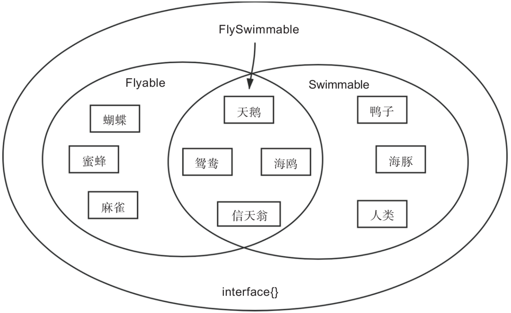

# 第27条 尽量定义小接口

接口越大，抽象程度越低。——Rob Pike，Go语言之父

## 27.1 Go推荐定义小接口

接口就是将对象的行为进行抽象而形成的契约。契约有繁有简，Go选择了去繁就简。

**契约的自动遵守**：Go语言中接口与其实现者之间的关系是隐式的，无须像其他语言（如Java）那样要求实现者显式放置implements声明；实现者仅需实现接口方法集中的全部方法，便算是自动遵守了契约，实现了该接口。小**契约**：契约繁了便束缚了手脚，降低了灵活性，抑制了表现力。Go选择使用小契约，表现在代码上便是尽量定义小接口。

Go中更推荐定义小接口，因此在很多Go原生项目中方法数量在1～3个范围内的接口占了绝大多数。

## 27.2 小接口的优势

1. 接口越小，抽象程度越高，被接纳度越高

   抽象程度越高，对应的集合空间越大；抽象程度越低（越具象，越接近事物的真实面貌），对应的集合空间越小。如：

   ```go
   // 会飞的
   type Flyable interface {
       Fly()
   }
   
   // 会游泳的
   type Swimmable interface {
       Swim()
   }
   
   // 会飞且会游泳的
   type FlySwimmable interface {
       Flyable
       Swimmable
   }
   ```

   

2. 易于实现和测试

   小接口拥有较少的方法，一般情况下仅有一个方法。要想满足这一接口，我们仅需实现一个方法或少数几个方法即可，这显然要比实现拥有较多方法的接口容易得多。尤其是在单元测试环节，构建类型去实现仅有少量方法的接口要比实现拥有较多方法的接口轻松很多

3. 契约职责单一，易于复用组合

   Go的设计原则推崇通过组合的方式构建程序。

   Go开发人员一般会首先尝试通过嵌入其他已有接口类型的方式来构建新接口类型，就像通过嵌入io.Reader和io.Writer构建io.ReadWriter那样。

   如果有众多接口类型可选，怎么选择呢？很显然，应该选择那些新接口类型需要的契约职责，同时要求不要引入我们不需要的契约职责。在这样的情况下，拥有一个或少数几个方法的小接口便更有可能成为我们的目标，而那些拥有较多方法的大接口则大多会因引入诸多不需要的契约职责而被放弃。由此可见，小接口更契合Go的组合思想，也更容易发挥出组合的威力。

## 27.3 定义小接口可以遵循的一些点

保持简单有时候比做复杂更难。如何定义小接口没有标准的答案，但有一些可在实践中考量或遵循的点：

1. **抽象出接口**

   要设计和定义小接口，需要先有接口。

   在定义小接口之前，首先深入**问题域**，聚焦抽象并发现接口。**初期不要在意接口的大小**，月偏向业务层，抽象难度越高。

2. **将大接口拆分为小接口**

   将大接口按照应用场合进行拆分，分别提取到多个小接口中。

3. **接口的单一契约职责**

   上面拆分出的小接口是否需要进一步拆分直至每个接口都只有一个方法呢？这一点依然没有标准答案，不过大家可以考量现有小接口是否需要满足单一契约职责，就像io.Reader那样。如果需要，则可进一步拆分，提升抽象程度

## 27.4 总结

1. 接口是将对象的行为进行抽象而形成的契约
2. Go青睐定义小接口，即方法数量为1～3个、通常为1个接口。
3. 小接口抽象程度高，被接纳度高，易于实现和测试，易于复用组合。
4. 先抽象出接口，再拆分为小接口，另外接口的契约职责应尽可能保持单一。

