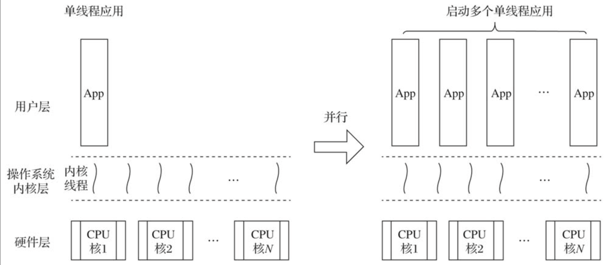
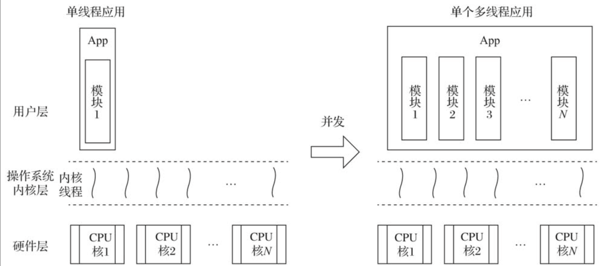

# 第31条 优先考虑并发设计

并发不是并行，并发关乎结构，并行关乎执行。 ——Rob Pike，Go语言之父

## 31.1 并发与并行

要充分利用多核的强大计算能力，一般有两种方案：

1. 并行方案

   **并行方案**就是在处理器核数充足的情况下**启动多个单线程应用和实例**，这样每个实例“运行”在一个核上，尽可能利用多核计算资源。

   

2. 并发方案

   简单来说，**并发**就是重新做应用结构设计，即将应用分解成多个基本执行单元中执行的、可能有一定关联关系的代码片段。这样应用虽然仍以单实例的方式运行，但其中每个内部模块都运行于一个独立的操作系统线程中，多核资源得以充分利用。

   

传统编程语言中主要基于**多线程模型**，但是线程的创建和销毁、以及上下文切换的代价较大。

Go语言的设计哲学之一是**原生并发，轻量高效**。Go没有使用操作系统线程作为代码片段基本执行单元，而是实现了goroutine这一**由Go运行时负责调度的用户层轻量级线程**为并发程序设计提供原生支持。goroutine相比传统操作系统有如下优势：

1. 资源占用小，每个goroutine初始栈大小仅为2KB。
2. 由Go运行时而不是操作系统调度，goroutine上下文切换代价较小。
3. 语言原生支持：goroutine由ggo关键字接函数或方法创建，函数或方法返回即表示goroutine退出，开发体验更佳。
4. 语言内置channel作为goroutine间通信原语，为并发设计提供强大支撑。

和传统语言不同，Go语言是面向并发而生，因此在应用结构设计阶段，**Go的管理是优先考虑并发设计**。

## 31.2 示例

例如在机场安检流程中，每个安检流程需要经过idCheck、bodyCheck、xRayCheck三步。

1. 传统方法使用顺序执行，每个人单队列顺序执行。
2. 并行方案：开辟多条管道执行校验，每条管道顺序执行
3. 并发：将idCheck、bodyCheck、xRayCheck分别拆分为3个管道，每个管道处理不同的事。这样最大耗时取决于每个管道的最大耗时，而不是累加。

## 31.3 总结

**并发关乎结构，并行关乎执行**。并发和并行是两个阶段的事情。并发在程序的设计和实现阶段，并行在程序的执行阶段。