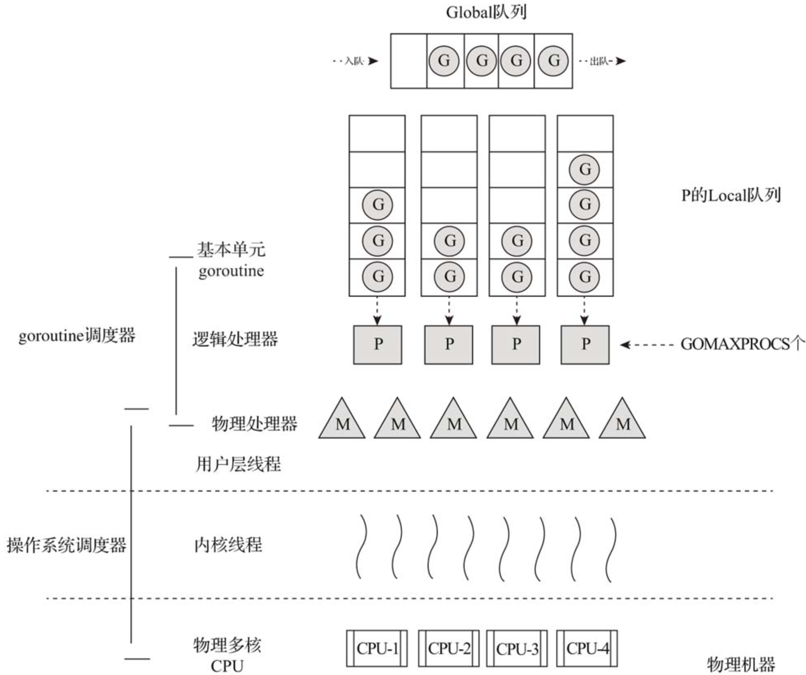
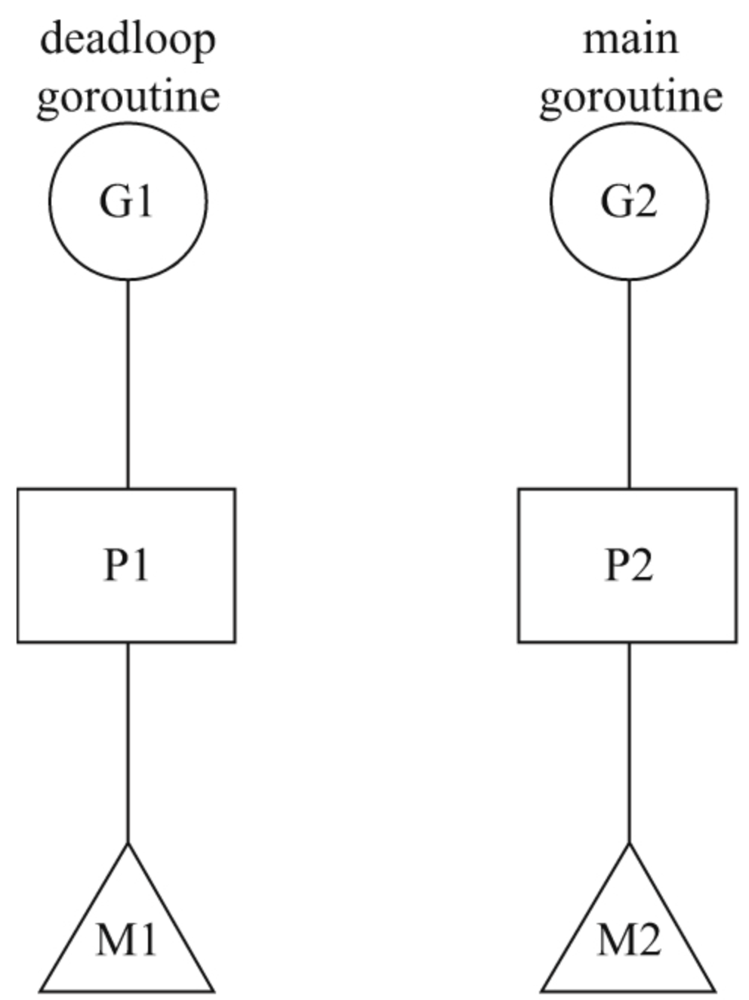
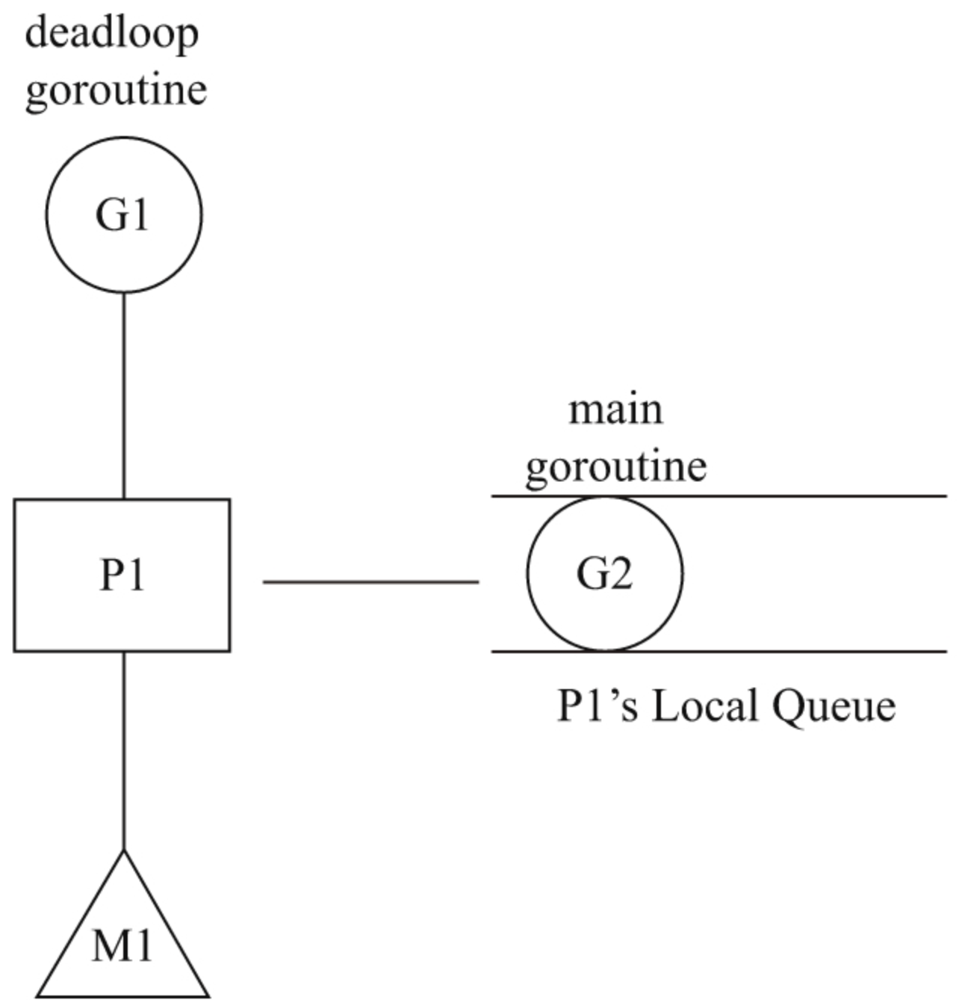

## 第32条 了解goroutine的调度原理

**goroutine是Go运行时管理的用户层轻量级线程**。相较于操作系统线程，goroutine的资源占用和使用代价小很多。可以创建几十个、几百个甚至上万个goroutine，Go运行时负责对goroutine进行管理。

## 32.1 goroutine调度器

Go采用用户层轻量级线程来解决这些问题，并将之称为goroutine。由于一个goroutine占用资源很少，一个Go程序中可以创建成千上万个并发的goroutine。而将这些goroutine按照一定算法放到CPU上执行的程序就称为goroutine调度器（goroutine scheduler）。一个Go程序对于操作系统来说只是一个用户层程序，操作系统眼中只有线程，goroutine的调度全要靠Go自己完成。

## 32.2 goroutine调度模型与演进过程

1. G-M模型

   2012年3月28日，Go 1.0正式发布。在这个版本中，Go开发团队实现了一个简单的goroutine调度器。在这个调度器中，每个goroutine对应于运行时中的一个抽象结构——G（goroutine），而被视作“物理CPU”的操作系统线程则被抽象为另一个结构——M（machine）。

2. G-P-M模型

   发现了G-M模型的不足后，Dmitry Vyukov亲自操刀改进了goroutine调度器，在Go 1.1版本中实现了G-P-M调度模型和work stealing算法。

   

   P是一个“逻辑处理器”，每个G要想真正运行起来，首先需要被分配一个P，即进入P的本地运行队列（local runq）中，这里暂忽略全局运行队列（global runq）那个环节。对于G来说，P就是运行它的“CPU”，可以说在G的眼里只有P。但从goroutine调度器的视角来看，真正的“CPU”是M，只有将P和M绑定才能让P的本地运行队列中的G真正运行起来。这样的P与M的关系就好比Linux操作系统调度层面用户线程（user thread）与内核线程（kernel thread）的对应关系：多对多（N:M）。

3. 抢占式调度

   G-P-M模型的实现是goroutine调度器的一大进步，但调度器仍然有一个头疼的问题，那就是不支持抢占式调度，这导致一旦某个G中出现死循环的代码逻辑，那么G将永久占用分配给它的P和M，而位于同一个P中的其他G将得不到调度，出现“饿死”的情况。更为严重的是，当只有一个P（GOMAXPROCS=1）时，整个Go程序中的其他G都将“饿死”。于是Dmitry Vyukov又提出了“Go抢占式调度器设计”（Go Preemptive Scheduler Design），并在Go 1.2版本中实现了抢占式调度。这个抢占式调度的原理是在每个函数或方法的入口加上一段额外的代码，让运行时有机会检查是否需要执行抢占调度。这种协作式抢占调度的解决方案只是局部解决了“饿死”问题，对于没有函数调用而是纯算法循环计算的G，goroutine调度器依然无法抢占。

4. NUMA调度模型

   在Go 1.2以后，Go将重点放在了对GC低延迟的优化上，对调度器的优化和改进似乎不那么热心了，只是伴随着GC的改进而作了些小的改动。Dmitry Vyukov在2014年9月提出了一个新的设计草案文档“NUMA‐aware scheduler for Go”，作为对未来goroutine调度器演进方向的一个提案，不过这个提案至今也没有被列入开发计划。

5. 其他优化

   Go运行时已经实现了netpoller，这使得即便G发起网络I/O操作也不会导致M被阻塞（仅阻塞G），因而不会导致大量线程（M）被创建出来。但是对于常规文件的I/O操作一旦阻塞，那么线程（M）将进入挂起状态，等待I/O返回后被唤醒。这种情况下P将与挂起的M分离，再选择一个处于空闲状态（idle）的M。如果此时没有空闲的M，则会新创建一个M（线程），这就是大量文件I/O操作会导致大量线程被创建的原因。

## 32.3 对goroutine调度器原理的进一步理解

1. **G、P、M**

   1. **G**：代表goroutine，存储了goroutine的执行栈信息、goroutine状态及goroutine的任务函数等。另外G对象是可以重用的。
   2. **P**：代表逻辑processor，P的数量决定了系统内最大可并行的G的数量（前提：系统的物理CPU核数>=P的数量）。P中最有用的是其拥有的各种G对象队列、链表、一些缓存和状态。
   3. **M**：M代表着真正的执行计算资源。在绑定有效的P后，进入一个调度循环；而调度循环的机制大致是从各种队列、P的本地运行队列中获取G，切换到G的执行栈上并执行G的函数，调用goexit做清理工作并回到M。如此反复。M并不保留G状态，这是G可以跨M调度的基础。

2. **G被抢占调度**

   Go会起一个sysmon线程，每20us～10ms启动一次：

   1. 释放闲置超过5分钟的span物理内存；
   2. 如果超过2分钟没有垃圾回收，强制执行；
   3. 将长时间未处理的netpoll结果添加到任务队列；
   4. 向长时间运行的G任务发出抢占调度；
   5. 收回因syscall长时间阻塞的P

3. **channel阻塞或网络I/O情况下的调度**

   如果G被阻塞在某个channel操作或网络I/O操作上，那么G会被放置到某个等待队列中，而M会尝试运行P的下一个可运行的G。如果此时P没有可运行的G供M运行，那么M将解绑P，并进入挂起状态。当I/O操作完成或channel操作完成，在等待队列中的G会被唤醒，标记为runnable（可运行），并被放入某个P的队列中，绑定一个M后继续执行。

4. **系统调用阻塞情况下的调度**

   如果G被阻塞在某个系统调用上，那么不仅G会阻塞，执行该G的M也会解绑P（实质是被sysmon抢走了），与G一起进入阻塞状态。如果此时有空闲的M，则P会与其绑定并继续执行其他G；如果没有空闲的M，但仍然有其他G要执行，那么就会创建一个新M（线程）。当系统调用返回后，阻塞在该系统调用上的G会尝试获取一个可用的P，如果有可用P，之前运行该G的M将绑定P继续运行G；如果没有可用的P，那么G与M之间的关联将解除，同时G会被标记为runnable，放入全局的运行队列中，等待调度器的再次调度。

## 32.4 调度状态的查看方法

GODEBUG运行时环境变了可以查看调试信息：

```go
$ GODEBUG=schedtrace=1000 godoc -http=:6060
SCHED 0ms: gomaxprocs=4 idleprocs=3 threads=3 spinningthreads=0 idlethreads=0 runqueue=0 [0 0 0 0]
SCHED 1001ms: gomaxprocs=4 idleprocs=0 threads=9 spinningthreads=0 idlethreads=3 runqueue=2 [8 14 5 2]
SCHED 2006ms: gomaxprocs=4 idleprocs=0 threads=25 spinningthreads=0 idlethreads=19 runqueue=12 [0 0 4 0]
SCHED 3006ms: gomaxprocs=4 idleprocs=0 threads=26 spinningthreads=0 idlethreads=8 runqueue=2 [0 1 1 0]
SCHED 4010ms: gomaxprocs=4 idleprocs=0 threads=26 spinningthreads=0 idlethreads=20 runqueue=12 [6 3 1 0]
SCHED 5010ms: gomaxprocs=4 idleprocs=0 threads=26 spinningthreads=1 idlethreads=20 runqueue=17 [0 0 0 0]
SCHED 6016ms: gomaxprocs=4 idleprocs=0 threads=26 spinningthreads=0 idlethreads=20 runqueue=1 [3 4 0 10]
...
```

如：

```go
SCHED 6016ms: gomaxprocs=4 idleprocs=0 threads=26 spinningthreads=0 idlethreads=20 runqueue=1 [3 4 0 10]
```

含义如下：

1. SCHED：调试信息输出标志字符串，代表本行是goroutine调度器相关信息的输出。
2. 6016ms：从程序启动到输出这行日志经过的时间。
3. gomaxprocs：P的数量。
4. idleprocs：处于空闲状态的P的数量。通过gomaxprocs和idleprocs的差值，我们就可以知道当前正在执行Go代码的P的数量。
5. threads：操作系统线程的数量，包含调度器使用的M数量，加上运行时自用的类似sysmon这样的线程的数量。
6. spinningthreads：处于自旋（spin）状态的操作系统数量。
7. idlethread：处于空闲状态的操作系统线程的数量。
8. runqueue=1：Go调度器全局运行队列中G的数量。
9. [3 4 0 10]：分别为4个P的本地运行队列中的G的数量。

## 32.5 goroutine调度实例简要分析

1. **为什么在死循环情况下，多个goroutine依旧被调度并轮流执行**

   ```go
   // chapter6/sources/go-scheduler-model-case1.go
   func deadloop() {
       for {
       }
   }
   
   func main() {
       go deadloop()
       for {
           time.Sleep(time.Second * 1)
           fmt.Println("I got scheduled!")
       }
   }
   ```

   

   多核CPU上P在不同的M上运行。

2. **如何让deadloop goroutine以外的goroutine无法得到调度？**

   如果一定要让deadloop goroutine以外的goroutine无法得到调度，该如何做呢？一种思路是：让Go运行时不要启动那么多P，让所有用户级的goroutine都在一个P上被调度。下面是实现上述思路的三种办法：在main函数的最开头处调用runtime.GOMAXPROCS(1)；设置环境变量export GOMAXPROCS=1后再运行程序；找一台单核单线程的机器（不过现在这样的机器太难找了，只能使用云服务器实现）。以第一种方法为例：

   ```go
   // chapter6/sources/go-scheduler-model-case2.go
   
   func deadloop() {
       for {
       }
   }
   
   func main() {
       runtime.GOMAXPROCS(1)
       go deadloop()
       for {
           time.Sleep(time.Second * 1)
           fmt.Println("I got scheduled!")
       }
   }
   ```

   

3. **如何让deadloop goroutine以外的goroutine无法得到调度？**

   ```go
   // chapter6/sources/go-scheduler-model-case4.go
   
   func add(a, b int) int {
       return a + b
   }
   
   func dummy() {
       add(3, 5)
   }
   
   func deadloop() {
       for {
           dummy()
       }
   }
   
   func main() {
       runtime.GOMAXPROCS(1)
       go deadloop()
       for {
           time.Sleep(time.Second * 1)
           fmt.Println("I got scheduled!")
       }
   }
   ```

   Go编译器在函数的入口处插入了一个运行时的函数调用：runtime.morestack_noctxt。这个函数会检查是否需要扩容连续栈，并进入抢占调度的逻辑中。

   所以在有栈扩容时，会引发调度器切换。

4. **为何runtime.morestack_noctxt(SB)放到了RET后面**

   按照Go语言开发团队的说法，这样做是为了更好地利用现代CPU的“静态分支预测”（static branch prediction）[2]，提升执行性能

## 32.6 总结

1. G—P—M运行模型
2. 调度器查看方法
3. 调度实例分析方法


