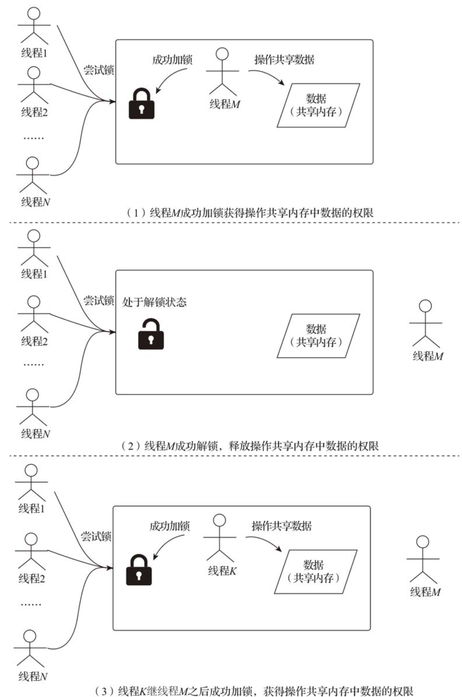
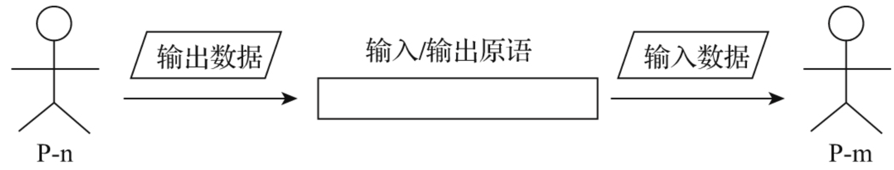
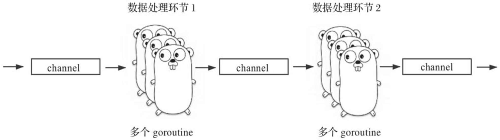
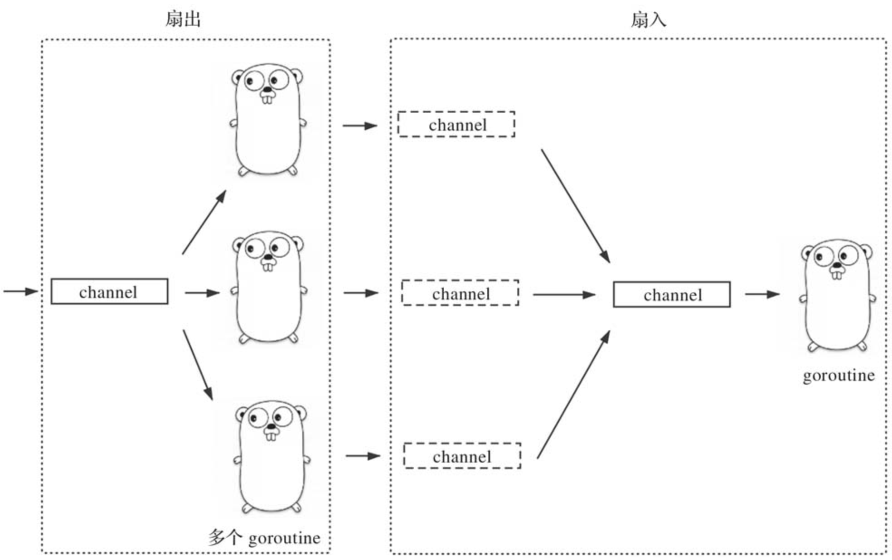

# 第33条 掌握Go并发模型和常见并发模式

不要通过共享内存来通信，而应该通过通信来共享内存。—Rob Pike，Go语言之父

## 33.1 Go并发模型

传统语言的病发模型是基于共享内存的模型，如下图所示：



这种基于共享内存的并发模型难用，并且易错，尤其在大型或复杂程序中。

Go语言从设计开始就将解决传统并发模型的问题作为目标之一，并在新并发模型设计上借鉴了著名计算机科学家Tony Hoare提出的CSP（Communicating Sequential Process，通信顺序进程）模型，如图：



CSP理论中的P（Process，进程）是个抽象概念，它代表任何顺序处理逻辑的封装，它获取输入数据（或从其他P的输出获取），并生产可以被其他P消费的输出数据。P并不一定与操作系统的进程或线程画等号。在Go中，与Process对应的是goroutine，但Go语言中goroutine的执行逻辑并不一定是顺序的，goroutine也可以创建其他goroutine以并发地完成工作。

为了实现CSP模型中的输入/输出原语，Go引入了goroutine（P）之间的通信原语channel。goroutine可以从channel获取输入数据，再将处理后得到的结果数据通过channel输出。通过channel将goroutine（P）组合与连接在一起，这使得设计和编写大型并发系统变得更为简单和清晰，我们无须再为那些传统共享内存并发模型中的问题而伤脑筋了。虽然CSP模型已经成为Go语言支持的主流并发模型，但Go也支持传统的基于共享内存的并发模型，并提供基本的低级同步原语（主要是sync包中的互斥锁、条件变量、读写锁、原子操作等）。

那么我们在实践中应该如何选择？是使用channel还是使用在低级同步原语保护下的共享内存呢？毫无疑问，从程序的整体结构来看，就像本条开头引述的Rob Pike的那句话一样，**Go始终推荐以CSP模型风格构建并发程序**，尤其是在复杂的业务层面。

对于局部情况，比如涉及性能敏感的区域或需要保护的结构体数据，可以使用更为高效的低级同步原语（如sync.Mutex），以保证goroutine对数据的同步访问。

## 33.2 Go常见的并发模式

在语言层面上，Go针对CSP模型提供了三种并发原语：

1. **goroutine**：对应CSP模型中的P，封装了数据的处理逻辑，是Go运行时调度的基本执行单元。
2. **channel**：对应CSP模型中的**输入/输出原语**，用于goroutine之间的通信和同步
3. **select**：用于应对多路输入/输出，可以让goroutine同时**协调处理**多个channel操作。

并发模式如下：

1. #### **创建模式**

   Go使用go关键字+函数/方法创建goroutine：

   ```go
   go fmt.Println("I am a goroutine")
    
   // $GOROOT/src/net/http/server.go
   c := srv.newConn(rw)
   go c.serve(connCtx)
   ```

   但在复杂并发程序中，需要考虑通过CSP模型输入/输出原语的承载体**channel**在goroutine之间建立**联系**。

   通常使用如下方式创建goroutine：

   ```go
   type T struct {...}
   
   func spawn(f func()) chan T {
       c := make(chan T)
       go func() {
           // 使用channel变量c(通过闭包方式)与调用spawn的goroutine通信
           ...
           f()
           ...
       }()
       
       return c
   }
   
   func main() {
       c := spawn(func(){})
       // 使用channel变量c与新创建的goroutine通信
   }
   ```

   以上方式在内部创建一个goroutine并返回一个channel类型变量的函数，这是Go中最常见的goroutine创建模式。spawn函数创建的新goroutine与调用spawn函数的goroutine之间通过一个channel建立起了联系：两个goroutine可以通过这个channel进行通信

2. #### **退出模式**

   goroutine的使用代价很低，Go官方推荐多使用goroutine。多数情况下，无序考虑对goroutine的退出进行控制：goroutine的执行函数返回，即以为这goroutine退出。但一些常驻的后台服务程序可能对goroutine有更高的退出要求。goroutine退出模式如下：

   1. **分离模式**

      这类goroutine在启动后即与创建者彻底分离，其生命周期与执行的主函数相关，函数返回即goroutine退出。这类通常有两个常见用途：

      1. **一次性任务**：新创建的goroutine用来执行一个简单的任务，执行后即退出。

         ```go
         // $GOROOT/src/net/dial.go
         func (d *Dialer) DialContext(ctx context.Context, network, address string) (Conn, error) {
             ...
             if oldCancel := d.Cancel; oldCancel != nil {
                 subCtx, cancel := context.WithCancel(ctx)
                 defer cancel()
                 go func() {
                     select {
                     case <-oldCancel:
                         cancel()
                     case <-subCtx.Done():
                     }
                 }()
                 ctx = subCtx
             }
             ...
         }
         ```

      2. **常驻后台执行一些特定任务**，如监视(monitor)、观察(watch)等。实现方式通常采用for {...}或for {select {...}}代码段形式，并多以定时器(timer)或时间(event)驱动执行。

         ```go
         // $GOROOT/src/runtime/mgc.go
         func gcBgMarkStartWorkers() {
             // 每个P都有一个运行在后台的用于标记的G
             for _, p := range allp {
                 if p.gcBgMarkWorker == 0 {
                     go gcBgMarkWorker(p) // 为每个P创建一个goroutine，以运行gcBgMarkWorker
                     notetsleepg(&work.bgMarkReady, -1)
                     noteclear(&work.bgMarkReady)
                 }
             }
         }
         
         func gcBgMarkWorker(_p_ *p) {
             gp := getg()
             ...
             for { // 常驻后台处理GC事宜
                 ...
             }
         }
         ```

   2. **join模式**

      父线程通过pthread_join等待子线程结束并获取子线程的结束状态。在go中也有这样的需求：goroutine创建者需要等待goroutine结束。这种为“join模式”

      1. **等待一个goroutine退出**

         ```go
         func worker(args ...interface{}) {
             if len(args) == 0 {
                 return
             }
             interval, ok := args[0].(int)
             if !ok {
                 return
             }
             
             time.Sleep(time.Second * (time.Duration(interval)))
         }
         
         func spawn(f func(args ...interface{}), args ...interface{}) chan struct{} {
             c := make(chan struct{})
             go func() {
                 f(args...)
                 c <- struct{}{}
             }()
             return c
         }
         
         func main() {
              done := spawn(worker, 5)
              println("spawn a worker goroutine")
              <-done
              println("worker done")
         }
         ```

         main goroutine在创建完新goroutine后便在该channel上阻塞等待，直到新goroutine退出前向该channel发送了一个信号。

      2. **获取goroutine退出状态**

         如果新的goroutine创建者不仅需要等待goroutine退出，还要精确获取结束状态，同样可以基于自定义类型的channel实现这一场景需求。

         ```go
         var OK = errors.New("ok")
         
         func worker(args ...interface{}) error {
             if len(args) == 0 {
                 return errors.New("invalid args")
             }
             interval, ok := args[0].(int)
             if !ok {
                 return errors.New("invalid interval arg")
             }
             
             time.Sleep(time.Second * (time.Duration(interval)))
             return OK
         }
         
         func spawn(f func(args ...interface{}) error, args ...interface{}) chan error {
             c := make(chan error)
             go func() {
                 c <- f(args...)
             }()
             return c
         }
         
         func main() {
             done := spawn(worker, 5)
             println("spawn worker1")
             err := <-done
             fmt.Println("worker1 done:", err)
             done = spawn(worker)
             println("spawn worker2")
             err = <-done
             fmt.Println("worker2 done:", err)
         }
         ```

         将channel中承载的类型由struct{}改为了error，这样channel承载的信息就不只是一个信号了，还携带了有价值的信息：**新goroutine的结束状态**。

      3. **等待多个goroutine退出**

         在有些场景中，goroutine创建者可能会创建不止一个goroutine，并且需要等待全部新goroutine退出。可以通过Go语言提供的sync.WaitGroup实现等待多个goroutine退出模式。

         ```go
         func worker(args ...interface{}) {
             if len(args) == 0 {
                 return
             }
             
             interval, ok := args[0].(int)
             if !ok {
                 return
             }
             
             time.Sleep(time.Second * (time.Duration(interval)))
         }
         
         func spawnGroup(n int, f func(args ...interface{}), args ...interface{}) chan struct{} {
             c := make(chan struct{})
             var wg sync.WaitGroup
             
             for i := 0; i < n; i++ {
                 wg.Add(1)
                 go func(i int) {
                     name := fmt.Sprintf("worker-%d:", i)
                     f(args...)
                     println(name, "done")
                     wg.Done() // worker done!
                 }(i)
             }
             
             go func() {
                 wg.Wait()
                 c <- struct{}{}
             }()
             
             return c
         }
         
         func main() {
             done := spawnGroup(5, worker, 3)
             println("spawn a group of workers")
             <-done
             println("group workers done")
         }
         ```

         通过`sync.WaitGroup`，`spawnGroup`每创建一个goroutine都会调用`wg.Add(1)`，新创建的goroutine会在退出前调用wg.Done。在spawnGroup中还创建了一个用于监视的goroutine，该goroutine调用`sync.WaitGroup`的Wait方法来等待所有goroutine退出。在所有新创建的goroutine退出后，Wait方法返回，该监视goroutine会向done这个channel写入一个信号，这时main goroutine才会从阻塞在done channel上的状态中恢复，继续往下执行。

      4. **支持超时机制的等待**

         如果不想无限阻塞等待所有新创建goroutine退出，而是仅等待一段合理的时间。如果这段时间内goroutine没有退出，则创建者继续向下执行或主动退出：

         ```go
         func main() {
             done := spawnGroup(5, worker, 30)
             println("spawn a group of workers")
             
             timer := time.NewTimer(time.Second * 5)
             defer timer.Stop()
             select {
             case <-timer.C:
                 println("wait group workers exit timeout!")
             case <-done:
                 println("group workers done")
             }
         }
         ```

         在上边代码中通过定时器（time.Timer）设置超时等待时间，并通过select原语同时监听timer.C和done这两个channel，哪个先返回数据就执行哪个。

   3. **notify-and-wait模式**

      前边场景中，goroutine创建者都是被动等待新goroutine的退出，但是在很多时候，goroutine创建者需要主动通知哪些新goroutine退出，尤其是当main gorutine作为创建者时，main退出需要通知其他goroutine。

      1. **通知并等待一个goroutine退出**

         ```go
         func worker(j int) {
             time.Sleep(time.Second * (time.Duration(j)))
         }
         
         func spawn(f func(int)) chan string {
             quit := make(chan string)
             go func() {
                 var job chan int // 模拟job channel
                 for {
                     select {
                     case j := <-job:
                         f(j)
                     case <-quit:
                         quit <- "ok"
                     }
                 }
             }()
             return quit
         }
         
         func main() {
             quit := spawn(worker)
             println("spawn a worker goroutine")
             
             time.Sleep(5 * time.Second)
             
             // 通知新创建的goroutine退出
             println("notify the worker to exit...")
             quit <- "exit"
             
             timer := time.NewTimer(time.Second * 10)
             defer timer.Stop()
             select {
             case status := <-quit:
                 println("worker done:", status)
             case <-timer.C:
                 println("wait worker exit timeout")
             }
         }
         ```

         使用创建模式创建goroutine的spawn函数返回的channel的作用发生了变化，从原先的只是用于新goroutine发送退出信号给创建者，变成了一个双向的数据通道：既承载创建者发送给新goroutine的退出信号，也承载新goroutine返回给创建者的退出状态。

      2. **通知并等到多个goroutine退出**

         Go语言的channel有一个特性是，当使用close函数关闭channel时，所有阻塞到该channel上的goroutine都会得到通知。我们就利用这一特性实现满足这一场景的模式

         ```go
         func worker(j int) {
             time.Sleep(time.Second * (time.Duration(j)))
         }
         
         func spawnGroup(n int, f func(int)) chan struct{} {
             quit := make(chan struct{})
             job := make(chan int)
             var wg sync.WaitGroup
             
             for i := 0; i < n; i++ {
                 wg.Add(1)
                 go func(i int) {
                     defer wg.Done() // 保证wg.Done在goroutine退出前被执行
                     name := fmt.Sprintf("worker-%d:", i)
                     for {
                         j, ok := <-job
                         if !ok {
                             println(name, "done")
                             return
                         }
                         // 执行这个job
                         worker(j)
                     }
                 }(i)
             }
             
             go func() {
                 <-quit
                 close(job) // 广播给所有新goroutine
                 wg.Wait()
                 quit <- struct{}{}
             }()
             
             return quit
         }
         
         func main() {
             quit := spawnGroup(5, worker)
             println("spawn a group of workers")
             
             time.Sleep(5 * time.Second)
             // 通知 worker goroutine 组退出
             println("notify the worker group to exit...")
             quit <- struct{}{}
             
             timer := time.NewTimer(time.Second * 5)
             defer timer.Stop()
             select {
             case <-timer.C:
                 println("wait group workers exit timeout!")
             case <-quit:
                 println("group workers done")
             }
         }
         ```

         上面这段示例代码的关键是创建者直接利用了worker goroutine接收任务（job）的channel来广播退出通知，而实现这一广播的代码就是close(job)。此时各个worker goroutine监听job channel，当创建者关闭job channel时，通过“comma ok”模式获取的ok值为false，也就表明该channel已经被关闭，于是worker goroutine执行退出逻辑（退出前wg.Done()被执行。

   4. **退出模式的应用**

      先定义一个接口：

      ```go
      type GracefullyShutdowner interface {
          Shutdown(waitTimeout time.Duration) error
      }
      ```

      这样凡事实现了接口的类型都可以在程序退出时得到退出通知和调用，从而有机会做退出前清理工作。

      ```go
      type ShutdownerFunc func(time.Duration) error
      
      func (f ShutdownerFunc) Shutdown(waitTimeout time.Duration) error {
          return f(waitTimeout)
      }
      ```

      一组goroutine的退出总体上有两种情况。一种是并发退出，在这类退出方式下，各个goroutine的退出先后次序对数据处理无影响，因此各个goroutine可以并发执行退出逻辑；另一种则是串行退出，即各个goroutine之间的退出是按照一定次序逐个进行的，次序若错了可能会导致程序的状态混乱和错误。

      1. **并发退出**：

         ```go
         func ConcurrentShutdown(waitTimeout time.Duration, shutdowners ...GracefullyShutdowner) error {
             c := make(chan struct{})
         
             go func() {
                 var wg sync.WaitGroup
                 for _, g := range shutdowners {
                     wg.Add(1)
                     go func(shutdowner GracefullyShutdowner) {
                         defer wg.Done()
                         shutdowner.Shutdown(waitTimeout)
                     }(g)
                 }
                 wg.Wait()
                 c <- struct{}{}
             }()
         
             timer := time.NewTimer(waitTimeout)
             defer timer.Stop()
         
             select {
             case <-c:
                 return nil
             case <-timer.C:
                 return errors.New("wait timeout")
             }
         }
         ```

         将各个GracefullyShutdowner接口的实现以一个变长参数的形式传入ConcurrentShutdown函数。ConcurrentShutdown函数的实现也很简单（类似上面的超时等待多个goroutine退出的模式），具体如下：

         1. 为每个传入的GracefullyShutdowner接口实现的实例启动一个goroutine来执行退出逻辑，并将timeout参数传入每个实例的Shutdown方法中；

         2. 为每个传入的GracefullyShutdowner接口实现的实例启动一个goroutine来执行退出逻辑，并将timeout参数传入每个实例的Shutdown方法中；

         3. 通过select监听一个退出通知channel和一个timer channel，决定到底是正常退出还是超时退出。

            测试用例如下：

            ```go
            func shutdownMaker(processTm int) func(time.Duration) error {
                return func(time.Duration) error {
                    time.Sleep(time.Second * time.Duration(processTm))
                    return nil
                }
            }
            
            func TestConcurrentShutdown(t *testing.T) {
                f1 := shutdownMaker(2)
                f2 := shutdownMaker(6)
                
                err := ConcurrentShutdown(10*time.Second, ShutdownerFunc(f1), ShutdownerFunc(f2))
                if err != nil {
                    t.Errorf("want nil, actual: %s", err)
                    return
                }
                
                err = ConcurrentShutdown(4*time.Second, ShutdownerFunc(f1), ShutdownerFunc(f2))
                if err == nil {
                    t.Error("want timeout, actual nil")
                    return
                }
            }
            ```

            在上面的测试中，通过一个工具函数shutdownMaker制作出通过ShutdownerFunc转型即可满足接口GracefullyShutdowner的类型实例，并分别测试了ConcurrentShutdown函数的正常和等待超时两种状况

      2. **串行退出**

         ```go
         func SequentialShutdown(waitTimeout time.Duration, shutdowners ...GracefullyShutdowner) error {
             start := time.Now()
             var left time.Duration
             timer := time.NewTimer(waitTimeout)
             
             for _, g := range shutdowners {
                 elapsed := time.Since(start)
                 left = waitTimeout - elapsed
                 
                 c := make(chan struct{})
                 go func(shutdowner GracefullyShutdowner) {
                     shutdowner.Shutdown(left)
                     c <- struct{}{}
                 }(g)
                 
                 timer.Reset(left)
                 select {
                 case <-c:
                     // 继续执行
                 case <-timer.C:
                     return errors.New("wait timeout")
                 }
             }
             return nil
         }
         ```

         串行退出有个问题是waitTimeout值的确定，因为这个超时时间是所有goroutine的退出时间之和。在上述代码里，将每次的left（剩余时间）传入下一个要执行的goroutine的Shutdown方法中。select同样使用这个left作为timeout的值（通过timer.Reset重新设置timer定时器周期）。对照ConcurrentShutdown，SequentialShutdown更简单。

3. #### **管道模式**

   Go语言的缔造者们借鉴了Unix的设计哲学，在go中引入了channel这种并发原语，而channel原语使构建管道并发模式变得容易且自然。

   

   在该流水线中，每个数据处理环节都由一组功能相同的goroutine完成。在每个数据处理环节，goroutine都要从数据输入channel获取前一个环节生产的数据，然后对这些数据进行处理，并将处理后的结果数据通过数据输出channel发往下一个环节。

   ```go
   func newNumGenerator(start, count int) <-chan int {
       c := make(chan int)
       go func() {
           for i := start; i < start+count; i++ {
               c <- i
           }
           close(c)
       }()
       return c
   }
   
   func filterOdd(in int) (int, bool) {
       if in%2 != 0 {
         return 0, false
       }
       return in, true
   }
   
   func square(in int) (int, bool) {
       return in * in, true
   }
   
   func spawn(f func(int) (int, bool), in <-chan int) <-chan int {
       out := make(chan int)
       
       go func() {
           for v := range in {
               r, ok := f(v)
               if ok {
                   out <- r
               }
           }
           close(out)
       }()
       
       return out
   }
   
   func main() {
       in := newNumGenerator(1, 20)
     	// TODO 为什么数据不会乱序？因为第一次spawn(filterOdd, in)塞进去时候太快了？
       out := spawn(square, spawn(filterOdd, in))
       
       for v := range out {
           println(v)
       }
   }
   ```

   管道具有良好的可扩展性。如果要过滤掉所有大于100的数，可以改造为：

   ```go
   in := newNumGenerator(1, 20)
   out := spawn(square, spawn(filterOdd, spawn(filterNumOver100, in))
   ```

   管道的两种扩展模式：

   1. **扇出模式**

      在某个处理环节，多个功能相同的goroutine从同一个channel读取数据并处理，直到该channel关闭，这种情况被称为“扇出”（fan-out）。使用扇出模式可以在一组goroutine中均衡分配工作量，从而更均衡地利用CPU。

   2. **扇入模式**

      在某个处理环节，处理程序面对不止一个输入channel。把所有输入channel的数据汇聚到一个统一的输入channel，然后处理程序再从这个channel中读取数据并处理，直到该channel因所有输入channel关闭而关闭。这种情况被称为“扇入”。

      

      扇出模式和扇入模式的实现示例：

      ```go
      func newNumGenerator(start, count int) <-chan int {
          c := make(chan int)
          go func() {
              for i := start; i < start+count; i++ {
                  c <- i
              }
              close(c)
          }()
          return c
      }
      
      func filterOdd(in int) (int, bool) {
          if in%2 != 0 {
              return 0, false
          }
          return in, true
      }
      
      func square(in int) (int, bool) {
          return in * in, true
      }
      
      func spawnGroup(name string, num int, f func(int) (int, bool), in <-chan int) <-chan int {
          groupOut := make(chan int)
          var outSlice []chan int
          for i := 0; i < num; i++ {
              out := make(chan int)
              go func(i int) {
                  name := fmt.Sprintf("%s-%d:", name, i)
                  fmt.Printf("%s begin to work...\n", name)
                  
                  for v := range in {
                      r, ok := f(v)
                      if ok {
                          out <- r
                      }
                  }
                  close(out)
                  fmt.Printf("%s work done\n", name)
              }(i)
              outSlice = append(outSlice, out)
          }
          
          // 扇入模式
          //
          // out --\
          //        \
          // out ---- --> groupOut
          //        /
          // out --/
          //
          go func() {
              var wg sync.WaitGroup
              for _, out := range outSlice {
                  wg.Add(1)
                  go func(out <-chan int) {
                      for v := range out {
                              groupOut <- v
                      }
                      wg.Done()
                  }(out)
              }
              wg.Wait()
              close(groupOut)
          }()
          
          return groupOut
      }
      
      func main() {
            in := newNumGenerator(1, 20)
            out := spawnGroup("square", 2, square, spawnGroup("filterOdd", 3, filterOdd, in))
      
            time.Sleep(3 * time.Second) //为了输出更直观的结果，这里等上面的goroutine都就绪
      
            for v := range out {
                fmt.Println(v)
          }
      }
      ```

      我们通过spawnGroup函数实现了扇出模式，针对每个输入channel，都建立多个功能相同的goroutine，让它们从这个共同的输入channel读取数据并处理，直至channel被关闭。在spawnGroup函数的结尾处，将多个goroutine的输出channel聚合到一个groupOut channel中，这就是扇入模式的实现。

4. ####  **超时与取消模式**

   我们经常会使用Go编写向服务发起请求并获取应答结果的客户端应用。如：编写一个从气象数据服务中心获取气象信息的客户端。该客户端每次会并发向三个气象中心发起数据查询请求，并以最快返回的那个座位此次请求的应答返回值。

   第一版实现如：

   ```go
   type result struct {
       value string
   }
   
   func first(servers ...*httptest.Server) (result, error) {
       c := make(chan result, len(servers))
       queryFunc := func(server *httptest.Server) {
           url := server.URL
           resp, err := http.Get(url)
           if err != nil {
               log.Printf("http get error: %s\n", err)
               return
           }
           defer resp.Body.Close()
           body, _ := ioutil.ReadAll(resp.Body)
           c <- result{
               value: string(body),
           }
       }
       for _, serv := range servers {
           go queryFunc(serv)
       }
       return <-c, nil
   }
   
   func fakeWeatherServer(name string) *httptest.Server {
       return httptest.NewServer(http.HandlerFunc(func(w http.ResponseWriter, 
           r *http.Request) {
           log.Printf("%s receive a http request\n", name)
           time.Sleep(1 * time.Second)
           w.Write([]byte(name + ":ok"))
       }))
   }
   
   func main() {
       result, err := first(fakeWeatherServer("open-weather-1"),
           fakeWeatherServer("open-weather-2"),
           fakeWeatherServer("open-weather-3"))
       if err != nil {
           log.Println("invoke first error:", err)
           return
       }
       
       log.Println(result)
   }
   ```

   以上代码使用httptest包的NewServer函数创建了三个模拟器的气象数据服务中心，然后将这三个气象数据服务中心的实例传入first函数。后者创建了三个goroutine，每个goroutine向一个气象数据服务中心发起查询请求。三个发起查询的goroutine都会将应答结果写入同一个channel中，first获取第一个结果数据后就返回了。

   如果加入超时时间，在500ms内没有收到返回值时就退出，则修改为：

   ```go
   func first(servers ...*httptest.Server) (result, error) {
       c := make(chan result, len(servers))
       queryFunc := func(server *httptest.Server) {
           url := server.URL
           resp, err := http.Get(url)
           if err != nil {
               log.Printf("http get error: %s\n", err)
               return
           }
           defer resp.Body.Close()
           body, _ := ioutil.ReadAll(resp.Body)
           c <- result{
               value: string(body),
           }
       }
       for _, serv := range servers {
           go queryFunc(serv)
       }
       
       select {
       case r := <-c:
           return r, nil
       case <-time.After(500 * time.Millisecond):
           return result{}, errors.New("timeout")
       }
   }
   ```

   加入超时模式的版本依然存在问题，就是即便first函数因超时而返回，三个已经创建的goroutine可能依然处在向气象数据服务中心请求或等待应答状态，没有返回，也没有被回收，资源仍然在占用。这时可以使用Go的context包来实现取消模式。context包是谷歌内部关于Go的一个最佳实践。使用context包实现取消模式的代码如下：

   ```go
   type result struct {
       value string
   }
   
   func first(servers ...*httptest.Server) (result, error) {
       c := make(chan result)
       ctx, cancel := context.WithCancel(context.Background())
       defer cancel()
       queryFunc := func(i int, server *httptest.Server) {
           url := server.URL
           req, err := http.NewRequest("GET", url, nil)
           if err != nil {
               log.Printf("query goroutine-%d: http NewRequest error: %s\n", i, err)
               return
           }
           req = req.WithContext(ctx)
           
           log.Printf("query goroutine-%d: send request...\n", i)
           resp, err := http.DefaultClient.Do(req)
           if err != nil {
               log.Printf("query goroutine-%d: get return error: %s\n", i, err)
               return
           }
           log.Printf("query goroutine-%d: get response\n", i)
           defer resp.Body.Close()
           body, _ := ioutil.ReadAll(resp.Body)
           
           c <- result{
               value: string(body),
           }
           return
       }
       
       for i, serv := range servers {
           go queryFunc(i, serv)
       }
       
       select {
       case r := <-c:
           return r, nil
       case <-time.After(500 * time.Millisecond):
           return result{}, errors.New("timeout")
       }
   }
   
   func fakeWeatherServer(name string, interval int) *httptest.Server {
       return httptest.NewServer(http.HandlerFunc(func(w http.ResponseWriter, 
           r *http.Request) {
           log.Printf("%s receive a http request\n", name)
           time.Sleep(time.Duration(interval) * time.Millisecond)
           w.Write([]byte(name + ":ok"))
       }))
   }
   
   func main() {
       result, err := first(fakeWeatherServer("open-weather-1", 200),
           fakeWeatherServer("open-weather-2", 1000),
           fakeWeatherServer("open-weather-3", 600))
       if err != nil {
           log.Println("invoke first error:", err)
           return
       }
       
       fmt.Println(result)
       time.Sleep(10 * time.Second)
   }
   ```

   在这版实现中，利用context.WithCancel创建了一个可以取消的context.Context变量，在每个发起查询请求的goroutine中，我们用该变量更新了request中的ctx变量，使其支持被取消。这样在first函数中，无论是成功得到某个查询goroutine的返回结果，还是超时失败返回，通过defer cancel()设定cancel函数在first函数返回前被执行，那些尚未返回的在途（on-flight）查询的goroutine都将收到cancel事件并退出（http包支持利用context.Context的超时和cancel机制。

   运行结果如下：

   ```go
   $go run go-concurrency-pattern-12.go
   2020/01/21 23:20:32 query goroutine-1: send request...
   2020/01/21 23:20:32 query goroutine-0: send request...
   2020/01/21 23:20:32 query goroutine-2: send request...
   2020/01/21 23:20:32 open-weather-3 receive a http request
   2020/01/21 23:20:32 open-weather-2 receive a http request
   2020/01/21 23:20:32 open-weather-1 receive a http request
   2020/01/21 23:20:32 query goroutine-0: get response
   {open-weather-1:ok}
   2020/01/21 23:20:32 query goroutine-1: get return error: Get http://127.0.0.1:56437: context canceled
   2020/01/21 23:20:32 query goroutine-2: get return error: Get http://127.0.0.1:56438: context canceled
   ```

   可以看到，first函数在得到open-weather-1这个气象数据服务中心的响应后，执行了cancel函数，其余两个http.DefaultClient.Do调用便取消了请求，返回了context canceled的错误，于是这两个goroutine得以退出。

## 33.3 总结

1. 基于CSP的并发模型与传统的基于共享内存的区别在于CSP使用管道传输数据，而不是依赖共享内存
2. go为实现CSP提供了三个并发原语：goroutine、select、channel
3. 常见的并发模式：创建模式、多种退出模式、管道模式、超时和取消模式

