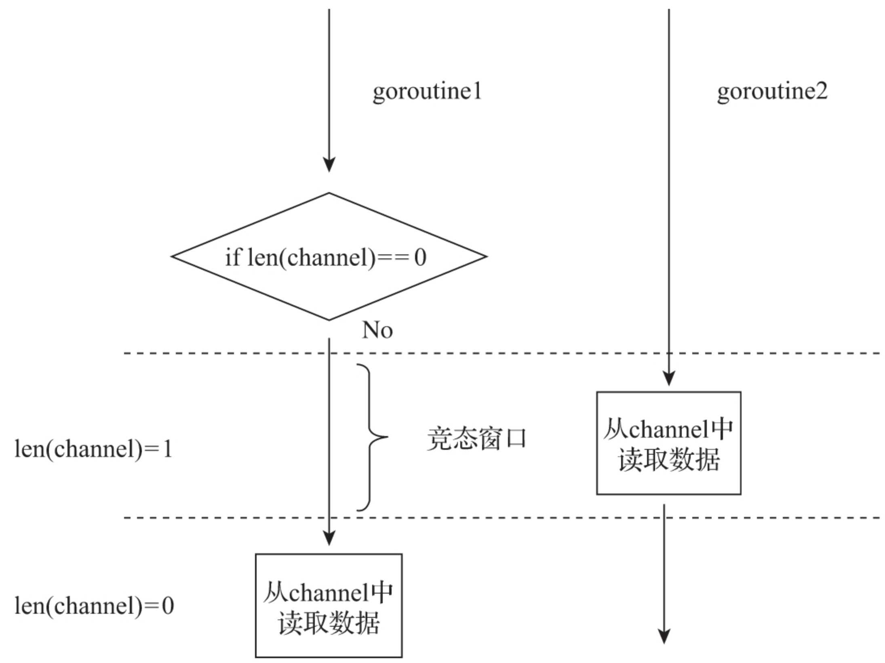

# 第34条 了解channel的妙用

channel是go语言提供的一种重要的并发原语。在Go语言的CSP模型中扮演着重要的角色：既实现goroutine间的通信，又可以实现goroutine间的同步。

channel类型在go中为“一等公民”，既可以向普通变量使用，比如：定义channel变量、为channel变量赋值，将channel作为参数传递给函数/方法，将channel作为返回值从函数/方法中返回，甚至将channel发送到其他channel中。

正是因为channel一等公民的特性，channel原语使用起来很简单：

```go
c := make(chan int)    // 创建一个无缓冲(unbuffered)的int类型的channel
c := make(chan int, 5) // 创建一个带缓冲的int类型的channel
c <- x        // 向channel c中发送一个值
<- c          // 从channel c中接收一个值
x = <- c      // 从channel c接收一个值并将其存储到变量x中
x, ok = <- c  // 从channel c接收一个值。若channel关闭了，ok将被置为false
for i := range c { ... } // 将for range与channel结合使用
close(c)      // 关闭channel c

c := make(chan chan int) // 创建一个无缓冲的chan int类型的channel
func stream(ctx context.Context, out chan<- Value) error // 将只发送(send-only) channel作为函数参数
func spawn(...) <-chan T // 将只接收(receive-only)类型channel作为返回值
```

当需要同时对多个channel进行操作时，会结合使用Go为CSP模型提供另一个原语：`select`。通过select，可以同时在多个channel上进行发送/接收操作：

```go
select {
    case x := <-c1: // 从channel c1接收数据
        ...
    case y, ok := <-c2: // 从channel c2接收数据，并根据ok值判断c2是否已经关闭
        ...
    case c3 <- z: // 将z值发送到channel c3中
        ...
    default: // 当上面case中的channel通信均无法实施时，执行该默认分支
}
```

channel和select两种原语的操作十分简单，这遵循了Go语言“**追求简单**”的设计哲学，但它们却为Go并发程序带来了强大的表达能力。下面就来看看Go并发原语channel的妙用（结合select）。

## 34.1 无缓冲channel

无缓冲channel兼具通信和同步特性，可以通过不带capacity参数的内置make函数创建一个可用的无缓冲channel：

```go
c := make(chan T) // T为channel中元素的类型
```

由于无缓冲channel的运行时层实现不带有缓冲区，因此对无缓冲channel的接收和发送操作是同步的，即对于同一个无缓冲channel，只有在对其进行接收操作的goroutine和对其进行发送操作的goroutine都存在的情况下，通信才能进行，否则单方面的操作会让对应的goroutine陷入阻塞状态。

如果一个无缓冲channel没有任何goroutine对其进行接收操作，一旦有goroutine先对其进行发送操作，那么动作发生和完成的时序如下：　　

**发送动作先发生**　

​	-> 接收动作发生（有goroutine对其进行接收操作）　　　　　

​		-> 发送动作完成/接收动作完成（先后顺序不能确定）

如果一个无缓冲channel没有任何goroutine对其进行发送操作，一旦有goroutine先对其进行接收操作，那么动作发生和完成的时序如下：

**接收动作先发生**　　　　

　-> 发送动作发生（有goroutine对其进行发送操作）　　　　　

​		-> 发送动作完成/接收动作完成（先后顺序不确定）

对于无缓冲channel而言，我们得到以下结论：

1. 发送动作一定发生在接收动作完成之前；
2. 接收动作一定发生在发送动作完成之前

因此：

```go
var c = make(chan int)
var a string

func f() {
    a = "hello, world"
    <-c
}

func main() {
    go f()
    c <- 5
    println(a)
}
/*
a输出的一定是hello world
因为main中向channel发送5，channel一定会等到接收动作开始执行才继续向下
a="hello world"一定在channel接收动作之前执行
所以a输出一定是hello world
*/
```

1. #### 用作信号传递

   1. **一对一通知信号**

      ```go
      type signal struct{}
      
      func worker() {
          println("worker is working...")
          time.Sleep(1 * time.Second)
      }
      
      func spawn(f func()) <-chan signal {
          c := make(chan signal)
          go func() {
              println("worker start to work...")
              f()
              c <- signal(truct{}{})
          }()
          return c
      }
      
      func main() {
          println("start a worker...")
          c := spawn(worker)
          <-c
          fmt.Println("worker work done!")
      }
      ```

      span函数返回的channel被用于承载新的goroutine退出的**通知信号**，该信号专用于通知main goroutine。main goroutine在调用spawn函数后一直阻塞在这个通知信号接收动作上。

      运行结果：

      ```go
      $go run go-channel-case-2.go
      start a worker...
      worker start to work...
      worker is working...
      worker work done!
      ```

   2. ##### 一对多通知信号

      ```go
      type signal struct{}
      
      func worker(i int) {
          fmt.Printf("worker %d: is working...\n", i)
          time.Sleep(1 * time.Second)
          fmt.Printf("worker %d: works done\n", i)
      }
      
      func spawnGroup(f func(i int), num int, groupSignal <-chan signal) <-chan signal {
          c := make(chan signal)
          var wg sync.WaitGroup
          
          for i := 0; i < num; i++ {
              wg.Add(1)
              go func(i int) {
                  <-groupSignal
                  fmt.Printf("worker %d: start to work...\n", i)
                  f(i)
                  wg.Done()
              }(i + 1)
          }
          
          go func() {
              wg.Wait()
              c <- signal(struct{}{})
          }()
          return c
      }
      
      func main() {
          fmt.Println("start a group of workers...")
          groupSignal := make(chan signal)
          c := spawnGroup(worker, 5, groupSignal)
          time.Sleep(5 * time.Second)
          fmt.Println("the group of workers start to work...")
          close(groupSignal)
          <-c
          fmt.Println("the group of workers work done!")
      }
      ```

      在上面的例子中，main goroutine创建了一组5个worker goroutine，这些goroutine启动后会阻塞在名为groupSignal的无缓冲channel上。main goroutine通过close(groupSignal)向所有worker goroutine广播“开始工作”的信号，所有worker goroutine在收到groupSignal后一起开始工作，就像起跑线上的运动员听到了裁判员发出的起跑信号枪声起跑一样。

      ```go
      $go run go-channel-case-3.go
      start a group of workers...
      the group of workers start to work...
      worker 3: start to work...
      worker 3: is working...
      worker 4: start to work...
      worker 4: is working...
      worker 1: start to work...
      worker 1: is working...
      worker 5: start to work...
      worker 5: is working...
      worker 2: start to work...
      worker 2: is working...
      worker 3: works done
      worker 4: works done
      worker 5: works done
      worker 1: works done
      worker 2: works done
      the group of workers work done!
      ```

      关闭一个无缓冲channel会让所有阻塞在该channel上的接收操作返回，从而实现一种**一对多的广播机制**。该一对多的信号通知机制还常用于通知一组worker goroutine退出，比如下面的例子：

      ```go
      type signal struct{}
      
      func worker(i int, quit <-chan signal) {
          fmt.Printf("worker %d: is working...\n", i)
      LOOP:
          for {
              select {
              default:
                  // 模拟worker工作
                  time.Sleep(1 * time.Second)
              case <-quit:
                  break LOOP
              }
          }
          fmt.Printf("worker %d: works done\n", i)
      }
      
      func spawnGroup(f func(int, <-chan signal), num int, groupSignal <-chan signal) <-chan signal {
          c := make(chan signal)
          var wg sync.WaitGroup
          
          for i := 0; i < num; i++ {
              wg.Add(1)
              go func(i int) {
                  fmt.Printf("worker %d: start to work...\n", i)
                  f(i, groupSignal)
                  wg.Done()
              }(i + 1)
          }
          
          go func() {
              wg.Wait()
              c <- signal(struct{}{})
          }()
          return c
      }
      
      func main() {
          fmt.Println("start a group of workers...")
          groupSignal := make(chan signal)
          c := spawnGroup(worker, 5, groupSignal)
          fmt.Println("the group of workers start to work...")
          
          time.Sleep(5 * time.Second)
          
          // 通知workers退出
          fmt.Println("notify the group of workers to exit...")
          close(groupSignal)
          <-c
          fmt.Println("the group of workers work done!")
      }
      ```

2. #### 用于替代锁

   无缓冲channel具有同步特性，这让它在某些场合可以替代锁，从而使得程序更加清晰，可读性更好。传统基于共享内存+锁模式的goroutine安全计数器实现如下：

   ```go
   type counter struct {
       sync.Mutex
       i int
   }
   
   var cter counter
   
   func Increase() int {
       cter.Lock()
       defer cter.Unlock()
       cter.i++
       return cter.i
   }
   
   func main() {
       for i := 0; i < 10; i++ {
           go func(i int) {
               v := Increase()
               fmt.Printf("goroutine-%d: current counter value is %d\n", i, v)
           }(i)
       }
       time.Sleep(5 * time.Second)
   }
   ```

   使用无缓冲channel替代锁后的实现如下：

   ```go
   type counter struct {
       c chan int
       i int
   }
   
   var cter counter
   
   func InitCounter() {
       cter = counter{
           c: make(chan int),
       }
       
       go func() {
           for {
               cter.i++
               cter.c <- cter.i
           }
       }()
       fmt.Println("counter init ok")
   }
   
   func Increase() int {
       return <-cter.c
   }
   
   func init() {
       InitCounter()
   }
   
   func main() {
       for i := 0; i < 10; i++ {
           go func(i int) {
               v := Increase()
               fmt.Printf("goroutine-%d: current counter value is %d\n", i, v)
           }(i)
       }
       time.Sleep(5 * time.Second)
   }
   ```

   在这个实现中，我们将计数器操作全部交给一个独立的goroutine处理，并通过无缓冲channel的同步阻塞特性实现计数器的控制。这样其他goroutine通过Increase函数试图增加计数器值的动作实质上就转化为一次无缓冲channel的接收动作。这种并发设计逻辑更符合Go语言所倡导的“**不要通过共享内存来通信，而应该通过通信来共享内存**”的原则

## 34.2 带缓冲channel

与无缓冲的channel不同，带缓冲channel可以通过带有capacity参数的内置make函数创建：

```go
c := make(chan T, capacity) // T为channel中元素的类型, capacity为带缓冲channel的缓冲区容量
```

由于带缓冲channel的运行时层实现带有缓冲区，因此对带缓冲channel的发送操作在缓冲区未满、接收操作在缓冲区非空的情况下是异步的（发送或接收无须阻塞等待）。也就是说，对一个带缓冲channel，在缓冲区无数据或有数据但未满的情况下，对其进行发送操作的goroutine不会阻塞；在缓冲区已满的情况下，对其进行发送操作的goroutine会阻塞；在缓冲区为空的情况下，对其进行接收操作的goroutine亦会阻塞。

1. #### 用作消息队列

   与主要用于信号/事件管道的无缓冲channel相比，可自行设置容量、异步收发的带缓冲channel更适合用作消息队列，并且带缓冲channel在数据收发性能上要好于无缓冲channel。

   1. ##### 接收单发性能基准测试

      ```go
      // 无缓冲channel
      $go test -bench . one_to_one_test.go
      goos: darwin
      goarch: amd64
      BenchmarkUnbufferedChan1To1Send-8        6202120               198 ns/op
      BenchmarkUnbufferedChan1To1Recv-8        6752820               178 ns/op
      PASS
      
      // 带缓冲channel
      $go test -bench . one_to_one_cap_10_test.go
      goos: darwin
      goarch: amd64
      BenchmarkBufferedChan1To1SendCap10-8    14397186                83.7 ns/op
      BenchmarkBufferedChan1To1RecvCap10-8    14275723                82.2 ns/op
      PASS
      
      $go test -bench . one_to_one_cap_100_test.go
      goos: darwin
      goarch: amd64
      BenchmarkBufferedChan1To1SendCap100-8   18011007                65.5 ns/op
      BenchmarkBufferedChan1To1RecvCap100-8   18031082                65.4 ns/op
      PASS
      ```

   2. ##### 多收多发性能基准测试

      ```go
      // 无缓冲channel
      $go test -bench . multi_to_multi_test.go 
      goos: darwin
      goarch: amd64
      BenchmarkUnbufferedChanNToNSend-8         317324              3793 ns/op
      BenchmarkUnbufferedChanNToNRecv-8         295288              4139 ns/op
      PASS
      
      // 带缓冲channel
      $go test -bench . multi_to_multi_cap_10_test.go 
      goos: darwin
      goarch: amd64
      BenchmarkBufferedChanNToNSendCap10-8      534625              2252 ns/op
      BenchmarkBufferedChanNToNRecvCap10-8      476221              2752 ns/op
      PASS
      
      $go test -bench .  multi_to_multi_cap_100_test.go
      goos: darwin
      goarch: amd64
      BenchmarkBufferedChanNToNSendCap100-8    1000000              1283 ns/op
      BenchmarkBufferedChanNToNRecvCap100-8    1000000              1250 ns/op
      PASS
      ```

   对于带缓冲channel而言，选择适当容量会在一定程度上提升收发性能。

2. #### 用作计数信号量

   Go并发设计的一个惯用法是将带缓冲channel用作计数信号量（counting semaphore）。带缓冲channel中的当前数据个数代表的是当前同时处于活动状态（处理业务）的goroutine的数量，而带缓冲channel的容量（capacity）代表允许同时处于活动状态的goroutine的最大数量。一个发往带缓冲channel的发送操作表示获取一个信号量槽位，而一个来自带缓冲channel的接收操作则表示释放一个信号量槽位。

   ```go
   var active = make(chan struct{}, 3)
   var jobs = make(chan int, 10)
   
   func main() {
       go func() {
           for i := 0; i < 8; i++ {
               jobs <- (i + 1)
           }
           close(jobs)
       }()
       
       var wg sync.WaitGroup
       
       for j := range jobs {
           wg.Add(1)
           go func(j int) {
               active <- struct{}{}
               log.Printf("handle job: %d\n", j)
               time.Sleep(2 * time.Second)
               <-active
               wg.Done()
           }(j)
       }
       wg.Wait()
   }
   ```

   上面的示例创建了一组goroutine来处理job，同一时间最多允许3个goroutine处于活动状态。为达成这一目标，示例使用了一个容量为3的带缓冲channel，active作为计数信号量，这意味着允许同时处于活动状态的最大goroutine数量为3。运行结果如下：

   ```go
   $go run go-channel-case-7.go 
   2020/02/04 09:57:02 handle job: 8
   2020/02/04 09:57:02 handle job: 4
   2020/02/04 09:57:02 handle job: 1
   2020/02/04 09:57:04 handle job: 2
   2020/02/04 09:57:04 handle job: 3
   2020/02/04 09:57:04 handle job: 7
   2020/02/04 09:57:06 handle job: 6
   2020/02/04 09:57:06 handle job: 5
   ```

   可以看到虽然创建了很多job，但是因为active缓冲区限制，最多只能有3个job同时运行。

3. #### len(channel)的应用

   len是Go语言原生内置函数，它可以接受数组、切片、map、字符串或channel类型的操作，并返回对应类型的“长度”—— 一个整数值。以len(s)为例：

   1. 如果s是字符串（string）类型，len(s)返回字符串中的字节数；

   2. 如果s是[n]T或*[n]T的数组类型，len(s)返回数组的长度n；

   3. 如果s是[]T的切片（slice）类型，len(s)返回切片的当前长度；

   4. 如果s是map[K]T的map类型，len(s)返回map中已定义的key的个数；

   5. 如果s是chan T类型，那么len(s)针对channel的类型不同，有如下两种语义：当s为无缓冲channel时，len(s)总是返回0；当s为带缓冲channel时，len(s)返回当前channel s中尚未被读取的元素个数。这样一来，针对带缓冲channel的len调用才是有意义的。

      但是使用len判断channel是否有值时，因为竞态窗口的存在，可能出现状态改变：

      

      goroutine1在判断需要从channel中读数据时，goroutine2已经将数据读出，因此为了解决这种场景，可以将判断与读取放在同一个事务中，使用select实现：

      ```go
       func producer(c chan<- int) {
          var i int = 1
          for {
              time.Sleep(2 * time.Second)
              ok := trySend(c, i)
              if ok {
                  fmt.Printf("[producer]: send [%d] to channel\n", i)
                  i++
                  continue
              }
              fmt.Printf("[producer]: try send [%d], but channel is full\n", i)
          }
      }
      
      func tryRecv(c <-chan int) (int, bool) {
          select {
          case i := <-c:
              return i, true
          default:
              return 0, false
          }
      }
      
      func trySend(c chan<- int, i int) bool {
          select {
          case c <- i:
              return true
          default:
              return false
          }
      }
      
      func consumer(c <-chan int) {
          for {
              i, ok := tryRecv(c)
              if !ok {
                  fmt.Println("[consumer]: try to recv from channel, but the channel is empty")
                  time.Sleep(1 * time.Second)
                  continue
              }
              fmt.Printf("[consumer]: recv [%d] from channel\n", i)
              if i >= 3 {
                  fmt.Println("[consumer]: exit")
                  return
              }
          }
      }
      
      func main() {
          c := make(chan int, 3)
          go producer(c)
          go consumer(c)
          
          select {} // 临时用来阻塞主goroutine
      }
      ```

      这样操作时必须要求判断长度之后立马跟上读取操作，会改变channel的状态，但是有时只想判断长度，不想读取数据。但目前没有一种方法可以实现这样的功能。特定场合下，只能使用len(channel)实现。但是只适用于只有一个接收者情况。

## 34.3 nil channel的妙用

没有初始化的channel(nil channel)进行读写操作将会发生阻塞，比如：

```go
func main() {
    var c chan int
    <-c
}
```

或者：

```go
func main() {
    var c chan int
    c<-1
}
```

这两种代码执行时都会报错：nil chan。

main goroutine被阻塞在channel上，导致Go运行时被认为出现deadlock状态，并抛出panic。

但nil并非一无是处，有时候妙用nil channel可以达到事半功倍的效果。如：

```go
// chapter6/sources/go-channel-case-9.go 

func main() {
    c1, c2 := make(chan int), make(chan int)
    go func() {
        time.Sleep(time.Second * 5)
        c1 <- 5
        close(c1)
    }()
    
    go func() {
        time.Sleep(time.Second * 7)
        c2 <- 7
        close(c2)
    }()
    
    var ok1, ok2 bool
    for {
        select {
        case x := <-c1:
            ok1 = true
            fmt.Println(x)
        case x := <-c2:
            ok2 = true
            fmt.Println(x)
        }
        
        if ok1 && ok2 {
            break
        }
    }
    fmt.Println("program end")
}
/*
程序输出：
5
0
0
0
... //循环输出0
7
program end
*/
```

在这个代码中，期望依次输出5和7两个数字，但是实际输出5之后，程序输出很多0才输出7并退出。程序运行过程如下：

1. 前5s，select一致处于阻塞状态
2. 第5s，c1返回一个5后被关闭，`select`语句的`case x := <-c1`被执行，程序输出5，for循环继续运行
3. c1被关闭，由于从已关闭channel接收数据将永远不被阻塞，所以新一轮select又将执行case x := <-c1。因为c1处于关闭状态，从这个channel获取数据会得到该channel类型的零值，所以取出的是0，程序一直输出0
4. 2s后，case x := <-c2倍执行，程序输出7后满足退出条件，于是程序终止。

如何改进：

```go
func main() {
    c1, c2 := make(chan int), make(chan int)
    go func() {
        time.Sleep(time.Second * 5)
        c1 <- 5
        close(c1)
    }()
    
    go func() {
        time.Sleep(time.Second * 7)
        c2 <- 7
        close(c2)
    }()
    
    for {
        select {
        case x, ok := <-c1:
            if !ok {
                c1 = nil
            } else {
                fmt.Println(x)
            }
        case x, ok := <-c2:
                if !ok {
                    c2 = nil
                } else {
                    fmt.Println(x)
                }
        }
        if c1 == nil && c2 == nil {
            break
        }
    }
    fmt.Println("program end")
}
/*
输出结果
5
7
*/
```

在c1或者c2被关闭后，显式将c1或c2置为nil。对一个**nil channel执行获取操作，该操作将被阻塞**，因此被置为nil的c1或c2的分支不再被select选中执行。

## 34.4 与select结合使用的惯用法

1. ##### 利用default分支避免阻塞

   select语句的default分支的语义是在其他分支均因通信未就绪而无法被选择的时候执行，这就为default分支赋予了一种“避免阻塞”的特性

2. ##### 实现超时机制

   ```go
   func worker() {
       select {
       case <-c:
           // ...
       case <-time.After(30 *time.Second):
           return
       }
   }
   ```

   在应用带有超时机制的select时，要特别注意timer使用后的释放，尤其是在大量创建timer时。Go语言标准库提供的timer实质上是由Go运行时自行维护的，而不是操作系统级的定时器资源。Go运行时启动了一个单独的goroutine，该goroutine执行了一个名为timerproc的函数，维护了一个“最小堆”。该goroutine会被定期唤醒并读取堆顶的timer对象，执行该timer对象对应的函数（向timer.C中发送一条数据，触发定时器），执行完毕后就会从最小堆中移除该timer对象。

   创建一个time.Timer实则就是在这个最小堆中添加一个timer对象实例，而调用timer.Stop方法则是从堆中删除对应的timer对象。作为time.Timer的使用者，我们要做的就是尽量减轻在使用Timer时对管理最小堆的goroutine和Go GC的压力，即要及时调用timer的Stop方法从最小堆中删除尚未到达过期时间的timer对象。

3. ##### 实现心跳机制

   结合time包的Ticker，可以实现带有心跳机制的select。这种机制使我们可以监听channel的同时，执行一些周期性的任务。比如：

   ```go
   func worker() {
       heartbeat := time.NewTicker(30 * time.Second)
       defer heartbeat.Stop()
       for {
           select {
           case <-c:
               // ... 处理业务逻辑
           case <- heartbeat.C:
               //... 处理心跳
           }
       }
   }
   ```

## 34.5 总结

1. channel通常要和select连用，并和for一起组成循环监听
2. 无缓冲channel只有生产和消费同时在情况下才能处理数据，否则会被阻塞
3. 使用len判断带缓冲区channel长度时可能存在误区，判断完len之后可能会被其他协程读取
4. nil channel中取数据会永远被阻塞
5. select和channel结合时语法
   1. 与default连用
   2. 设置超时时间
   3. 设置心跳机制
