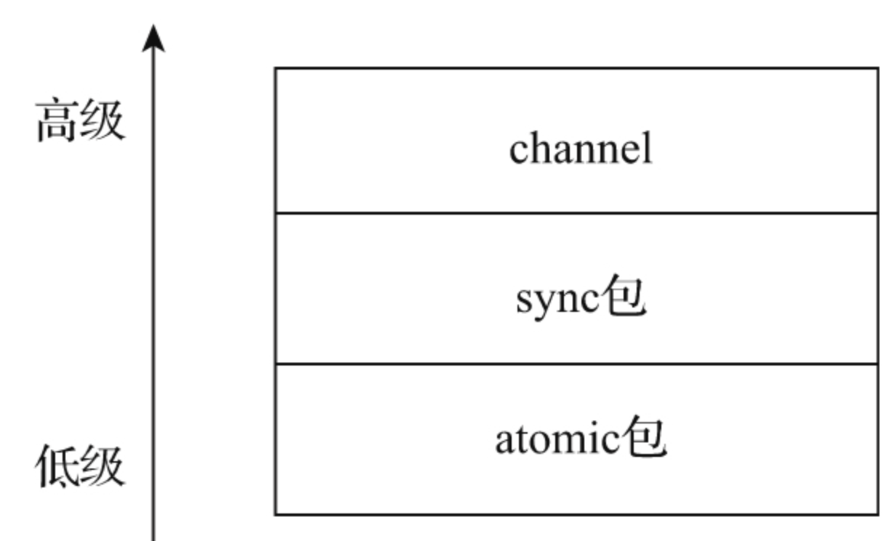

# 第36条 使用atomic包实现伸缩性更好的并发读取

## 36.1 atomic包与原子操作

atomic包是Go语言提供的原子操作（atomic operation）原语的相关接口。

原子操作由底层硬件直接提供支持，是一种硬件实现的指令级“事务”，因此相比操作系统层面和Go运行时层面提供的同步技术而言，它更为原始。atomic包封装了CPU实现的部分原子操作指令，为用户层提供体验良好的原子操作函数，因此atomic包中提供的原语更接近硬件底层，也更为低级，它常被用于实现更为高级的并发同步技术。



## 36.2 对共享整型变量的无锁读写

atomic包提供了两大类原子操作接口：一类是针对整型变量的，包括有符号整型、无符号整型以及对应的指针类型；另一类是针对自定义类型的。第一类原子操作接口的存在让atomic包天然适合于实现某一个共享整型变量的并发同步。

```go
// chapter6/sources/go-atomic-package-1_test.go 

var n1 int64

func addSyncByAtomic(delta int64) int64 {
    return atomic.AddInt64(&n1, delta)
}

func readSyncByAtomic() int64 {
    return atomic.LoadInt64(&n1)
}

var n2 int64
var rwmu sync.RWMutex

func addSyncByRWMutex(delta int64) {
    rwmu.Lock()
    n2 += delta
    rwmu.Unlock()
}

func readSyncByRWMutex() int64 {
    var n int64
    rwmu.RLock()
    n = n2
    rwmu.RUnlock()
    return n
}

func BenchmarkAddSyncByAtomic(b *testing.B) {
    b.RunParallel(func(pb *testing.PB) {
        for pb.Next() {
            addSyncByAtomic(1)
        }
    })
}

func BenchmarkReadSyncByAtomic(b *testing.B) {
    b.RunParallel(func(pb *testing.PB) {
        for pb.Next() {
            readSyncByAtomic()
        }
    })
}

func BenchmarkAddSyncByRWMutex(b *testing.B) {
    b.RunParallel(func(pb *testing.PB) {
        for pb.Next() {
            addSyncByRWMutex(1)
        }
    })
}

func BenchmarkReadSyncByRWMutex(b *testing.B) {
    b.RunParallel(func(pb *testing.PB) {
        for pb.Next() {
            readSyncByRWMutex()
        }
    })
}
```

利用原子操作的无锁并发写性能随着并发量增大保持恒定

利用原子操作的无锁并发读性能随着并发量增大有持续增长的趋势，并且性能约为读锁的200倍。

## 36.3 对共享自定义变量的无锁读写

```go
// chapter6/sources/go-atomic-package-2_test.go 

type Config struct {
    sync.RWMutex
    data string
}

func BenchmarkRWMutexSet(b *testing.B) {
    config := Config{}
    b.ReportAllocs()
    b.RunParallel(func(pb *testing.PB) {
        for pb.Next() {
            config.Lock()
            config.data = "hello"
            config.Unlock()
        }
    })
}

func BenchmarkRWMutexGet(b *testing.B) {
    config := Config{data: "hello"}
    b.ReportAllocs()
    b.RunParallel(func(pb *testing.PB) {
        for pb.Next() {
            config.RLock()
            _ = config.data
            config.RUnlock()
        }
    })
}

func BenchmarkAtomicSet(b *testing.B) {
    var config atomic.Value
    c := Config{data: "hello"}
    b.ReportAllocs()
    b.RunParallel(func(pb *testing.PB) {
        for pb.Next() {
            config.Store(c)
        }
    })
}

func BenchmarkAtomicGet(b *testing.B) {
    var config atomic.Value
    config.Store(Config{data: "hello"})
    b.ReportAllocs()
    b.RunParallel(func(pb *testing.PB) {
        for pb.Next() {
            _ = config.Load().(Config)
        }
    })
}
```

利用原子操作的无锁并发写的性能随着并发量的增大而小幅下降；

利用原子操作的无锁并发读的性能随着并发量增大有持续提升的趋势，并且性能约为读锁的100倍。

## 36.4 总结

1. 随着并发量提升，使用atomic实现的**共享变量**的并发读写性能表现更为稳定，尤其是原子读操作。这让atomic与sync包中的原语比起来表现出更好的伸缩性和更高的性能。因此，atomic包更适合一些对性能十分敏感、并发量较大且读多写少的场合。
2. 但是atomic原子操作可以同步的范围有限制，只能是一个整型变量或自定义类型变量。如果要对一个复杂的临界区数据进行同步，首选sync包中的原语。