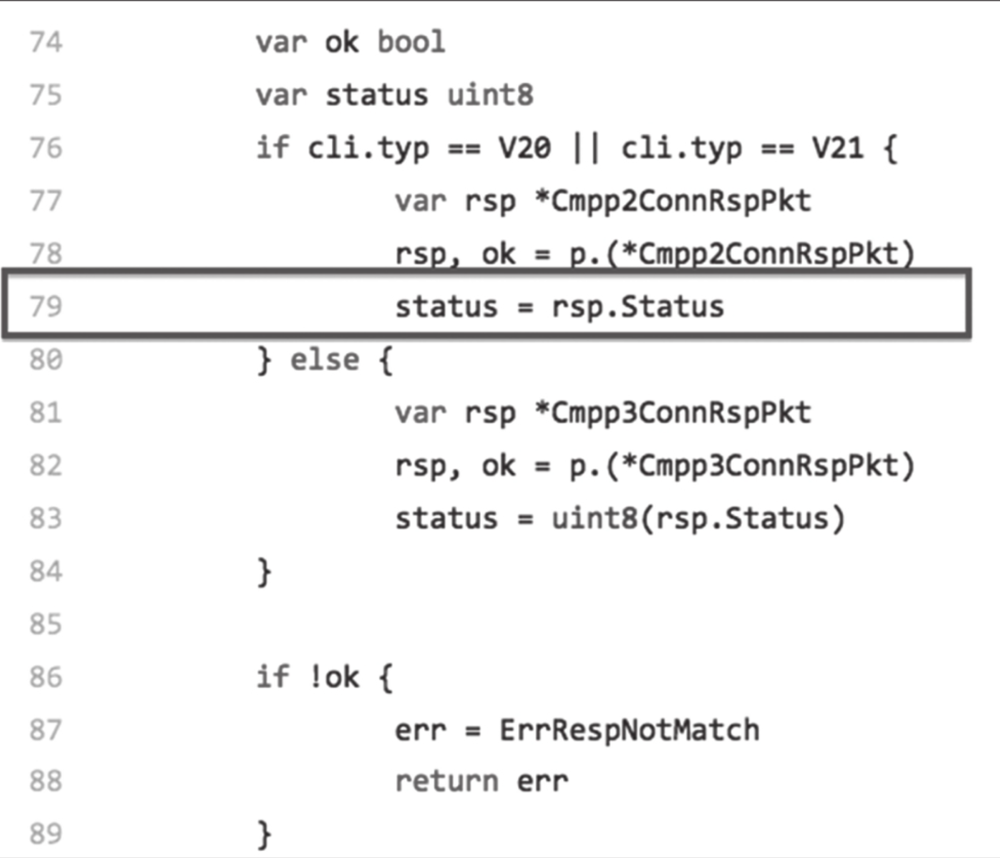

## 第39条 不要使用panic进行正常的错误处理

Go的正常错误处理与异常处理之间是泾渭分明的，Go提供了panic专门用于处理异常，但是不建议用panic进行正常的错误处理。

## 39.1 Go的panic不是java的checked exception

1. **checked exception实质是错误，而panic是异常**

   checked exception用于一些可预见的、常会发生的错误场景，异常处理是针对这些场景的**错误处理预案**。对应Go中的正常错误处理，即基于显示error模型的显示错误处理。

   而panic是一个Go内置函数，用来停止当前常规控制流并启动paniccking过程。当函数F调用panic函数时，函数F停止，已经进行求值的defer函数会正常执行，然后函数F将控制权返还给调用者。

   java中的checked exception是有意为之，而在Go中，panic是“不得已而为之”，即所有引发panic的情形，无论是显示的（主动调用）还是隐式的（Go运行时检测到违法情况而引发的），都是不期望看到的。对于引发的panic，很少有预案应对，更多的是让程序快速崩溃掉。Go中的panic更接近Java的RuntimeException+Error，而不是checked exception。

2. **API调用者没有义务处理panic**

   API的提供者不能把panic当作错误处理返回给调用方。

3. **未被捕获的panic意味着“游戏结束”**

   一旦panic没有倍捕获，它导致的不只是一个goroutine退出，而是整个Go程序的崩溃退出，因此panic不应该是用来处理正常的错误，而要使用error和多返回值的显示错误处理方式。

## 39.2 panic的典型应用

1. **充当断言角色，提示潜在bug**

   例如在标准库encoding/json包中关于panic消息的一段注释：

   ```go
   // $GOROOT/src/encoding/json/decode.go
   ...
   // 当一些本不该发生的事情导致我们结束处理时，phasePanicMsg将被用作panic消息
   // 它可以指示JSON解码器中有bug
   // 或者在解码器执行时还有其他代码正在修改数据切片
   const phasePanicMsg = "JSON decoder out of sync - data changing underfoot?"
   
   func (d *decodeState) init(data []byte) *decodeState {
       d.data = data
       d.off = 0
       d.savedError = nil
       d.errorContext.Struct = nil
   
       d.errorContext.FieldStack = d.errorContext.FieldStack[:0]
       return d
   }
   
   
   func (d *decodeState) valueQuoted() interface{} {
       switch d.opcode {
       default:
           panic(phasePanicMsg)
   
       case scanBeginArray, scanBeginObject:
           d.skip()
           d.scanNext()
   
       case scanBeginLiteral:
           v := d.literalInterface()
           switch v.(type) {
           case nil, string:
               return v
           }
       }
       return unquotedValue{}
   }
   ```

   panic充当一个类似断言的角色，去掉这行代码不会对原程序造成任何影响，但真正出问题时，开发人员旧缺少了“断言”潜在的bug提醒。Go标准库中大多数panic**充当类似断言**的作用。

2. **用于简化错误处理控制结构**

   利用panic辅助简化错误处理控制结构，让业务代码专注于业务逻辑，减少if err!=nil重复出现

   ```go
   // $GOROOT/src/fmt/scan.go
   type scanError struct {
       err error
   }
   
   func (s *ss) error(err error) {
       panic(scanError{err})
   }
   
   func (s *ss) Token(skipSpace bool, f func(rune) bool) (tok []byte, err error) {
       defer func() {
           if e := recover(); e != nil {
               if se, ok := e.(scanError); ok {
                   err = se.err
               } else {
                   panic(e)
               }
           }
       }()
       if f == nil {
           f = notSpace
       }
       s.buf = s.buf[:0]
       tok = s.token(skipSpace, f)
       return
   }
   
   func (s *ss) token(skipSpace bool, f func(rune) bool) []byte {
       if skipSpace {
           s.SkipSpace()
       }
       for {
           r := s.getRune()
           if r == eof {
               break
           }
           if !f(r) {
               s.UnreadRune()
               break
           }
           s.buf.writeRune(r)
       }
       return s.buf
   }
   
   func (s *ss) getRune() (r rune) {
       r, _, err := s.ReadRune()
       if err != nil {
           if err == io.EOF {
               return eof
           }
           s.error(err)
       }
       return
   }
   ```

3. **使用recover捕获panic，防止goroutine意外退出**

   前面提到了panic的“危害”：无论在哪个goroutine中发生未被捕获的panic，整个程序都将崩溃退出。在有些场景下我们必须抑制这种“危害”，保证程序的健壮性。

   http server就是一个典型的代表：

   ```go
   // $GOROOT/src/net/http/server.go
   func (c *conn) serve(ctx context.Context) {
      c.remoteAddr = c.rwc.RemoteAddr().String()
      ctx = context.WithValue(ctx, LocalAddrContextKey, c.rwc.LocalAddr())
      defer func() {
          if err := recover(); err != nil && err != ErrAbortHandler {
              const size = 64 << 10
              buf := make([]byte, size)
              buf = buf[:runtime.Stack(buf, false)]
              c.server.logf("http: panic serving %v: %v\n%s", c.remoteAddr, err, buf)
          }
          if !c.hijacked() {
              c.close()
              c.setState(c.rwc, StateClosed)
          }
      }()
      ...
   }
   ```

   针对每个连接，http包都会启动一个单独的goroutine运行用户传入的handler函数。如果处理某个连接的goroutine引发panic，我们需要保证应用程序本身以及处理其他连接的goroutine仍然是可正常运行的。

## 39.3 理解panic的输出信息

panic输出示例：

```go
panic: runtime error: invalid memory address or nil pointer dereference
[signal SIGSEGV: segmentation violation code=0x1 addr=0x0 pc=0x8ca449]

goroutine 266900 [running]:
pkg.tonybai.com/smspush/vendor/github.com/bigwhite/gocmpp.(*Client).Connect(0xc42040c7f0, 0xc4203d29c0, 0x11, 0xc420423256, 0x6, 0xc420423260, 0x8, 0x37e11d600, 0x0, 0x0)
        /root/.go/src/pkg.tonybai.com/smspush/vendor/github.com/bigwhite/gocmpp/client.go:79 +0x239
pkg.tonybai.com/smspush/pkg/pushd/pusher.cmpp2Login(0xc4203d29c0, 0x11, 0xc420423256, 0x6, 0xc420423260, 0x8, 0x37e11d600, 0xc4203d29c0, 0x11, 0x73)
        /root/.go/src/pkg.tonybai.com/smspush/pkg/pushd/pusher/cmpp2_handler.go:25 +0x9a
pkg.tonybai.com/smspush/pkg/pushd/pusher.newCMPP2Loop(0xc42071f800, 0x4, 0xaaecd8)
        /root/.go/src/pkg.tonybai.com/smspush/pkg/pushd/pusher/cmpp2_handler.go:65 +0x226
pkg.tonybai.com/smspush/pkg/pushd/pusher.(*tchanSession).Run(0xc42071f800, 0xaba7c3, 0x17)
        /root/.go/src/pkg.tonybai.com/smspush/pkg/pushd/pusher/session.go:52 +0x98
pkg.tonybai.com/smspush/pkg/pushd/pusher.(*gateway).addSession.func1(0xc4200881a0, 
    0xc42071f800, 0xc42040c700)
        /root/.go/src/pkg.tonybai.com/smspush/pkg/pushd/pusher/gateway.go:61 +0x11e
created by pkg.tonybai.com/smspush/pkg/pushd/pusher.(*gateway).addSession
        /root/.go/src/pkg.tonybai.com/smspush/pkg/pushd/pusher/gateway.go:58 +0x350
```

引发异常的代码：

```go
/root/.go/src/pkg.tonybai.com/smspush/vendor/github.com/bigwhite/gocmpp/client.go:79 +0x239
```



```go
gocmpp.(*Client).Connect(0xc42040c7f0, 0xc4203d29c0, 0x11, 0xc420423256, 0x6, 0xc420423260, 0x8, 0x37e11d600, 0x0, 0x0)
pusher.cmpp2Login(0xc4203d29c0, 0x11, 0xc420423256, 0x6, 0xc420423260, 0x8, 0x37e11d600, 0xc4203d29c0, 0x11, 0x73)
pusher.newCMPP2Loop(0xc42071f800, 0x4, 0xaaecd8)
```

关于发生panic后输出的栈跟踪信息（stack trace）的识别，总体可遵循以下几个要点。栈跟踪信息中每个函数/方法后面的“参数数值”个数与函数/方法原型的参数个数不是一一对应的。

栈跟踪信息中每个函数/方法后面的“参数数值”是按照函数/方法原型参数列表中从左到右的参数类型的内存布局逐一展开的，每个数值占用一个字（word，64位平台下为8字节）。

如果是方法，则第一个参数是receiver自身。

如果receiver是指针类型，则第一个参数数值就是一个指针地址；

如果是非指针的实例，则栈跟踪信息会按照其内存布局输出。

函数/方法返回值放在栈跟踪信息的“参数数值”列表的后面；如果有多个返回值，则同样按从左到右的顺序，按照返回值类型的内存布局输出。指针类型参数：占用栈跟踪信息的“参数数值”列表的一个位置；数值表示指针值，也是指针指向的对象的地址。string类型参数：由于string在内存中由两个字表示（第一个字是数据指针，第二个字是string的长度），因此在栈跟踪信息的“参数数值”列表中将占用两个位置。slice类型参数：由于slice类型在内存中由三个字表示（第一个字是数据指针，第二个字是len，第三个字是cap），因此在栈跟踪信息的“参数数值”列表中将占用三个位置。内建整型（int、rune、byte）：由于按字逐个输出，对于类型长度不足一个字的参数，会进行合并处理。比如，一个函数有5个int16类型的参数，那么在栈跟踪信息中这5个参数将占用“参数数值”列表中的两个位置：第一个位置是前4个参数的“合体”，第二个位置则是最后那个int16类型的参数值。struct类型参数：会按照struct中字段的内存布局顺序在栈跟踪信息中展开。interface类型参数：由于interface类型在内存中由两部分组成（一部分是接口类型的参数指针，另一部分是接口值的参数指针），因此interface类型参数将使用“参数数值”列表中的两个位置。栈跟踪输出的信息是在函数调用过程中的“快照”信息，因此一些输出数值虽然看似不合理，但由于其并不是最终值，问题也不一定发生在它们身上，比如返回值参数。

## 39.3 总结

1. panic是异常，属于非预期错误
2. panic异常需要捕获，不然会造成整个程序崩溃
3. panic常用于类型断言和简化代码处理结构

