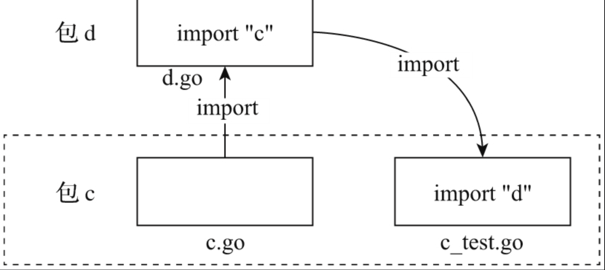

# 第40条 理解包外测试与包内测试的区别

Go语言在工具链和标准库中提供对测试的原生支持，这算是Go语言在工程实践方面的创新，也是Go相较于其他主流语言的突出亮点。

Go要求所有测试代码都存放在以*_test.go结尾的文件中。

go test命令也是通过同样的方式将包代码和包测试代码区分开的。go test将所有包目录下的*_test.go文件编译成一个临时二进制文件（可以通过go test -c显式编译出该文件），并执行该文件，后者将执行各个测试源文件中名字格式为TestXxx的函数所代表的测试用例并输出测试执行结果。

## 40.1 官方文档的自相矛盾

go包中分为**包内测试**和**包外测试**。

测试代码放在与被测代码同名的包中的测试方法称为“包内测试”，查看包内测试源码：

```go
$go list -f={{.TestGoFiles}} .
```

测试代码放在名为被测包包名+_test的包中的测试方法称为包外测试。

```go
$go list -f={{.XTestGoFiles}} .
```

## 40.2 包内测试与包外测试

1. **Go标准库中包内测试和包外测试的使用情况**

   Go语言源码中包外测试和包内测试比例不相上下，各占一半。

2. **包内测试的优势与不足**

   包内测试这种方法本质上是一种**白盒测试**方法。测试代码和被测包源码在同一包名下，测试代码可以访问该包下的所有符号，无论是导出的还是未导出的。因此追求高覆盖率时，更适合使用包内测试。

   1. **测试代码自身需要经常性的维护**

      包内测试本质意味着是一种**面向实现的测试**。测试数据构造和数据结构是紧耦合的。但包的内部实现逻辑又是易变的，优化调整是一种经常性的行为，这就意味着包内测试的测试代码需要经常性维护。

   2. **硬伤：包循环引用**

      

   

3. **包外测试（仅针对导出API的测试）**

   包外测试本质上是**面向接口的黑盒测试**。接口指测试包对外导出的API。而导出API是需要长期保持稳定，因此包外测试代码**表现出健壮的特性**，即很少随着被测代码内部实现逻辑调整而调整和维护。

   但是包外测试可能存在**测试盲区**，容易出现**被测试包的测试覆盖不足**情况。

   Go标准库的实现者提供了一个解决问题的惯用法：安插后门。即增加一个export_test.go文件文件，将不能导出的内部符号在测试阶段暴露给包外测试代码。

   ```go
   // $GOROOT/src/fmt/export_test.go
   package fmt
   
   var IsSpace = isSpace
   var Parsenum = parsenum
   ```

   或者定义一些辅助包外测试的代码：

   ```go
   // $GOROOT/src/strings/export_test.go
   package strings
   
   func (r *Replacer) Replacer() interface{} {
       r.once.Do(r.buildOnce)
       return r.r
   }
   
   func (r *Replacer) PrintTrie() string {
       r.once.Do(r.buildOnce)
       gen := r.r.(*genericReplacer)
       return gen.printNode(&gen.root, 0)
   }
   ...
   ```

4. **优先使用包外测试**

   包外测试有如下优点：

   1. 优先保证被测试包导出API的正确性；
   2. 可从用户角度验证导出API的有效性；
   3. 保持测试代码的健壮性，尽可能地降低对测试代码维护的投入；
   4. 不失灵活！可通过export_test.go这个“后门”来导出我们需要的内部符号，满足窥探包内实现逻辑的需求。

​	可以使用测试代码文件名区分所属的测试类别，如：net/http包就使用transport_internal_test.go这个名字来明确该测试文件采用包内测试的方法，而对应的transport_test.go则是一个采用包外测试的源文件。

## 40.3 总结

1. 包内测试：能提升测试覆盖率，但是可能导致包循环引用，与被测逻辑耦合度较高

2. 包外测试：只能测试接口，与代码耦合度低

3. 可以使用export_test.go为包外测试添加后门

4. 优先使用包外测试，或者使用包外结合包内测试的方法

   