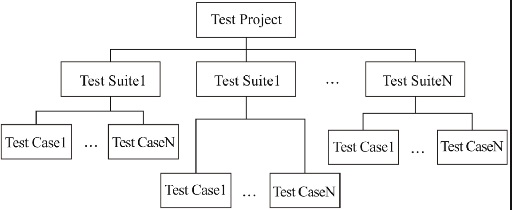
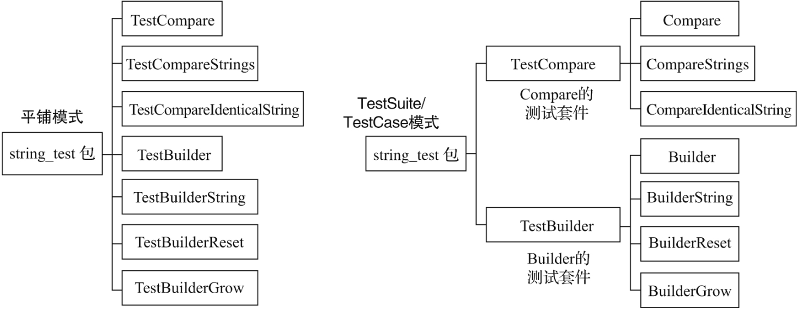
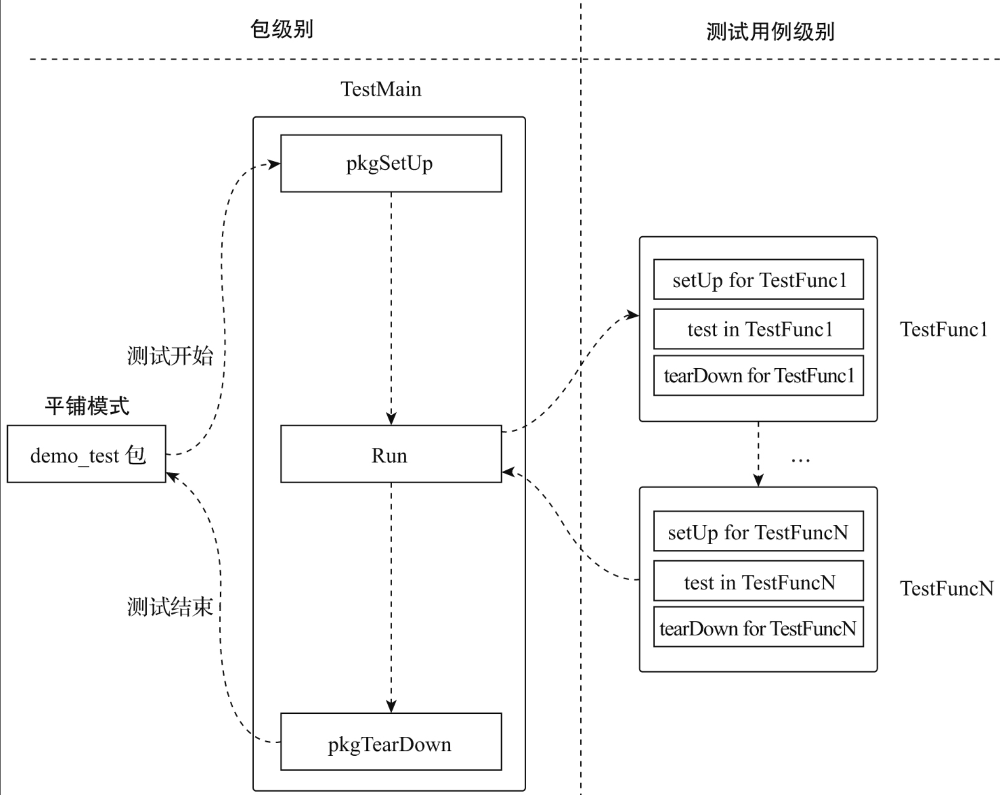
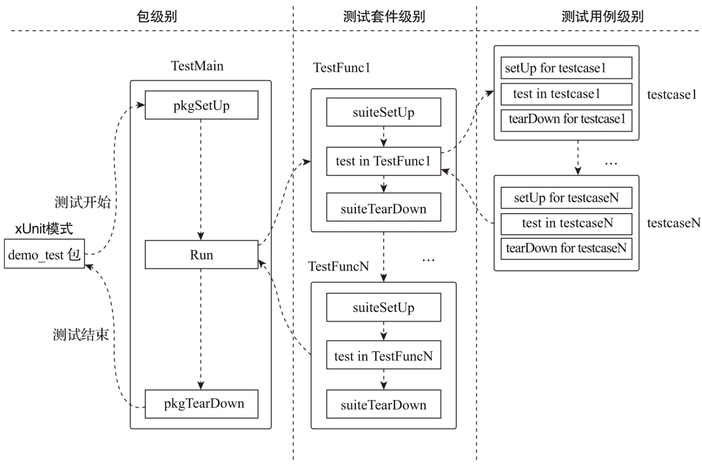

# 第41条 有层次地组织测试代码

## 41.1 经典模式 — 平铺

**所有测试代码平铺在顶层**，测试函数名称既用来区分测试，又用来关联测试。

使用go test -run可以单独执行某个方法的测试，或者go test .执行所有测试。

平铺模式的优点：

1. 简单：没有额外的抽象，上手容易

2. 独立：每个测试函数都是独立的，互不关联，避免相互干扰

   平铺型输出如下：

   ```go
   # go test -v .
   === RUN   TestCompare
   --- PASS: TestCompare (0.00s)
   === RUN   TestCompareIdenticalString
   --- PASS: TestCompareIdenticalString (0.00s)
   === RUN   TestCompareStrings
   --- PASS: TestCompareStrings (0.00s)
   === RUN   TestReader
   --- PASS: TestReader (0.00s)
   ...
   === RUN   TestEqualFold
   --- PASS: TestEqualFold (0.00s)
   === RUN   TestCount
   --- PASS: TestCount (0.00s)
   ...
   PASS
   ok    strings     0.457s
   ```

   

## 41.2 xUnit家族模式



测试代码组织以测试套件(Test Suite)和测试用例(Test Case)两个层级。一个测试工程由若干个测试套件组成，每个测试套件又包含多个测试用例。

```go
// chapter8/sources/strings-test-demo/compare_test.go
package strings_test

...

func testCompare(t *testing.T) {
    ...
}

func testCompareIdenticalString(t *testing.T) {
    ...
}

func testCompareStrings(t *testing.T) {
    ...
}

func TestCompare(t *testing.T) {
    t.Run("Compare", testCompare)
    t.Run("CompareString", testCompareStrings)
    t.Run("CompareIdenticalString", testCompareIdenticalString)
}

// chapter8/sources/strings-test-demo/builder_test.go
package strings_test

...

func testBuilder(t *testing.T) {
    ...
}
func testBuilderString(t *testing.T) {
    ...
}
func testBuilderReset(t *testing.T) {
    ...
}
func testBuilderGrow(t *testing.T) {
    ...
}

func TestBuilder(t *testing.T) {
    t.Run("TestBuilder", testBuilder)
    t.Run("TestBuilderString", testBuilderString)
    t.Run("TestBuilderReset", testBuilderReset)
    t.Run("TestBuilderGrow", testBuilderGrow)
}
```



```go
$go test -v .
=== RUN   TestBuilder
=== RUN   TestBuilder/TestBuilder
=== RUN   TestBuilder/TestBuilderString
=== RUN   TestBuilder/TestBuilderReset
=== RUN   TestBuilder/TestBuilderGrow
--- PASS: TestBuilder (0.00s)
    --- PASS: TestBuilder/TestBuilder (0.00s)
    --- PASS: TestBuilder/TestBuilderString (0.00s)
    --- PASS: TestBuilder/TestBuilderReset (0.00s)
    --- PASS: TestBuilder/TestBuilderGrow (0.00s)
=== RUN   TestCompare
=== RUN   TestCompare/Compare
=== RUN   TestCompare/CompareString
=== RUN   TestCompare/CompareIdenticalString
--- PASS: TestCompare (0.44s)
    --- PASS: TestCompare/Compare (0.00s)
    --- PASS: TestCompare/CompareString (0.44s)
    --- PASS: TestCompare/CompareIdenticalString (0.00s)
PASS
ok         strings-test-demo     0.446s
```

相对平铺模式，这种输出会更有层次感，可以一眼看出测试了哪些函数/方法。

## 41.3 测试固件

测试固件指一个**人造的、确定性的环境**，一个测试用例或一个测试套件（下的一组测试用例）在这个环境中进行测试，测试结果是可重复的（多次运行结果相同）。一般使用setUp和tearDown代表固件的创建/设置与拆除/销毁动作。

Go 1.14版本以前，一般是用：

```go
func setUp() func(){
    ...
    return func() {
    }
}

func TestXxx(t *testing.T) {
    defer setUp()()
    ...
}
```

Go 1.14版本testing包增加了testing.Cleanup方法，为测试固件的销毁提供了包级原生的支持：

```go
func setUp() func(){
    ...
    return func() {
    }
}

func TestXxx(t *testing.T) {
    t.Cleanup(setUp())
    ...
}
```

有些时候，我们需要将所有测试函数放入一个更大范围的测试固件环境中执行，这就是包级别测试固件。在Go 1.4版本以前，我们仅能在init函数中创建测试固件，而无法销毁包级别测试固件。Go 1.4版本引入了TestMain，使得包级别测试固件的创建和销毁终于有了正式的施展舞台。

```go
// chapter8/sources/classic_package_level_testfixture_test.go
package demo_test

...
func setUp(testName string) func() {
    fmt.Printf("\tsetUp fixture for %s\n", testName)
    return func() {
        fmt.Printf("\ttearDown fixture for %s\n", testName)
    }
}

func TestFunc1(t *testing.T) {
    t.Cleanup(setUp(t.Name()))
    fmt.Printf("\tExecute test: %s\n", t.Name())
}

func TestFunc2(t *testing.T) {
    t.Cleanup(setUp(t.Name()))
    fmt.Printf("\tExecute test: %s\n", t.Name())
}

func TestFunc3(t *testing.T) {
    t.Cleanup(setUp(t.Name()))
    fmt.Printf("\tExecute test: %s\n", t.Name())
}

func pkgSetUp(pkgName string) func() {
    fmt.Printf("package SetUp fixture for %s\n", pkgName)
    return func() {
        fmt.Printf("package TearDown fixture for %s\n", pkgName)
    }
}

func TestMain(m *testing.M) {
    defer pkgSetUp("package demo_test")()
    m.Run()
}
```

在所有测试函数运行之前，包级别测试固件被创建，在所有函数运行完毕之后，包级别测试固件被销毁。



如果测试固件相同时，为每个测试函数都单独创建/销毁测试固件显得有些重复和冗余，此时可以用：

```go
// chapter8/sources/xunit_suite_level_testfixture_test.go
package demo_test

...
func suiteSetUp(suiteName string) func() {
    fmt.Printf("\tsetUp fixture for suite %s\n", suiteName)
    return func() {
        fmt.Printf("\ttearDown fixture for suite %s\n", suiteName)
    }
}

func func1TestCase1(t *testing.T) {
    fmt.Printf("\t\tExecute test: %s\n", t.Name())
}

func func1TestCase2(t *testing.T) {
    fmt.Printf("\t\tExecute test: %s\n", t.Name())
}

func func1TestCase3(t *testing.T) {
    fmt.Printf("\t\tExecute test: %s\n", t.Name())
}

func TestFunc1(t *testing.T) {
    t.Cleanup(suiteSetUp(t.Name()))
    t.Run("testcase1", func1TestCase1)
    t.Run("testcase2", func1TestCase2)
    t.Run("testcase3", func1TestCase3)
}

func func2TestCase1(t *testing.T) {
    fmt.Printf("\t\tExecute test: %s\n", t.Name())
}

func func2TestCase2(t *testing.T) {
    fmt.Printf("\t\tExecute test: %s\n", t.Name())
}

func func2TestCase3(t *testing.T) {
    fmt.Printf("\t\tExecute test: %s\n", t.Name())
}

func TestFunc2(t *testing.T) {
    t.Cleanup(suiteSetUp(t.Name()))
    t.Run("testcase1", func2TestCase1)
    t.Run("testcase2", func2TestCase2)
    t.Run("testcase3", func2TestCase3)
}

func pkgSetUp(pkgName string) func() {
    fmt.Printf("package SetUp fixture for %s\n", pkgName)
    return func() {
        fmt.Printf("package TearDown fixture for %s\n", pkgName)
    }
}

func TestMain(m *testing.M) {
    defer pkgSetUp("package demo_test")()
    m.Run()
}
```

将对测试固件需求相同的一组测试用例放在一个测试套件中，针对测试套件创建和销毁测试固件。



## 41.4 总结

1. 测试代码一般会有两种格式：平铺型和xUnit型
2. 平铺型指将所有代码进行平铺，比较容易分别每个测试代码的作用，适合少量测试代码场景
3. xUnit型是将测试代码分为不同的测试构件，每个测试构件中分为多种case
4. 测试固件是一般使用setUp和tearDown方法创建和销毁