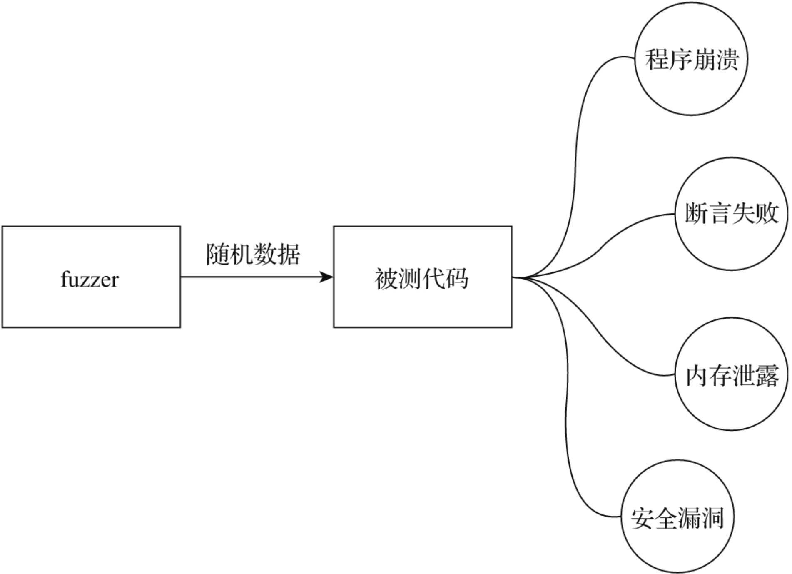

# 第45条 使用模糊测试让潜在bug无处遁形

**模糊测试：指半自动或自动地为程序提供非法的、非预期、随机的数据，并监控程序在这些输入数据下是否会崩溃、内置断言失败、内存泄露、安全漏洞等情况。**



在Go 1.5版本发布的同时，前英特尔黑带级工程师、现谷歌工程师Dmitry Vyukov发布了Go语言模糊测试工具go-fuzz。在GopherCon 2015技术大会上，Dmitry Vyukov在其名为“Go Dynamic Tools”的主题演讲中着重介绍了go-fuzz。

## 45.1 模糊测试在挖掘Go代码的潜在bug中的作用

go-fuzz工具让Gopher具备了在Go语言中为被测代码建立模糊测试的条件.

Dmitry Vyukov使用go-fuzz对当时（2015年）的Go标准库以及其他第三方开源库进行了模糊测试并取得了惊人的战果：

```go
// 60个测试
60 tests

// 在Go标准库中发现137个bug(70个已经修复)
137 bugs in std lib (70 fixed)

// 在其他项目中发现165个bug
165 elsewhere (47 in gccgo, 30 in golang.org/x, 42 in freetype-go, protobuf, http2,
    bson)
```

## 45.2 go-fuzz的初步工作原理

go-fuzz的工作流程如下：

1. 生成随机数据
2. 将上述数据作为输入传递给被测程序
3. 观察是否有崩溃记录（crash），如果发现崩溃记录，则说明找到了潜在的bug

开发者可以根据crash记录确认和修复bug。

go-fuzz采用的是代码覆盖率引导的**fuzzing算法**。go-fuzz运行起来后将进入一个死循环，该循环中的逻辑的伪代码大致如下：

```go
// go-fuzz-build在构建用于go-fuzz的二进制文件(*.zip)的过程中
// 在被测对象代码中埋入用于统计代码覆盖率的桩代码及其他信息
Instrument program for code coverage

Collect initial corpus of inputs  // 收集初始输入数据语料(位于工作路径下的corpus目录下)
for {
    // 从corpus中读取语料并做随机变化
    Randomly mutate an input from the corpus

    // 执行Fuzz，收集代码覆盖率数据
    Execute and collect coverage

    // 如果输入数据提供了新的代码覆盖率，则将该输入数据存入语料库(corpus)
    If the input gives new coverage, add it to corpus
}
```

go-fuzz的核心**是对语料库的输入数据如何进行变化**。go-fuzz内部使用两种对语料库的输入数据进行变化的方法**：突变（mutation）和改写（versify）**。

**常见的突变策略如下**：

1. 插入/删除/重复/复制随机范围的随机字节
2. 位反转
3. 交换2字节
4. 将一个字节设置为随机值
5. 从一个byte/unit6/unit32/unit 64中添加/减去
6. 将一个byte/uint16/uint32替换为另一个值；
7. 将一个ASCII数字替换为另一个数字；
8. 拼接另一个输入；
9. 插入其他输入的一部分；
10. 插入字符串/整数字面值；
11. 替换为字符串/整数字面值

例如演进序列可能是：

```go
""
"", "A"
"", "A", "AB"
"", "A", "AB", "ABC"
"", "A", "AB", "ABC", "ABCD"
```

**改写是比较先进的高级方法**，它会学习文本的结构，对输入进行简单分析，识别出输入语料数据中各个部分的类型，比如数字、字母数字、列表、引用等，然后针对不同部分运用突变策略。

如原语料库：

```
`<item name="foo"><prop name="price">100</prop></item>`
```

改写方法后的输入数据例子：

```go
<item name="rb54ana"><item name="foo"><prop name="price"></prop><prop/></item>
    </item>
<item name=""><prop name="price">=</prop><prop/> </item>
<item name=""><prop F="">-026023767521520230564132665e0333302100</prop><prop/>
    </item>
<item SN="foo_P"><prop name="_G_nx">510</prop><prop name="vC">-9e-07036514
    </prop></item>
<item name="foo"><prop name="c8">prop name="p"</prop>/}<prop name=" price">01e-6
    </prop></item>
<item name="foo"><item name="foo"><prop JY="">100</prop></item>8<prop/></item>
```

## 45.3 go-fuzz使用方法

1. #### 安装go-fuzz

   ```go
   $ go get github.com/dvyukov/go-fuzz/go-fuzz
   $ go get github.com/dvyukov/go-fuzz/go-fuzz-build
   ```

   go get会自动将两个工具安装到$GOROOT/bin或$GOPATH/bin下。

2. ### 带有模糊测试的项目组织

   假设待测试的Go包为foo，包源文件路径为$GOPATH/src/github.com/bigwhite/fuzzexamples/foo。为了应用go-fuzz为包foo建立模糊测试，我们一般会在foo下创建fuzz.go源文件，其内容模板如下：

   ```go
   // +build gofuzz
   
   package foo
   
   func Fuzz(data []byte) int {
       ...
   }
   ```

   go-fuzz-build在构建用于go-fuzz命令输入的二进制文件时，会搜索带有“+build gofuzz”指示符的Go源文件以及其中的Fuzz函数。如果foo包下没有这样的文件，在执行go-fuzz-build时，你会得到类似如下的错误日志：

   ```go
   $go-fuzz-build github.com/bigwhite/fuzzexamples/foo
   failed to execute go build: exit status 2
   $go-fuzz-main
   /var/folders/2h/xr2tmnxx6qxc4w4w13m01fsh0000gn/T/go-fuzz-build641745751/src/go-fuzz-main/main.go:10: undefined: foo.Fuzz
   ```

   有时候，待测试包的包内功能很多，一个Fuzz函数不够用，可以在fuzztest下建立多个目录来应对。

   ```go
   github.com/bigwhite/fuzzexamples/foo/fuzztest]$tree
   .
   ├── fuzz1
   │   ├── corpus
   │   ├── fuzz.go
   │   └── gen
   │       └── main.go
   └── fuzz2
       ├── corpus
       ├── fuzz.go
       └── gen
           └── main.go
    ...
   ```

   其中的fuzz1，fuzz2，fuzzN各自为一个go-fuzz单元，如果要应用go-fuzz，则可以：

   ```go
   $ cd fuzz1
   $ go-fuzz-build github.com/bigwhite/fuzzexamples/foo/fuzztest/fuzz1
   $ go-fuzz -bin=./foo-fuzz.zip -workdir=./
   
   ...
   
   $ cd fuzz2
   $ go-fuzz-build github.com/bigwhite/fuzzexamples/foo/fuzztest/fuzz2
   $ go-fuzz -bin=./foo-fuzz.zip -workdir=./
   ```

   每个go-fuzz测试单元下有一套“固定”的目录组合。以fuzz1目录为例：

   ```go
   ├── fuzz1
   │   ├── corpus
   │   ├── fuzz.go
   │   └── gen
   │       └── main.go
   ```

   其中：

   1. corpus为存放输入数据语料的目录，在go-fuzz执行之前，可以放入初始语料；
   2. fuzz.go为包含Fuzz函数的源码文件；
   3. gen目录中包含手工生成初始语料的main.go代码。

3. ### go-fuzz-build

   go-fuzz-build会根据Fuzz函数构建一个用于go-fuzz执行的zip包（PACKAGENAME-fuzz.zip），包里包含了用途不同的三个文件：

   ```go
   cover.exe metadata sonar.exe
   ```

   这三个二进制程序的功能分别如下。

   1. cover.exe：被注入了代码测试覆盖率桩设施的二进制文件
   2. sonar.exe：被注入了sonar统计桩设施的二进制文件
   3. metadata：包含代码覆盖率统计、sonar的元数据以及一些整型、字符串字面值。

4. ### 执行go-fuzz

   一旦生成了foo-fuzz.zip，就可以针对fuzz1的模糊测试：

   ```go
   $cd fuzz1
   $go-fuzz -bin=./foo-fuzz.zip -workdir=./
   2019/12/08 17:51:48 workers: 4, corpus: 8 (1s ago), crashers: 0, restarts: 1/0, execs: 0 (0/sec), cover: 0, uptime: 3s
   2019/12/08 17:51:51 workers: 4, corpus: 9 (2s ago), crashers: 0, restarts: 1/3851, execs: 11553 (1924/sec), cover: 143, uptime: 6s
   2019/12/08 17:51:54 workers: 4, corpus: 9 (5s ago), crashers: 0, restarts: 1/3979, execs: 47756 (5305/sec), cover: 143, uptime: 9s
   ...
   ```

   go-fuzz执行时是一个无限循环，上面的测试需要手动停下来。go-fuzz会在指定的workdir中创建另两个目录：crashers和suppressions。顾名思义，crashers中存放的是代码崩溃时的相关信息，包括引起崩溃的输入用例的二进制数据、输入数据的字符串形式（xxx.quoted）以及基于这个数据的输出数据（xxx.output）。suppressions目录中则保存着崩溃时的栈跟踪信息，方便开发人员快速定位bug。

## 45.6 让模糊测试成为“一等公民”

当前Go官方尚未把模糊测试当成“一等公民”来对待，即还没有在Go工具链上原生支持模糊测试，模糊测试在Go中的应用还仅限于使用第三方的go-fuzz或谷歌开源的gofuzz。

但当前的go- fuzz等工具实现存在一些无法理解的问题，比如：

1. go-fuzz模仿Go工具构建逻辑，一旦Go原生工具构建逻辑发生变化，就会导致go-fuzz-build不断损坏；
2. go-fuzz-build无法处理cgo，很难实现；
3. 目前的代码覆盖率工具（coverage）是通过在源码中插入桩代码实现的，这使其很难与其他构建系统（build system）集成；
4. 基于从源码到源码的转换无法处理所有情况，并且转换功能有限，某些代码模式可能会处理不当或导致构建失败；
5. 使用从源码到源码转换的方法产生的代码运行很慢。

## 45.7 总结

模糊测试具有提升Go代码质量、挖掘潜在bug的重要作用。但模糊测试不是“银弹”，具有其适用的范围。模糊测试最适合那些处理复杂输入数据的程序，比如文件格式解析、网络协议解析、人机交互界面入口等。模糊测试是软件测试技术的一个重要分支，与单元测试等互为补充，相辅相成。

