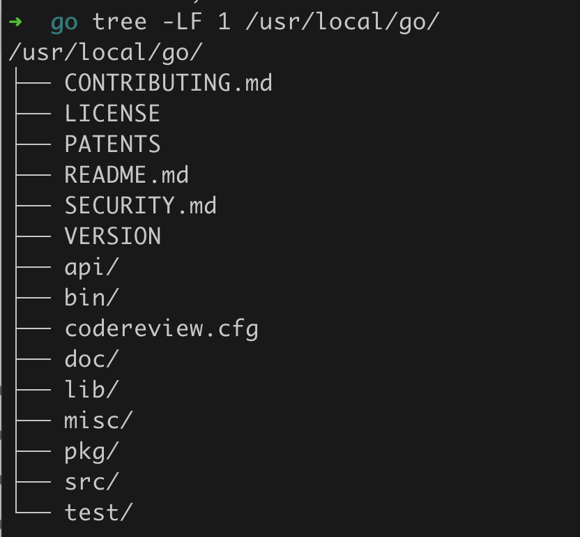
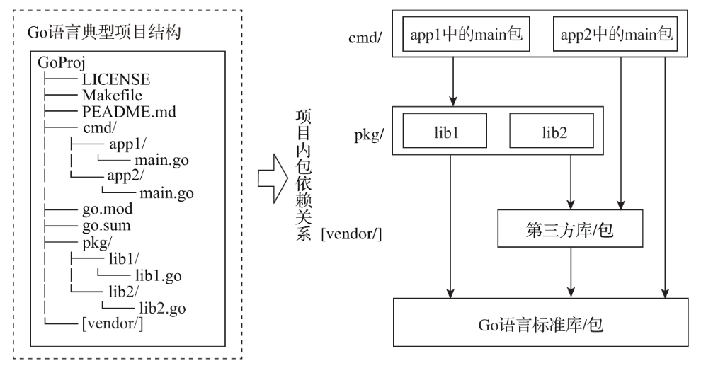
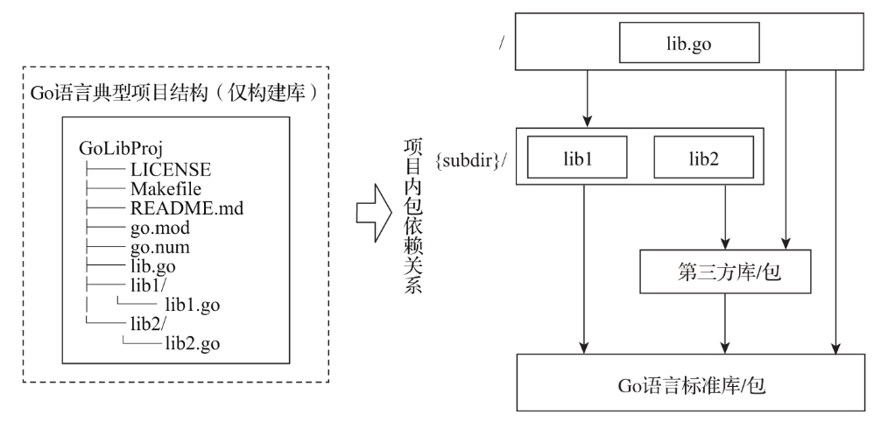
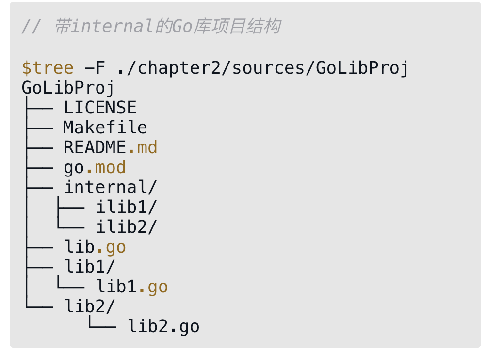

# 第5条 使用的到公认且广泛使用的项目结构

我们在编写实用程序或库时，都会遇到采用什么样的项目结构（project structure）的问题。在Go语言中，项目结构十分重要，因为它决定了项目内部包的布局及包依赖关系是否合理，同时还会影响到外部项目对该项目中包的依赖与引用。

## 5.1 Go项目的项目结构

先看Go语言自身的项目结构：



有三个特点：

1. 代码构建的脚本源文件放在src下面的顶层目录中
2. src下的二级目录cmd下面存放着Go工具链相关的可执行文件（比如go、gofmt等）的主目录以及他们的main包源文件
3. src下的二级目录pkg下面存放着上面cmd下各工具链程序依赖的包、Go运行时以及Go标准库的源文件。(1.4版本删除了pkg这一层级目录，改为直接使用src/xxx)

## 5.2 Go语言典型项目结构

1. Go项目结构的最小标准布局

   Go语言官方一直没有给出Go项目的标准布局是什么样的。不过Go语言项目的技术负责人Russ Cox在一个开源项目的issue中给出了他关于Go项目结构的最小标准布局[1]的想法。他认为Go项目的最小标准布局应该是这样的：

   ```go
   go.mod
   LICENSE
   xx.go
   yy.go
   ```

   或

   ```go
   go.mod
   LICENSE
   package1
   	-package1.go
   package2
   	-package2.go
   ```

   pkg、cmd、docs这些目录不应该成为Go项目标准结构的一部分，至少不是必需的。最小标准布局与Go一贯崇尚的“简单”哲学设计一脉相承，这个布局很灵活，可以满足各种项目的需求

2. 以构建二进制可执行文件为目的的Go项目结构

   

   ​		cmd目录：存放编译之后的二进制文件

   ​		pkg目录：存放项目自身要使用并且同样也是可执行文件对应main包要依赖的库文件。

   ​		Makefile：这里的MakeFile代表第三方构建工具所用的脚本

   ​		go.mod和go.sum：Go语言包依赖管理使用的配置文件。Go1.16版本之后成为默认的依赖包管理和构建机制。

   ​		vendor目录（可选）：vendor是Go 1.5版本引入的用于在项目本地缓存特定版本依赖包的机制

3. 以只构建库为目的的Go项目结构

   

   去除了cmd和pkg两个子目录：由于仅构建库，没必要保留存放二进制文件main包源文件的cmd目录；由于Go库项目的初衷一般都是对外部（开源或组织内部公开）暴露API，因此也没有必要将其单独聚合到pkg目录下面了。

   vendor不再是可选目录：对于库类型项目而言，不推荐在项目中放置vendor目录去缓存库自身的第三方依赖，库项目仅通过go.mod（或其他包依赖管理工具的manifest文件）明确表述出该项目依赖的模块或包以及版本要求即可。

4. 关于internel目录

   

   根据Go internal机制的作用原理，internal目录下的ilib1、ilib2可以被以GoLibProj目录为根目录的其他目录下的代码（比如lib.go、lib1/lib1.go等）所导入和使用，但是却不可以为GoLibProj目录以外的代码所使用，从而实现选择性地暴露API包。当然internal也可以放在项目结构中的任一目录层级中，关键是项目结构设计人员明确哪些要暴露到外层代码，哪些仅用于同级目录或子目录中。

5. 总结

   以上两个针对构建二进制可执行文件类型以及库类型的项目参考结构是Go社区在多年实践后得到公认且使用较为广泛的项目结构，并且它们与Russ Cox提出的Go项目最小标准布局是兼容的，对于稍大型的Go项目来说很有参考价值。但并不是必需的。


