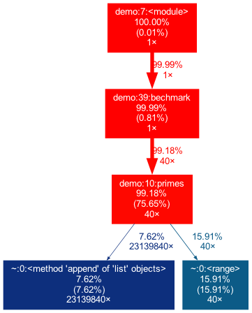

## 分析python程序CPU使用率案例

1. 用到工具

   1. cProfile
   2. line_profiler
   3. pprofile
   4. vprof

2. 示例代码

   ```python
   import time
   
   def primes(n):
       if n == 2:
           return [2]
       elif n < 2:
           return []
       s = []
       for i in range(3, n + 1):
           if i % 2 != 0:
               s.append(i)
       mront = n ** 0.5
       half = (n + 1) / 2 - 1
       i = 0
       m = 3
       while m <= mront:
           if s[i]:
               j = (m * m - 3) / 2
               s[j] = 0
               while j < half:
                   s[j] = 0
                   j += m
           i = i + 1
           m = 2 * i + 3
       l = [2]
       for x in s:
           if x:
               l.append(x)
       return l
   
   
   def bechmark():
       start = time.time()
       count = 0
       for _ in xrange(40):
           count = len(primes(1000000))
       end = time.time()
       print "BechMark duration %r seconds, count:%r" %(end- start, count)
   
   if __name__ == '__main__':
       bechmark()
   ```

3. cProfile

   1. 安装：python自带

   2. 使用：python -m cProfile demo.py

   3. 运行结果分析

      1. 结果参数说明：
         1. ncalls：执行次数
         2. tottime：执行耗时
         3. percall：平均每次执行耗时
         4. cumtime：在此函数以及子函数执行期间的耗时
         5. percall：cumtime/ncalls
         6. filename:lineno：文件名和函数名

   4. 运行结果示例

      ```
      BechMark duration 19.009029865264893 seconds, count:78498
               23139965 function calls in 19.010 seconds
      
         Ordered by: standard name
         
         ncalls  tottime  percall  cumtime  percall filename:lineno(function)
             40   14.327    0.358   18.846    0.471 demo.py:10(primes)
              1    0.163    0.163   19.009   19.009 demo.py:39(bechmark)
              1    0.001    0.001   19.010   19.010 demo.py:7(<module>)
             40    0.000    0.000    0.000    0.000 {len}
       23139840    1.418    0.000    1.418    0.000 {method 'append' of 'list' objects}
              1    0.000    0.000    0.000    0.000 {method 'disable' of '_lsprof.Profiler' objects}
             40    3.101    0.078    3.101    0.078 {range}
              2    0.000    0.000    0.000    0.000 {time.time}
      ```

   5. 将运行结果可视化展示：

      1. 需要安装graphviz，mac安装：

         ```shell
         # 更新brew
         brew update 
         # 安装依赖
         brew install harfbuzz 
         # 安装graphviz
         brew install graphviz
         # 安装gprof2dot
         pip install gprof2dot
         ```

      2. 使用：

         ```
         # 将执行结果导出到文件
         python -m cProfile -o output.pstats demo.py
         # 根据根据文件生成图片
         gprof2dot -f pstats output.pstats | dot -Tpng -o output.png
         ```

      3. 分析结果

         

      4. ​	其他示例：

         ```
         import cProfile
         import re
         cProfile.run('re.compile("foo|bar")', 'restats')
         ```

      5. 调用参数说明

         1. -o：将执行结果写入到文件中，而不是显示在控制台
         2. -s：指定排序值方式以对输出进行排序。
         3. `python -m cProfile [-o output_file] [-s sort_order] myscript.py`

