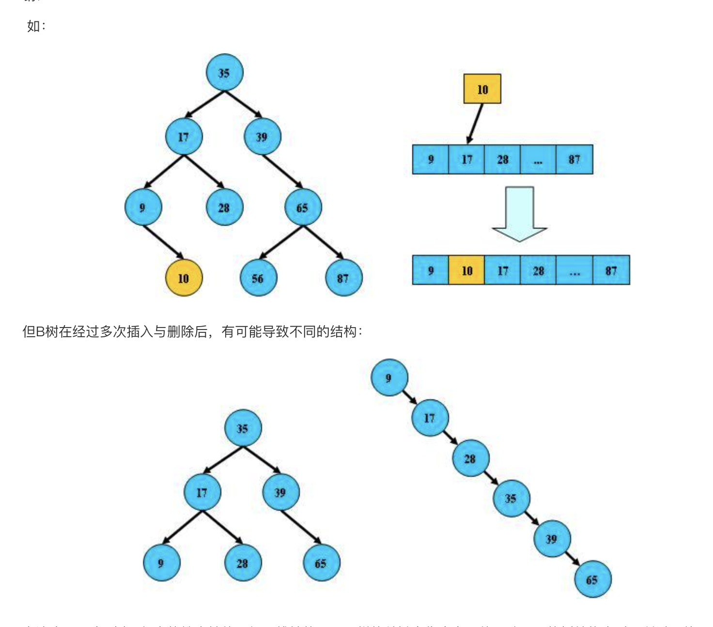
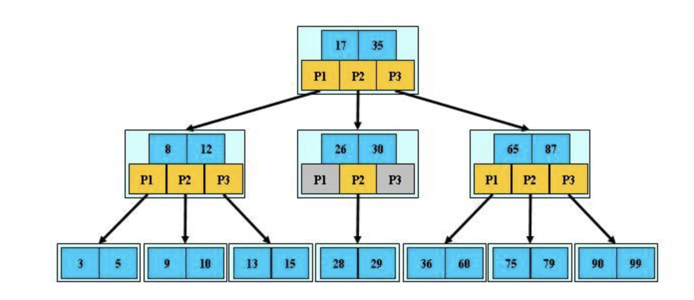
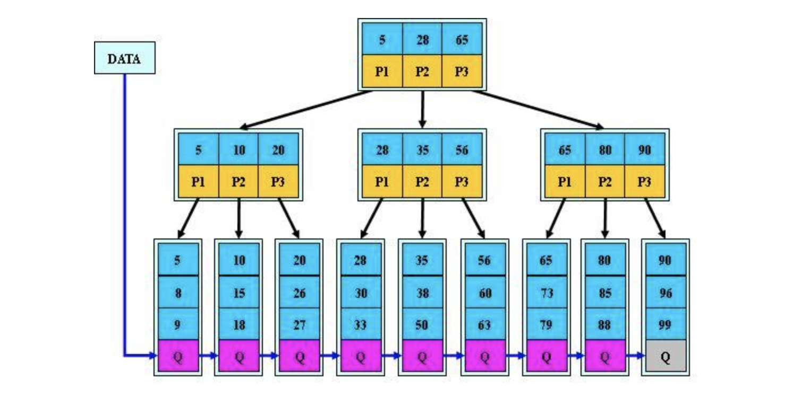
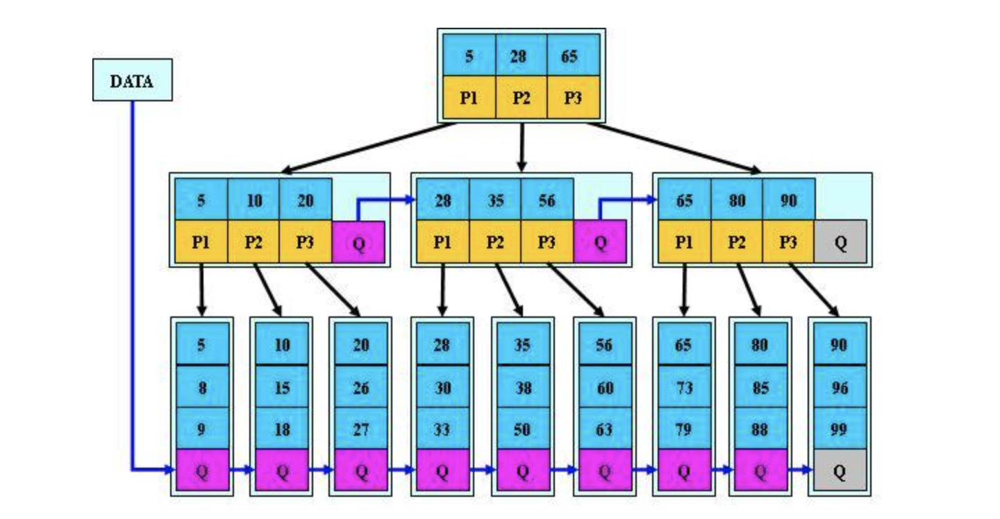

#### 1、Mysql索引联合索引，联合索引不生效怎么办

>1.索引失效分析工具：使用explain命令加在要分析的sql语句前面，在执行结果中查看key这一列的值，如果为NULL，说明没有使用索引。
>
>索引失效的场景：
>
>1. or语句前后没有同时使用索引。当or左右查询字段只有一个是索引，该索引失效，只有当or左右查询字段均为索引时，才会生效。
>2. 复合索引未使用左列索引，即不是使用第一列索引，索引失效。
>3. like以%开头，当like前缀没有%，后缀有%时，索引有效; 
>4. 需要类型转换; （比如在一个int字段中使用字符串进行查询，或者在varchar字段中使用int进行查询）
>5. where中索引列有运算，或者索引列使用了函数;（比如在查询name时使用LENGTH方法）
>6. where中在索引字段上使用not，<>，!=。（不等于操作符是永远不会用到索引的，因此对它的处理只会产生全表扫描。key<>0 改为 key>0 or key<0。）不等于操作符是永远不会用到索引的，因此对它的处理只会产生全表扫描。优化方法：key<>0 改为 key>0 or key<0。
>7. 如果mysql觉得全表扫描更快时（数据少）;
>8. 在索引列上使用 IS NULL 或 IS NOT NULL操作。
>
>（索引是不索引空值的，所以这样的操作不能使用索引，可以用其他的办法处理，例如：数字类型，判断大于0，字符串类型设置一个默认值，判断是否等于默认值即可。）

#### 2、分库分表设计怎么保证id的唯一

> 雪花算法、自增数据库控制

#### 3、redis过期删除的策略

>volatile-lru：从已设置过期时间的数据集（server.db[i].expires中挑选最近最少使用的数据淘汰。
>
>allkeys-lru：从数据集（server.db[i].dict）中挑选最少使用的数据淘汰。
>
>volatle-ttl：从已设置过期时间的数据集（server.db[i].expires）中挑选将要过期的数据淘汰。
>
>volatle-lru ：从已设置过期时间的数据集（server.db[i].expires）中挑选最近使用次数最少的数据淘汰。
>
>allkeys-lfu：从数据集（server.db[i].dict）中挑选最近使用次数最少的数据淘汰。
>
>volatile-random：从已设置过期时间的数据集(server.db[i].expires)中任意选择数据淘汰。
>
>allkeys-random：从数据集（server.db[i].dict）中任意选择数据淘汰

#### 4、redis的hash结构的key跟value都有哪些数据类型

>key为string
>
>field为string
>
>value也为string

#### 5、mysql事务的隔离级别

>1. 读未提交：该事务中读取了其他事务未提交的数据，导致使用了脏数据。没有视图的概念。可能会导致脏读、幻读、不可重复读问题。
>2. 读已提交：一个事务修改了数据且成功提交事务后，才可查询到更新后的数据。读提交隔离时开始执行SQL时创建视图。
>3. 可重复读：一个事务在执行过程中查询到的数据，总是与该事务启动时看到的数据是一致的。未提交变更对其他事务也是不可见的。可重复读视图是在事务启动时创建的，整个事务期间都使用这个视图。
>4. 串行化：对于同一行记录，写会加写锁。当出现读写锁冲突的时候，后访问的事务必须等前一个事务执行完成，才能继续执行。串行化直接使用加锁的方式来避免并行访问。

#### 6、脏读、幻读产生的场景

>##### 脏读（Dirty Read）
>
>脏读是指一个事务读取了另一个未提交事务中的数据。这种情况下，读取到的数据可能是不一致的，因为未提交的事务可能会被回滚。
>
>**场景**：
>
>假设有两个事务T1和T2。
>
>1. 事务T1读取某行数据。
>2. 事务T2修改了这行数据并执行了更新操作，但尚未提交。
>3. 事务T1再次读取这行数据。
>
>在这种情况下，事务T1读取到了事务T2未提交的数据，即脏读。
>
>##### 幻读（Phantom Read）
>
>幻读是指在一个事务内，多次查询同一范围的数据，但由于其他事务的插入或删除操作，导致每次查询结果集的数量不同。
>
>**场景**：
>
>假设有两个事务T1和T2。
>
>1. 事务T1查询某个范围内的数据，得到结果集A。
>2. 事务T2在这个范围内插入了一条新记录。
>3. 事务T1再次查询这个范围内的数据，得到结果集B。

#### 7、python代码怎么提升if，else的效率

>使用字典映射

#### 8、python代码怎么进行测试

>单元测试：unitest，pytest

#### 9、python2跟python3的区别

>1. python2 print是一个方法，py3是一个类
>2. py2.6中对format方法有严格限制，必须使用下标
>3. py2中除法使用的是地板除，比如5/2得到的是2。py3中得到的是2.5
>4. py3默认编码是utf8，py2中使用utf8编码时需要显示指出
>5. 2.x raise语句使用逗号将抛出对象类型和参数分开，3.x取消了这种奇葩的写法，直接调用构造函数抛出对象即可，只有继承自BaseException的对象才可以被抛出。
>6. py3中移除了<>表示不等于的写法
>7. py3中移除了long类型，只有int类型
>8. py3中的字典的keys、values、items方法返回的是迭代器。py2中返回的是列表。
>9. six库中有很多兼容py2和py3的库

#### 10、python的数据类型怎么存储的，哪些可变跟不可变

>不可变：数字、字符串、元组
>
>可变：列表、集合、字典

#### 11、单点登录原理

>1. 用户访问系统1的受保护资源，系统1发现用户未登录，跳转至sso认证中心，并将自己的地址作为参数 
>2. sso认证中心发现用户未登录，将用户引导至登录页面 
>3. 用户输入用户名密码提交登录申请 
>4. sso认证中心校验用户信息，创建用户与sso认证中心之间的会话，称为全局会话，同时创建授权

#### 12、linux中查看端口占用，查看进程资源占用，哪些是close状态

>1. lsof -i:端口或netstat -anp | grep 端口号
>2. netstat -nulpt查看所有端口使用情况
>3. ps -ef

#### 13、常用的linux命令

>top、ps、netstat、ls、cat、cd、vim、

#### 14、GIL全局解释器锁

>GIL使得对象模型都是可以并发访问。GIL全局解释器锁解决多线程之间数据完整性和状态同步的问题，但是这个锁在同一时刻只有一个线程在运行，所以在多核的情况下也只能发挥出单核的性能,多线程依旧像是单线程的运行

#### 15、抓包工具

>tcpdump

#### 16、代码的异常怎么处理

>try、catch

#### 17、用过哪些orm框架，怎么实现的

>peewee、sql_alchemy、底层基于pymysql

#### 18、怎么查看sql的索引命中情况

>explain语句
>
>`EXPLAIN`语句的输出结果包含以下列：
>
>- **id**：查询的标识符，用于区分嵌套查询。
>- **select_type**：查询类型，如`SIMPLE`、`PRIMARY`、`SUBQUERY`等。
>- **table**：查询涉及的表。
>- **type**：连接类型，如`ALL`、`index`、`range`等。
>- **possible_keys**：可能使用的索引。
>- **key**：实际使用的索引。
>- **key_len**：使用的索引长度。
>- **ref**：使用的索引列。
>- **rows**：预计扫描的行数。
>- **filtered**：按表条件过滤的行数的百分比。
>- **Extra**：其他信息，如`Using where`、`Using index`等
>
>**Extra列**：
>
>`EXPLAIN`语句的`Extra`列提供的信息有助于了解查询的执行过程和性能状况
>
>1. **Using index**：查询使用了覆盖索引，即查询所需的所有列都包含在索引中，不需要回表查询。这是最佳的情况，因为它避免了回表查询，提高了查询性能。
>2. **Distinct**：查询使用了`DISTINCT`关键字，用于去除结果集中的重复行。这种情况通常发生在需要去重的查询中。
>3. **Using where**：查询使用了`WHERE`子句来过滤结果集。这是正常的查询情况，表明查询使用了条件过滤。
>4. **Using filesort**：表示查询需要对结果集进行排序，但是无法使用索引来完成排序，因此需要进行额外的排序操作。这种情况可能会导致性能下降。
>5. **Using temporary**：表示查询需要创建临时表来存储中间结果，通常发生在分组（`GROUP BY`）、排序（`ORDER BY`）或连接（`JOIN`）操作中。这种情况可能会导致性能下降。
>6. **Using join buffer (Block Nested Loop)**：表示查询使用了连接缓冲区来进行嵌套循环连接（Nested Loop Join）。这种情况可能会导致性能下降。
>7. **Range checked for each Record (index map: #)**：表示查询没有使用索引，而是对每条记录进行了范围检查。这种情况通常发生在查询条件涉及到非等值比较（如`>`, `<`, `>=`, `<=`）时，可能会导致性能下降。
>8. **Not exists**：表示查询使用了子查询，并且子查询使用了`NOT EXISTS`关键字。这种情况可能会导致性能下降。
>9. **Impossible where**：表示查询的`WHERE`子句永远为假，因此查询不会返回任何结果。这种情况表明查询存在问题，需要优化。
>10. **Select tables optimized away**：表示查询中的某些表由于没有满足条件的记录而被优化掉，不需要进行查询。这种情况表明查询已经得到了优化。
>11. **Using sort_union(...), sort_intersection(...)**：表示查询使用了集合操作（如`UNION`、`INTERSECT`），需要对结果集进行排序。这种情况可能会导致性能下降。

#### 19、[B树跟B+的区别。](https://cloud.tencent.com/developer/article/1021946?from=article.detail.1729255)

>B树，即二叉搜索树。
>
>1. 所有非叶子结点至多拥有两个儿子（left和right）
>2. 所有节点存储一个关键字
>3. 非叶子结点的左指针指向小于其关键字的子树，右指针指向大于其关键字的子树。
>
>B树的搜索从根节点开始，如果查询的关键字与节点的关键字相等，那么命中；如果比节点小，则进入左分支。如果B树所有非叶子结点的左右子树节点树木均保持差不多（平衡），那么B树的查找频率逼近二分查找。但B树在经过多次插入删除后，有可能导致不同的结构，实际使用的B树是在原B树的基础上加上平衡算法，即平衡二叉树.

>B-树：是一种多路搜索树
>
>1. 定义任意非叶子结点最多只有M个儿子，且M>2。
>2. 根节点的儿子数为[2,M]
>3. 除根节点以外的非叶子结点儿子数为[M/2,M]
>4. 每个节点存放至少M/2-1（向上取整）和至多M-1个关键字；至少(2个关键字)
>5. 非叶子结点的关键字:[k1]，[k2]，...k[M-1]；且k[i]<k[i+1]
>6. 非叶子结点的关键字：k[1]，p[2],...,P[M]；其中p[1]指向关键字小于k[1]的子树，P[M]指向关键字大于k[M-1]的子树，其它P[i]指向关键字属于(K[i-1], K[i])的子树；
>7. 所有叶子结点位于同一层；如（M=3）

>B-树的搜索从根节点开始，对节点内的关键字（有序）序列进行二分查找，如果命中则结束，否则进入查询关键字所属范围的儿子节点；重复直到所对应的儿子指针为空，或已经是叶子结点。
>
>B-树的特性：
>
>1. 关键字集合分布在整颗树中
>2. 任何一个关键字出现且只出现在一个节点中
>3. 搜索有可能在非叶子结点结束
>4. 其搜索性能等价于在关键字全集内做一次二分查找
>5. 自动层次控制
>
>由于限制了除根节点以外的非叶子结点，至少含有M/2个儿子，确保了节点的至少利用率，底层搜索性能为Olong2N。B-树的性能总是等价于二分查找，也就没有B树平衡的问题。由于M/2的限制，在插入节点时，如果节点已满，需要将节点分裂为两个各占M/2的节点，删除节点时，需将两个不足M/2的兄弟节点合并。

>B+树是B-树的变体，也是一种多路搜索树；
>
>1. 其定义基本与B-树相同
>2. 非叶子结点的子树指针与关键字个数相同
>3. 非叶子结点的子树指针P[i]，指向关键字属于[K[i],K[i+1]]的子树，B-树是开区间
>4. 为所有叶子结点增加一个链指针
>5. 所有关键字都在叶子结点出现。

>B+树搜索也与B-树基本相同，区别是B+树只有达到叶子结点才命中（B-树可以在非叶子结点命中），其性能也等价于在关键字全集做一次二分查找；
>
>B+树特性：
>
>1. 所有关键字都出现在叶子结点的链表中（稠密索引），且链表中的关键字恰好是有序的。
>2. 不可能在非叶子结点命中
>3. 非叶子结点相当于叶子结点的索引（稀疏索引），叶子结点相当于存储（关键字）数据的数据层
>4. 更适合文件索引系统

>B*树
>
>是B+树的变体，在B+树的非根与非叶子结点再增加指向兄弟的指针。

B*树定义了非叶子结点关键字个数至少为(2/3)*M，即块的最低使用率为2/3（代替B+树的1/2）；

​    **B+树的分裂：**

　　当一个结点满时，分配一个新的结点，并将原结点中1/2的数据复制到新结点，最后在父结点中增加新结点的指针；

　　B+树的分裂只影响原结点和父结点，而不会影响兄弟结点，所以它不需要指向兄弟的指针；

 **B\*树的分裂**：

　　当一个结点满时，如果它的下一个兄弟结点未满，那么将一部分数据移到兄弟结点中，再在原结点插入关键字，最后修改父结点中兄弟结点的关键字（因为兄弟结点的关键字范围改变了）；

　　如果兄弟也满了，则在原结点与兄弟结点之间增加新结点，并各复制1/3的数据到新结点，最后在父结点增加新结点的指针；

所以，B*树分配新结点的概率比B+树要低，空间使用率更高；

**小结**

 **B树：**二叉树，每个结点只存储一个关键字，等于则命中，小于走左结点，大于走右结点；

 **B-树：**多路搜索树，每个结点存储M/2到M个关键字，非叶子结点存储指向关键字范围的子结点；所有关键字在整颗树中出现，且只出现一次，非叶子结点可以命中；

  **B+树：**在B-树基础上，为叶子结点增加链表指针，所有关键字都在叶子结点中出现，非叶子结点作为叶子结点的索引；B+树总是到叶子结点才命中；

 **B\*树：**在B+树基础上，为非叶子结点也增加链表指针，将结点的最低利用率从1/2提高到2/3；
