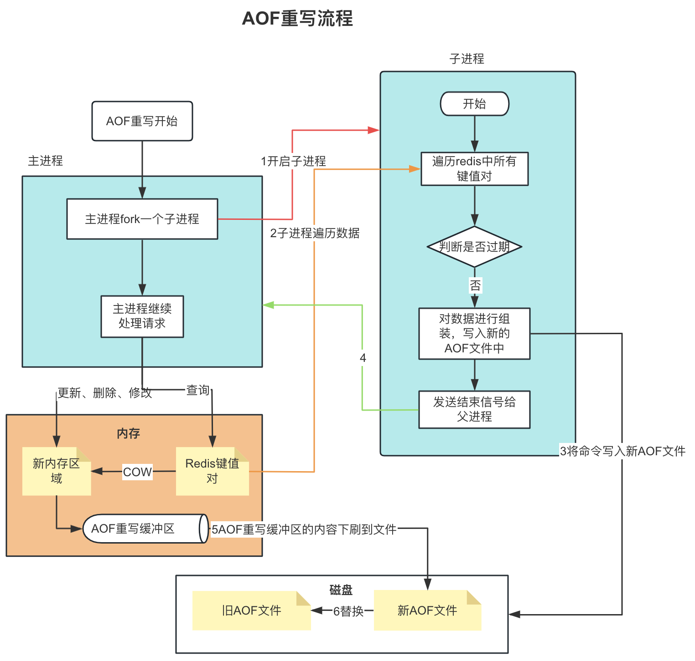

# Redis持久化方式

## RDB持久化

1. ### RDB持久化介绍

   1. #### 什么是RDB持久化？

      >Redis是内存型数据库，将数据状态存储在内存中，如果不将数据保存在磁盘中，一旦服务器进程退出，数据就会出现不可用情况，为了解决这个问题，Redis提供了RDB持久化功能，这个功能可以将Redis在内存中的数据库状态保存进磁盘中，避免数据丢失。
      >
      >RDB：Redis Database
      >
      >RDB可以手动执行也可以根据服务器配置自动执行，持久化功能生成的RDB文件是一个经过压缩的二进制文件，通过该文件可以还原生成RDB文件时数据库状态。

   2. #### RDB文件生成方式

      1.  **SAVE**：阻塞主进程，RDB文件创建完成之后主进程才能处理其他请求，不推荐使用

      1. **BGSAVE**：主进程fork一个子进程之后，子进程创建RDB文件，主进程继续处理其他请求

   3. #### RDB文件

      1. 是一个经过压缩二进制文件，保存Redis某一时刻状态，可以通过该文件还原Redis当时状态。

2. ### RDB文件创建和载入

   1. #### 创建

      1. ##### 手动通过save命令或bgsave命令可以生成Redis RDB文件

      2. ##### 设置自动保存间隔，服务器每隔一段时间自动执行BGSAVE命令，生成RDB文件，可以在配置文件中指定以下配置设置自动保存时间

         >save 900 1         # 900秒内对数据库至少做了1次修改
         >save 300 10       # 300秒内对数据库至少做了10次修改
         >save 60 10000   # 60s内对数据库至少做了10000次

      3. ##### redis如何实现隔一段时间自动保存？

         1. `saveparams`数组：保存所有RDB保存间隔，周期性操作函数默认100ms遍历一次所有的保存策略判断是否符合
         2. `dirty`计数器：Redis会在内存中维护一个dirty计数器，记录距离上次成功执行save命令或者bgsave命令之后服务器对数据库状态做了多少次修改（写入、删除、更新等操作）
         3. `lastsave`时间戳：记录上一次执行save或bgsave的时间

      4. ##### RDB文件创建流程

         

   2. #### 载入

      1. ##### Redis启动时，如果检测到RDB文件会自动载入，但是如果同时开启了AOF功能，则优先使用AOF文件进行数据还原。

      2. ##### Redis在载入RDB文件时，进程会一直阻塞，载入完成后才能处理其他请求

         

         

3. ### RDB文件结构

   1. #### 常规结构，由五部分组成

      

   2. #### databases部分

      1. RDB文件的databases部分可以保存任意多个非空数据库，例如如果db 0跟db 1为非空数据库，则RDB文件格式为，database 0表示db 0中的所有键值对数据，database 3表示db 3中的所有键值对数据

         

      2. 整体构成

         

      3. TYPE的类型

         1. REDIS_RDB_TYPE_STRING
         2. REDIS_RDB_TYPE_LIST
         3. REDIS_RDB_TYPE_SET
         4. REDIS_RDB_TYPE_ZSET
         5. REDIS_RDB_TYPE_HASH
         6. REDIS_RDB_TYPE_LIST_ZIPLIST
         7. REDIS_RDB_TYPE_INTSET
         8. REDIS_RDB_TYPE_ZSET_ZIPLIST
         9. REDIS_RDB_TYPE_HASH_ZIPLIST

      4. value的内容

         1. 字符串对象：由len和string组成，len表示字符串的长度，string表示字符串的值。

         2. 列表对象：由list_length和items组成，list_length表示列表的长度，items由若干个字符串对象组成，例如一个长度为["app"]的列表，组成为1,3,"app"。

         3. 集合：由set_size和elems组成，set_size表示集合的大小，elems表示集合的元素。

         4. 哈希对象：由hash_size和key_value_pair组成

            

         5. 有序集合：由storted_set_size、member、socre组成，member是一个字符串对象，其中score表示分值，是一个double类型浮点数，Redis在保存RDB文件时会先将score转换为string，再使用string方式进行保存，例如：

            
         
         6. 整数集合：将整数集合转换为字符串对象，然后将字符串对象保存进RDB文件
         
         7. ZIPLIST：将压缩列表转换为字符串对象，然后将字符串对象保存进RDB文件

## AOF持久化

1. ### 什么是AOF持久化

   1. #### AOF持久化介绍

      >append-of-file，将对数据的修改(创建、更新、删除)命令保存在AOF缓冲区中，并定期下刷到磁盘文件中，用于redis进程重启时恢复数据

   2. #### 追加方式

      >AOF持久化功能打开时，服务器每执行完一个写命令后，会以协议格式将被执行的写命令追加到服务器状态的aof_buf缓冲区末尾。并通过策略下刷到AOF文件中。

   3. #### 命令下刷到磁盘方式由appendfsync选项决定

      1. `always`：每条命令都下刷到磁盘，对性能影响最大
      2. `one sec`：每秒将缓冲区的内容下刷到磁盘，由另外的线程操作
      3. `no`：从不主动同步，由操作系统决定合适同步

2. ### AOF文件格式

   >*2     # 2 个参数
   >$6     # 第一个参数长度为6
   >SELECT # 第一个参数
   >$1     # 第二参数长度为1
   >8      # 第二参数
   >*3     # 3 个参数
   >$3     # 第一个参数长度为3
   >SET    # 第一个参数
   >$4     # 第二参数长度为4
   >name   # 第二个参数
   >$4     # 第三个参数长度为4
   >Jhon   # 第二参数长度为4

3. ### AOF文件重写

   1. #### AOF文件重写介绍

      >AOF文件使用命令追加的方式记录数据库状态，随着操作命令增多，AOF文件体积越来越大，为了避免AOF文件过大，影响Redis性能和数据恢复速度，Redis提供了AOF文件重写功能，通过该功能，redis可以创建一个新的AOF文件取代旧的AOF文件，新的AOF文件会将对key的多次操作合并为1个，两个AOF文件记录的数据库状态相同，但是大小会减少很多。
      >
      >虽然名为AOF重写，但是实际并不是将原来的AOF文件读出，再进行内容合并，而是基于当前数据库的状态，重新生成一个新的AOF文件。

   2. #### 触发时机

      1. ##### AOF文件大小超过预设阈值

         > AOF文件大小超过配置文件中设置的阈值(`auto-aof-rewrite-min-size`)以及增长率(`auto-aof-rewrite-percentage`)时，Redis会触发AOF重写。

      2. ##### 手动触发

         > 用户可以通过发送`BGREWRITEAOF`命令来手动触发AOF重写，这在AOF文件过大时，可以帮助减小文件大小，提高Redis性能

   3. #### 重写流程

      

      1. ##### 重写过程中的命令处理

         >AOF文件重写过程中有新的修改命令时的处理流程：
         >
         >1.执行修改命令
         >
         >2.命令发送到AOF缓冲区
         >
         >3.命令发送到AOF重写缓冲区

4. ### AOF文件载入过程

   

## 两种持久化方式的优缺点

1. ### RDB

   1. 在两次RDB持久化之间的修改的数据存在丢失的风险。根据数据写入频率和查询频率分为两种场景：
      1. 写多查少：会更频繁触发redis持久化，并且因为COW机制，RDB持久化时占用的内存空间会增多，服务一直处于高内存占用状态。
      2. 查多写少：推荐使用RDB持久化

2. ### AOF

   1. 在AOF缓冲区下刷到AOF前redis server宕机时数据有丢失的风险
   2. 三种下刷方式的区别
      1. always：每条命令都下刷，数据安全性最高
      2. one sec：每秒下刷一次，数据丢失时可能丢掉某一秒的数据
      3. no：两次间隔之间的数据可能丢失
   3. 缺点
      1. 在AOF文件重写过程中，需要同时使用AOF缓冲区和AOF重写缓冲区，会占用很大内存空间
      2. AOF重写这段时间AOF缓冲区和AOF重写缓冲区命令基本一致，但是要落盘两次
      3. AOF重写过程中，主进程要把增量数据发送给子进程，子进程循环读取pipe中主进程发送的增量数据，然后追加到AOF临时文件，占用CPU资源
      4. 子进程重写完成后，主进程还需要检查缓冲区内容是否全部写入，如果没全部写入时，还需要主进程将数据追加到AOF文件中，占用CPU资源

3. ### 结论

   1. 两种持久化方式都存在各自的缺点，至今还没有完美的解决办法可以同时兼顾落盘一致性和高qps使用

   2. 阿里云解决办法：https://developer.aliyun.com/article/866957

      1. 简而言之：将AOF文件分为多个子AOF文件

         1. BASE：基础AOF，由子进程重写AOF文件时产生，文件只会有一个

         2. INCR：增量AOF，AOFRW开始执行时创建，可能存在多个

         3. HISTORY：历史AOF文件，AOFRW成功完成时，本次AOFRW之前的所有BASE和INCR AOF都变为HISTORY。

            

   3. AWS解决办法

      >AWS MemoryDB的思路是基于类似Aurora的共享存储概念，把日志存放在远端共享存储中，同时内存中仍然保留Redis原有的结构。通过这种方式提升数据的持久化一致性，同时也保证了数据读取的延时和吞吐；而缺点则同样因为日志保存在远端，写入性能严重下降（仅有ElastiCache也即Redis社区版的15%~25%，该数据来自AWS官方评测，见本文末尾参考资料）。在主备一致性上，由于直接采取日志的物理复制，所以主备一致性近似接近落盘一致性。
      >
      >原来AOF rewrite这种压缩（compaction）引起的开销也因为在远端做掉而规避掉，因此是一种很彻底的云原生解法。

## 问题

1. COW是什么：COPY-ON-WRITE写时复制，表示Redis在生成RDB文件或者AOF重写时，子进程不会立即复制父进程所有数据，而只有在对某一部分内存做修改时才会复制该内存页，一般是4kb为单位进行复制。

2. RDB文件损坏还会不会载入：RDB载入时会先把除了校验值部分所有的数据载入内存中，然后判断载入的数据的校验和是否跟文件中记录的校验和相等，如果相等表示文件是正常文件，如果不想等表示是异常RDB文件，不会再进行载入。

3. BGSAVE和BGREWRITEAOF执行过程关系

   >1. 如果BGSAVE命令正在执行、又发送了新的BGSAVE命令，第二个BGSAVE命令会被拒绝。
   >2. 如果BGSAVE命令正在执行，发送了BGREWRITEAOF命令，BGREWRITEAOF命令会延迟到BGSAVE命令执行完成之后执行
   >3. 如果BGREWRITEAOF正在执行，发送了BGSAVE命令，BGSAVE命令会被服务器拒绝

   