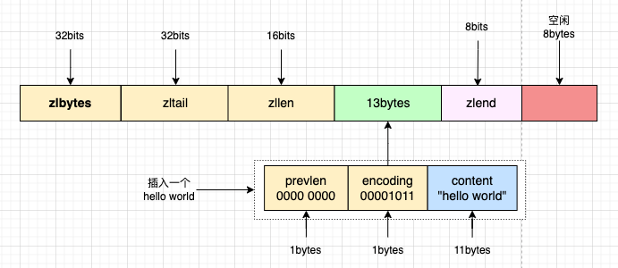

# Redis中的数据结构

Redis作为一种内存型数据库，需要充分利用内存，所以针对不同的键类型设置合适的底层数据结构至关重要，通过本篇文章可以了解到Redis常用类型的底层数据结构底层实现原理，对Redis底层数据结构有更清晰的认知。

# 1.分享收获

在日常使用中我们可能对上层实现的数据结构操作很熟悉，但是对底层的数据结构实现却知之甚少，希望通过本篇文章可以了解到Redis常用类型的底层数据结构实现和特性。

# 2.Redis基础数据类型

## 2.1基础类型

1. **string**：简单k:v结构，存储字符串，常用于分布式锁、限频等。
2. **list**：**k: [v1, v2, v3]**结构，存储数据标签、或用作队列等。
3. **hash**：**{ k: {field: v1}** 结构，}存储某类具有相似特征的数据，如告警中云盘信息，某个仓库下的云盘等。
4. **set**：**{v1, v2, v3**}集合结构， 存储需要去重的数据，比如记录每天用户的留存量等。
5. **sortd** **set**：**{v1: score1, v2: score2}**有序集合，相比set多了元素的score信息，方便对数据排序，求top n，或者使用time作为分数实现范围查询。

## 2.2复杂类型

1. **bitmap：**存储bit类型数据，一般用于批量统计如考勤场景使用。
2. **pub/sub：**消息队列，通过广播方式发送消息，不支持持久化。
3. **stream：**5.0版本以后新引入的消息队列，支持持久化，支持按照offset消费数据，类似kafka。
4. **Boolean Filter：**一般用于判断某个元素是否存在，应用于缓存穿透。
5. **Geo：**地理坐标数据**。**
6. …

## 2.3redis数据结构总览


1. redis整体为一个大的**redisServer**，其中redisDB *db数组中保存所有的数据库
   1. db中的每个元素为**redisDB**结构，结构中包含一个***dict**指针，指向存储数据的dict。
   2. dict结构中包含4个元素
      1. **dictType \*type**：*type指向dictType类型指针，保存了操作特定类型键的函数，如销毁、复制、对比等函数
      2. **void \*privadata**：保存了需要传给特定类型函数的值
      3. **dictht ht[2]**：hash表数组，正常状态下只有ht[0]存放数据，rehash状态过程中两个hash表都会存放数据，由四部分组成：
         1. ***table**：存放具体数据的数组，数组中由多个dictEntry组成
            1. ***dictEntry**：hash表节点数组，每个hash表节点中可能有多个元素，多个元素使用单向链表连接
               1. 单个dictEntry结构体由key和value组成，其中key用于存储redis的键指针，value存储值指针，通常所说的redis的数据类型实际是指value的类型。key和value都指向一个redisObject。
               2. redisObject存放数据的类型和数据存放指针，由三部分组成：type(string、list、set等类型编码)、encoding(底层使用的数据结构编码)、ptr(指向底层存储具体数据的指针)
         2. **size**：hash表中hash槽的个数
         3. **sizemask**：hash表掩码，用于计算某个键存储在hash表的哪个槽时使用。总等于size-1，因为size是一个2的n次幂值，sizemask的2进制数据所有位都为1，此时用另一个值取**and**之后总得到一个0～sizemask的值(很多文档中讲这里是取余计算某个key在hash表中的位置，源码中实际取and，按位与的时间复杂度更低一些)。
         4. **used**：已经使用的hash槽的个数
      4. **rehashidx**：表示是否处于rehash过程，通常情况为-1，开始rehash时为0
2. **Redis Object的encoding分类**

| **编码常量**            | **对应的底层数据结构**  |
| ----------------------- | ----------------------- |
| OBJ_ENCODING_INT        | int类型整数             |
| OBJ_ENCODING_EMBSTR     | emb编码的简单动态字符串 |
| OBJ_ENCODING_RAW        | 简单动态字符串          |
| OBJ_ENCODING_HT         | 哈希表                  |
| OBJ_ENCODING_LINKEDLIST | 双向链表                |
| OBJ_ENCODING_ZIPLIST    | 压缩列表                |
| OBJ_ENCODING_INTSET     | 整数集合                |
| OBJ_ENCODING_SKIPLIST   | 跳跃表和字典            |
| OBJ_ENCODING_QUICKLIST  | quicklist               |
| OBJ_ENCODING_LISTPACK   | listpack                |

## 2.4各数据类型对应的底层数据结构


# 3.底层实现

## 3.1SDS

**simple dynamic string** 简单动态字符串，可变长，由4部分组成：

1. **len**：字符串长度
2. **alloc**：分配给字符串的数组空间长度。可以通过alloc-len快速得到剩余空间大小，如果新写入的数据空间不满足时可以进行扩容
3. **flags**：表示不同类型的sds，一共设计了 5 种类型，分别是 sdshdr5、sdshdr8、sdshdr16、sdshdr32 和 sdshdr64，主要是占用的空间不同。
4. **buf**[]数组：存放具体的数据。以\0为结束符。


相对C语言字符串，Redis中增加了len的概念，获取长度时可以O(1)获取。

**SDS限制**：单个最大存储512MB

## 3.2双向链表

链表在内存空间上是不连续的区域，通过指针连接，同时具有prev节点和next节点的为双向链表。方便删除某个元素或者对链表头部和尾部进行操作。

### 3.2.1 链表组成

1. ***head**：指向头节点指针
2. ***tail**：指向尾节点指针
3. **len**：记录链表的节点个数
4. **dup**：节点复制函数
5. **free**：节点释放函数
6. **match**：节点值对比函数


### 3.2.2 链表节点组成

1. ***prev**：指向上个节点指针，如果是头部节点，指向NULL

2. ***next**：指向下个节点指针，如果是尾部节点，指向NULL

3. ***value**：指向节点的值

   

### 3.2.3 链表优点

1. 通过**prev**和**next**指针可以快速定位当前元素前一个节点或后一个节点，时间复杂度O(1)。
2. 通过首、尾指针可以快速定位到链表头部或者链表尾部进行遍历，时间复杂读为O(1)。
3. 通过**len**快速得到链表的节点个数，时间复杂度O(1)。
4. 链表节点使用value指针保存数据，可以对应不同的数据类型。

### 3.2.4 链表缺点

1. 每个节点需要使用额外的prev和next存储前一个节点指针和后一个节点指针。
2. 在内存中不连续，不能很好使用CPU缓存。

## 3.3 压缩列表

压缩列表在过去版本中是**列表类型**和**哈希类型**底层实现之一，相对链表在内存中是一片连续的区域，能很好利用CPU缓存；并且针对不同数据进行相应编码，节省内存空间。一个压缩列表可以包含任意多个节点(entry)，每个节点可以保存一个字节数组或一个整数值。

### 3.3.1 压缩列表组成

1. **zlbytes：**记录压缩列表占用的字节数，在对压缩列表进行**内存重新分配**或者计算**zlend指针**位置时使用。
2. **zltail：**记录压缩列表表尾节点距离压缩列表的起始地址有多少字节，通过偏移量程序无需遍历整个压缩列表可以确定**表尾节点**(除了zlend之外倒数第一个entry)地址。
3. **zllen：**记录压缩列表包含的节点数。属性值小于**65535**时，属性值表示节点的数量，如果节点数大于**65535**时，需要遍历整个压缩列表才能得到真实长度。
4. **entryX**：列表节点。压缩列表中包含的节点。
5. **zlend：**压缩列表结束符**，**固定值十进制**255**，用于标记压缩列表的末端。


### 3.3.2 压缩列表节点

每个压缩列表节点包含3部分：

1. **prevlen**：记录前一个节点的长度，属性的长度是1字节或者5字节。如果前一节点小于254字节，需要1字节保存，如果前一节点大小**大于等于254**，使用5字节保存。其中第一字节会被填充为固定值**254。**
2. **encoding**：记录当前节点实际数据的类型以及长度。
3. **content**：记录当前节点的实际数值。

#### 3.3.2.1 prevlen

1. 记录前一个节点的长度，属性的长度是1字节或者5字节。如果前一节点小于254字节，需要1字节保存，如果前一节点大小大于等于254，使用5字节保存。其中第一字节会被填充为固定值254。

#### 3.3.2.2 encoding

不同类型的data对应的encoding编码分为两种：**字节数组编码**和**整数编码。**

字节数组编码格式值的最高位为00、01、10，表示节点的data中保存着字节数组，数组长度由编码去除掉最高位之后的其他位记录，其中如果是5字节表示时，另外4字节记录字节数组的长度。

**字节数组编码**：

| **编码**                                          | **编码长度** | **content属性保存的值**            |
| ------------------------------------------------- | ------------ | ---------------------------------- |
| 00pppppp                                          | 1字节        | 长度小于等于63字节的字节数组       |
| 01pppppp qqqqqqqq                                 | 2字节        | 长度小于等于16 383字节的字节数组   |
| 10000000 \|qqqqqqqq\|rrrrrrrr\|ssssssss\|tttttttt | 5字节        | 长度小于等于4294 967 295的字节数组 |

**整数编码**：

| **编码** | **编码长度**                         | **content属性保存的值** |
| -------- | ------------------------------------ | ----------------------- |
| 11000000 | 1字节                                | int16_t类型整数         |
| 11010000 | 1字节                                | int32_t类型整数         |
| 11100000 | 1字节                                | int64_t类型整数         |
| 11110000 | 1字节                                | 24位有符号整数          |
| 11111110 | 1字节                                | 8位有符号整数           |
| 1111xxxx | 1字节，后4位用0001～1101之间的值表示 | 表示0-12的无符号值      |
| 11111111 | 1字节                                | 压缩列表结束符，255     |

#### 3.3.2.3 content

示例：如果某个节点中存储的“hello world”

- 编码最高两位为00，表示存储的是一个小于等于63字节的字节数组
- 编码后6位为001011记录数组的长度11
- content保存节点的值"hello world"


### 3.3.3 压缩列表怎么实现正序遍历和反序遍历

假设有一个指向当前压缩列表的指针*p，如何实现正序遍历和反序遍历？

1. **正序遍历**

   1. 首先*p+4bytes(zlbytes)+4bytes(zltail)+2bytes(zllen)得到第一个entry的指针位置，首先读一字节的prevlen，然后读一字节的encoding高位，得到encoding的编码方式，再根据encoding得到content的字节数，从而实现从左向右遍历。

      

2. **反序遍历**

   1. 首先*p+ztail的值定位到压缩列表的末尾元素起始指针，根据当前元素的prevlen得到上个元素的大小，从而定位到上个元素起始指针，实现反序遍历。

### 3.3.4 压缩列表元素创建、插入、删除、修改流程

压缩列表节点变化时涉及3个数据的变化：当前压缩列表分配的字节数curlen，要插入数据需要占用的内存空间reqlen，以及判断下个节点prevlen保存值的变更nextdiff，newlen = curlen+reqlen+nextdiff

1. 创建：每个压缩列表创建时默认申请11字节存储空间，redis分配内存时会按照2的n次方分配，所以分配16字节存储空间，此时zlend在第**11字节**位置。


2. 插入：

   1. 尾节点插入：向redis中首个entry插入一个"hello world"，prevlen值为0，占用1字节，encoding编码占用1字节，data占用11字节，当前压缩列表剩余5字节，需要重新分配，重新分配一个32字节的内存空间。此时zlend在第32字节位置，新的数据插入*p+10字节位置

      

3. 其他节点插入：假设在m位置插入一个"hello word"，
   1. 首先取出当前m位置记录的prevlen，reqlen为13字节，所以prevlen长度不需要变化，如果需要扩容时对压缩列表进行扩容。
   2. 将m至tail的数据拷贝至新的内存地址
   3. 插入"hello world"
   4. 更新zltail、zlen

4. 删除：

   1. 假设删除一个占用260字节的节点：该节点的prevlen占用1byte，encoding占用2bytes，data占用257bytes，该节点的下一节点prevlen占用5字节，此时删除该节点需要修改：

      1. 下个节点的prevlen值
      2. zltail偏移量
      3. zllen节点的个数
      4. 并将该节点之后的其他节点值向前移动

      

5. 修改：假设当前节点占用13bytes，修改之后占用260bytes，下个节点的prev需要变更为**5bytes**，相比之前增加264字节

   1. 首先检测当前内存空间是否满足，如果不满足时进行扩容

   1. 将该节点后的节点拷贝至新的地址

   1. 更新下个节点的prevlen

   1. 插入新的元素

      

### 3.3.5 压缩列表优点

1. 使用连续内存存储，节省内存空间。
2. 使用zlen存储节点长度，获取整个压缩列表元素个数时间复杂度为O(1)。
3. 使用prevlen存储上个节点大小，通过**zltail**和**prevlen**可以进行反序遍历。

### 3.3.6 压缩列表缺点

1. 压缩列表查找元素时需要遍历整个压缩列表进行查找。
2. 新增、删除、修改元素时，占用内存需要重新分配，可能会引起连锁更新。

### 3.3.7 连锁更新 

压缩列表新增或者修改某个元素时，如果当前剩余空间不够，整个压缩列表占用的内存空间就需要重新分配。而当新插入的元素较大时，可能会导致后续元素的prevlen占用空间发生变化，从而引发连锁更新问题，导致每个元素的空间都要重新分配，造成访问压缩列表的性能下降。


假设有一个压缩列表，当前所有节点的大小都介于250-253字节之间，这时突然新插入一个大于254字节的值，因为原来**entry1**的**prevlen**只有1字节，需要扩容至5字节存储存储上一个节点的长度，这时整个entry1的节点长度>253字节，又触发了entry2的prevlen更新...导致整个压缩列表节点进行连锁更新。

因此压缩列表具有局限性，元素越多时，连锁更新的成本会越大。可以在 redis.conf 文件中，设置ziplist存储数据时的节点个数和单个元素的最大大小限制底层是否使用ziplist存储：

列表键使用：list-max-ziplist-entries节点个数，list-max-ziplist-value设置最大元素值

hash键用：hash-max-ziplist-entries和hash-max-ziplist-value

zset键用：zset-max-ziplist-entries和zset-max-ziplist-value

### 3.3.8 列表对应命令

| **列表命令** | **对应压缩列表方法** | **方法说明**                                                 |
| ------------ | -------------------- | ------------------------------------------------------------ |
| lpush        | ziplistPush          | 在key对应list的头部添加字符串元素，返回list元素中的个数      |
| lrange       | ziplistGet           | 获取list中指定下标范围的元素，后边跟两个参数分别代表起始位置和结束位置 |
| rpush        | ziplistPush          | 在key对应的list尾部添加元素                                  |
| linsert      | ziplistPush          | 在key对应list的特定位置前或者后添加字符串                    |
| lset         | ziplistReplace       | 更改list中指定下标的元素，返回ok表示设置成功                 |
| lpop         | ziplistDelete        | 从list的头部删除元素，并返回该元素                           |
| rpop         | ziplistDelete        | 从list尾部删除元素，并返回该元素                             |
| lindex       | ziplistIndex         | 返回名称为key的list中的index位置的元素                       |
| llen         | ziplistLen           | 返回指定key对应list的长度                                    |

## 3.4 quicklist

压缩列表使用连续的内存空间虽然节约了内存空间，但是也有两个设计代价：一是不能保存过多的元素，否则会导致性能下降。二是不能保存过大的元素，否则可能导致内存重新分配，严重时会触发连锁更新。

因此为了解决ziplist在设计上的不足，redis在3.2版本引入了quicklist来取代ziplist。

quicklist的设计是结合了链表以及ziplist的优势：每个quicklist是一个链表，在链表的每个节点又是一个ziplist。

### 3.4.1 quicklist组成

1. ```C
   typedef struct quicklist {
       quicklistNode *head;  //quicklist的链表头
       quicklistNode *tail;    //quicklist的链表尾
       unsigned long count;       //所有压缩列表中的总元素个数
       unsigned long len;          //quicklistNodes的个数
       int fill : QL_FILL_BITS;              //是一个位域，表示每个节点的填充因子，即每个节点中元素的数量。
       unsigned int compress : QL_COMP_BITS; // 是一个位域，表示在 quicklist 的两端不进行压缩的节点数。
       unsigned int bookmark_count: QL_BM_BITS;// 表示 quicklist 中 bookmark 的数量。
       quicklistBookmark bookmarks[]; // 一个可选的数组，用于存储 quicklist 的书签。这些书签可以用于快速定位 quicklist 中的某个元素。
   } quicklist;
   ```


### 3.4.2 quicklistNode组成

```
typedef struct quicklistNode {
    struct quicklistNode *prev; //前一个quicklistNode
    struct quicklistNode *next; //后一个quicklistNode
    unsigned char *zl;				//quicklistNode指向的ziplist
    unsigned int sz;            //ziplist的字节大小
    unsigned int count : 16;    //ziplist中的元素个数
    unsigned int encoding : 2;   //编码格式，原生字节数组或压缩存储
    unsigned int container : 2;  //存储方式
    unsigned int recompress : 1;//数据是否被压缩
    unsigned int attempted_compress : 1; //数据能否被压缩
    unsigned int extra : 10; //预留的bit位
} quicklistNode;
```

### 3.4.3 quicklist优点

相对于压缩列表，降低了连锁更新风险，每次需要更新整个压缩列表时也只需更新某个quicklistNode，同时也能缩减内存。

### 3.4.4 quicklist缺点

quicklist虽然减少了连锁更新风险，但是仍然可能发生连锁更新，可以使用list-max-ziplist-entries设置节点元素个数，list-max-ziplist-value最大元素大小限制。

## 3.5 listpack

listpack也叫紧凑列表，特点是使用一块连续的内存空间来紧凑的保存数据，同时为了节省内存空间，使用了多种编码方式来表示不同长度的数据（包括整数和字符串），存储格式类似于压缩列表。

### 3.5.1 listpack组成

每个listpack创建时默认包含3部分：

1. **totalbytes**：存储listpack占用的内存空间长度；固定占用4bytes。
2. **eleNums**：元素数量，固定占用2bytes。
3. **EOF**：结束符，固定占用1byte。


### 3.5.2 listpack节点组成 

listpack每个entry中包含元数据信息和数据本身，但是为了避免ziplist的连锁更新问题，listpack不保存前一个列表项的长度，只包含3部分信息：

1. **encoding**：元素编码
2. **data**：元素数据
3. **entry-len**：编码+数据总长度，最大为5字节

#### 3.5.2.1 encoding

encoding表示不同数据的编码，根据当编码可以得到当前节点data的大小。

**整数类型编码**

| **编码**              | **宏定义** | **编码格式**        | **宏定义长度** | **data保存的值范围** |
| --------------------- | ---------- | ------------------- | -------------- | -------------------- |
| LP_ENCODING_7BIT_UINT | 0          | 0xxx xxxx           | 1bit           | 7bit无符号数         |
| LP_ENCODING_13BIT_INT | 0xC0       | 110x xxxx xxxx xxxx | 3bit           | 13bit无符号数        |
| LP_ENCODING_16BIT_INT | 0xF1       | 1111 0001           | 1byte          | 2bytes               |
| LP_ENCODING_24BIT_INT | 0xF2       | 1111 0010           | 1byte          | 3bytes               |
| LP_ENCODING_32BIT_INT | 0xF3       | 1111 0011           | 1byte          | 4bytes               |
| LP_ENCODING_64BIT_INT | 0xF4       | 1111 0100           | 1byte          | 8bytes               |

**str类型编码**

| **编码**              | **宏定义** | **编码格式**        | **宏定义长度** | **编码长度** | **data保存的值范围**                          |
| --------------------- | ---------- | ------------------- | -------------- | ------------ | --------------------------------------------- |
| LP_ENCODING_6BIT_STR  | 0x80       | 10xx xxxxx          | 2bits          | 1bytes       | 6bits保存字符串长度，长度不超过63字节的字符串 |
| LP_ENCODING_12BIT_STR | 0xE0       | 1110 xxxx xxxx xxxx | 4bits          | 2bytes       | 12bits保存字符串长度，长度不超过4095的字符串  |
| LP_ENCODING_32BIT_STR | 0xF0       | 1111 0000           | 1byte          | 33bytes      | 32bits保存字符串长度，长字符串                |

#### 3.5.2.2 data

示例：如果某个节点中存储的整数7:

- encoding编码为0，占用1bit
- data占用7bit
- entry-len占用1字节


示例2：如果某个节点存储的"hello world"

- encoding编码为10,字符串长度为11，所以encoding为1000 1011
- data保存字符数组，占用11bytes
- entry-len占用1字节


#### 3.5.2.3 entry-len

entry-len存储encoding加数据总长度，按照一定策略分配内存空间：

- encoding+data<=127字节，使用1字节存储
- 127字节<encoding+data<=16383字节，使用2字节存储
- 16383字节<encoding+data<=2097151字节，使用3字节存储
- 2097151字节<encoding+data<=268435455字节，使用4字节存储
- 2097151字节<encoding+data字节，使用5字节存储

**Q**：**entry-len表示的内存空间为何是以7字节为进位？而不是8字节？**

**A：**entry-len使用特殊的编码方式：最高位用来表示当前字节是否为entry-len的最后一个字节，每个字节的低7位记录实际长度信息。最高位分为两种情况：

- 最高位为1：表示entry-len还没有结束，当前字节的左边字节仍然表示entry-len内容
- 最高位为0：表示当前字节是entry-len最后一字节。

**示例**：如果entry-len存储的为512，512的二进制表示为0010 0000 0000。拆分为2bytes：100和000 0000，在每个字节高位补上标志位后转换为entry-len编码格式为0000 0100  1000 0000。

### 3.5.3 listpack如何实现遍历

假设当前有指向当前listpack的指针*p，如何根据指针实现正序遍历和反序遍历：

1. **正序遍历**：首先通过*p+6bytes读到第一个entry的起始指针*m，接着向右读一个字节，得到当前元素的encoding类型，根据类型确定data的长度，从而确定enrty-len的大小，从而进行相应偏移。
2. **反序遍历**：首先通过*p+totalbytes存储的值获取到指向listpack结束符EOF的指针*n，*n-1得到倒数一个entry的entry-len元素的指针，通过entr-len的值得到当前元素占用的字节数。从而定位到当前entry的起始指针，再解析当前元素的encoding值和content内容，从而实现反序遍历。

## 3.6 哈希表

哈希表是一种保存键值对的数据结构，是哈希对象的低层实现之一。优点在于可以用O(1)的时间复杂度快速查询数据。哈希对象如果使用哈希表作为底层实现时，查找某个元素是否存在时时间复杂度为O(1)，但是如果底层用压缩列表或listpack时，查找某个元素时间复杂度会退化为O(n)。

### 3.6.1 哈希表组成

hash表本质是一个数组，首先对key进行hash计算，得到hash值，再根据hash值找到在hash表数组中找到对应的索引，从而得到具体的值。


### 3.6.2 哈希冲突

随着hash表中的元素增多，可能有很多key的hash值相同，hash到同一个hash桶中，被称为hash冲突。

redis使用链式地址法解决hash冲突，当多个key的hash值相同时，每个hash值节点都有一个next指针，多个hash表节点可以用next指针构成一个单向链表，解决键冲突问题。

### 3.6.3 渐进式rehash

当某个桶中元素越来越多，在hash桶中查找元素极端情况下时间复杂度会退化为O(m)，m表示同一个桶中元素个数。如果hash表中的元素很少，这时候hash表中的很多桶都是空闲状态，会浪费内存空间。这两种情况发生时redis通过重新创建一个新的hash表，并将旧的hash表中数据迁移到新的hash表中，再将新的hash表替换旧hash表从而实现hash表扩容，解决hash冲突问题，这个过程称为rehash。但是在rehash过程中，redis需要向外提供服务，所以redis会把数据迁移的过程分散到每一次请求以及定时器搬迁，防止一次性搬迁所有数据阻塞主线程，所以被称为渐进式rehash。

**渐进式rehash过程**：

首先将dict中的rehashidx设置为0，默认为-1，表示开始执行rehash操作，这个过程中对字典的所有操作（添加、删除、更新、修改），除了执行指定操作之外，还会将ht[0]中对应**rehashidx**（很多文档中讲这里是将对应索引上键值对替换，实际是不准确的的，rehash过程中是按照hash表数组中的索引进行逐步迁移，0、1、…这样迁移）上的所有键值对rehash到新的ht[1]中，当rehash工作完成之后，将rehashindex的属性+1， ht[0]的所有值全部转移到ht[1]之后，rehashindex值置为-1。

hash迁移之后，释放ht[0]，并将ht[1]设置为ht[0]，在ht[1]位置创建一个新的空白hash表。


**Redis怎么判断什么时候要对hash表进行扩容和缩容？**

redis通过负载因子判断hash表的稀疏，对hash表进行扩容和缩容。

**负载因子计算：**负载因子=ht[0].used / ht[0].size

**扩容发生的时机**：

1.服务器目前没有执行BGSAVE或者BGREWRITEAOF命令，并且hash表的负载因子大于等于1

2.服务器正在执行BGSAVE或者BGREWRITEAOF命令，并且hash表的负载因子大于等于5

**收缩时机**：扩展因子<0.1时，自动执行伸缩

**扩容规格**：第一个大于等于ht[0].used*2的2的n次幂。

**缩容规格**：第一个大于等于ht[0].used的2的n次幂。

如果一个hash结构中有4096个field时，下一次扩容时要扩容到8192。逐渐增大，hash 越大，扩容消耗的代价越大，所以推荐单个hash结构中元素个数不超过4096个。

## 3.7 整数集合

整数集合是set对象的底层实现之一，当一个Set对象只包含整数值时，并且元素数量不多时，就会使用整数集合作为底层数据结构。

**整数集合中每个元素占用的空间大小相同**。

### 3.7.1 整数集合组成

整数集合由3部分组成：

1. **encoding**：底层数据使用的编码，INTSET_ENC_INT16、INTSET_ENC_INT32、INTSET_ENC_INT64
2. **length**：元素数量
3. **contents**[]：保存元素的数组


### 3.7.2 升级

整数集合中使用统一的encoding表示每个元素使用的编码，如果一开始使用INTSET_ENC_INT16类型编码，突然某个元素为INTSET_ENC_INT32类型时，整数集合会将之前所有元素升级为INTSET_ENC_INT32之后，再将新的元素插入。

升级包含3步：

1. 扩容原来数组
2. 将数组中数据转换类型，并移动到相应位置
3. 将新的数据写入数组

**升级过程**：

假设有这样一个元素集合：


突然有一个新的元素65535加入到集合中，因为整数集合中每个元素占用的空间大小一致，现有的encoding已经无法满足，需要对集合进行扩容操作。

首先将整个集合转换为int_32类型，需要32*4=128字节，将集合扩容为128字节。

接着将3挪至64至95位，2挪至32-63位，1挪至0-31位。最后将65536插入96-127位。


整数集合底层使用数组，因为数组中所有元素需要类型相同，如果都设置为int_64时，如果有很多数都小于int_32，会浪费大量的空间，所以redis使用了升级操作来避免空间浪费。

**数组一旦升级之后，不支持降级操作。**

## 3.8 跳跃表(skip list)

跳跃表是一种有序数据结构，通过在每个节点维持多个指向其他节点的指针，从而达到快速访问节点的效果，能支持平均O(logN)时间复杂度的节点查找。

redis中zset使用跳跃表进行存储，并且zset还会使用**字典存储一份成员和分值**的对应关系。同时使用跳跃表和字典的好处在于同时支持范围查找或者精确查找某个成员是否存在。

跳跃表可以很快速进行范围查找，如果通过跳跃表查找某个元素分值时，需要遍历整个跳跃表，但是通过字典只需要O(1)就可以找到。

**有序集合结构包含两部分**：

1. ***dict**：指向字典，用于记录元素的分值，在使用ZSCORE查询元素分值时，就是通过查询字典的数据实现。
2. ***zsl**：指向跳跃表，用于范围查找，ZRANGEBYSCORE。

```
typedef struct zset {
    dict *dict;       // 存储分值
    zskiplist *zsl;   // 排序
} zset;
```

### 3.8.1 跳跃表组成

1. ***header**：指向头部跳跃表节点
2. ***tail**：指向尾部跳跃表节点
3. **length**：记录跳跃表长度，可以O(1)复杂度获取节点的数量。
4. **level**：记录跳跃表最大层数，用于O(1)复杂度获取跳跃表中层高最大的节点的层数量。


### 3.8.2 跳跃表节点

1. **sds ele**：元素的对象值
2. **double score**：元素的权重值
3. ***backward**：后向指针，指向该节点的前一个节点
4. **zskiplistLevel**：
   1. ***forward**：指向下一节点的前向指针
   2. **span**：距离下一节点的跨度

### 3.8.3 zset使用跳跃表存储原因

因为zset中既要保存元素，又要保存元素的权重，对应在跳表节点中sds类型的变量ele，以及double类型的score。因为跳表需要从尾节点中进行倒序查找，所以每个跳表节点中还保存了一个后向指针，指向该节点的前一个节点。

同时跳跃表是一个多层的有序链表，每一层由多个节点通过指针连接起来，因此在跳跃表节点的结构定义中，还包含了一个zskiplistLevel结构体类型的level数组。

level数组中的每一个元素对应一个zskiplistLevel结构体，也对应了跳表的一层，zskiplistLevel结构体中定义了一个指向下一节点的前向指针(*forward)，使得节点可以在某一层和后续节点连接起来。同时zskiplistLevel还定义了跨度，用来记录节点在某一层上的*forward指针和该指针指向的结点之间，跨越了level 0上的几个节点。

### 3.8.4 跳跃表查询过程

当查询一个结点时，跳表会先从头结点的最高层开始，查找下一个结点，因为在每个同时保存了元素和权重，所以跳表在比较结点时，会有两个判断：

1. 当查找到结点的元素权重，比要查找的权重小时，跳表会继续访问该层上的下一个结点
2. 当查找到的结点保存的元素权重等于要查找的元素权重时，跳表会在检查该节点保存的SDS类型数据，是否比要查找的SDS数据小，如果结点数据小于要查找的数据时，跳表仍然会继续访问该层的下一个结点。

如果两个条件都不满足，或者下一个结点为空时，跳表就会使用当前遍历到的结点的level数组里的下一层指针，然后沿着下一层指针继续查找。

例如要查找“abc元素，权重为3”

1. 首先从level 2出发，下一个结点为“abcd，权重为4”，这时发现当前结点的权重比要查找的大，则从头结点向下一层结点查找。
2. 查找到“ab元素，权重为2”，这时发现当前结点的权重比要查找的权重小，则从当前结点向下一层结点查找。又查找到”abcd，权重为4“的结点。
3. 发现当前结点比要查找的权重大，于是从"ab元素，权重为2"的结点向下降一层，找到了要查找的元素"abc，元素为3"。

### 3.8.5 跳跃表层高设置

因为level数组的存在，一个跳跃表节点可以在多层上被访问，而一个节点的level数组层数也决定了该节点可以在几层上被访问。并且相邻两层结点层数相同的数量会影响跳表的查询性能，如果所有结点的层数都一致，则跳跃表就退化为链表。跳跃表相邻两层最理想的比例时2:1，这时查找类似于二分查找，复杂度可以降低到O(logN)。但是如果每次都维持相邻的元素层数限制为2:1，当新插入新的元素时，需要对存量的所有结点层数做调整，如果不调整时，level 0的结点会越来越多。因此，redis为了避免每次插入结点时调整已存在结点的层数，采用另一种设计方法：**随机生成每个节点的层数**，此时相邻节点的不需要维持严格的2:1关系。这时插入新的结点时，只需要修改节后结点的指针，其他节点的层数不需要随之改变，这样降低了插入的复杂度。

**控制层高过程**：

redis通过设置初始值为0，并随机一个0-1之间的数，如果随机得到的数<0.25，就将层高+1，这样控制每层增加的概率不超过25%，层高最大设置为32层。

```C
#define ZSKIPLIST_MAXLEVEL 32 /* Should be enough for 2^64 elements */
#define ZSKIPLIST_P 0.25      /* Skiplist P = 1/4 */

int zslRandomLevel(void) {
    int level = 1;
    while ((random()&0xFFFF) < (ZSKIPLIST_P * 0xFFFF))
        level += 1;
    return (level<ZSKIPLIST_MAXLEVEL) ? level : ZSKIPLIST_MAXLEVEL;
}
```

# 结尾

希望通过本文，可以对redis的底层数据结构有更清晰的认知，以及更好的使用Redis；同时因个人水平有限，如果内容有误请指出。

参考文章：《Redis设计与实现》，《Redis深度历险》，Redis核心技术与实战(极客时间专栏)