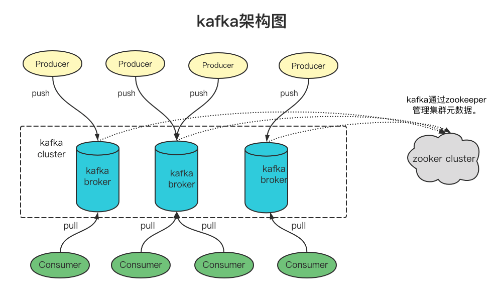
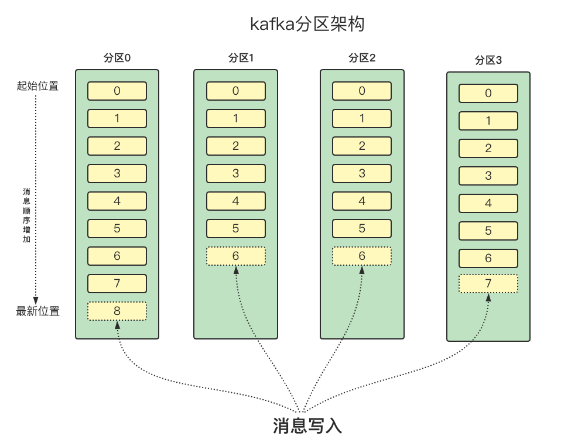
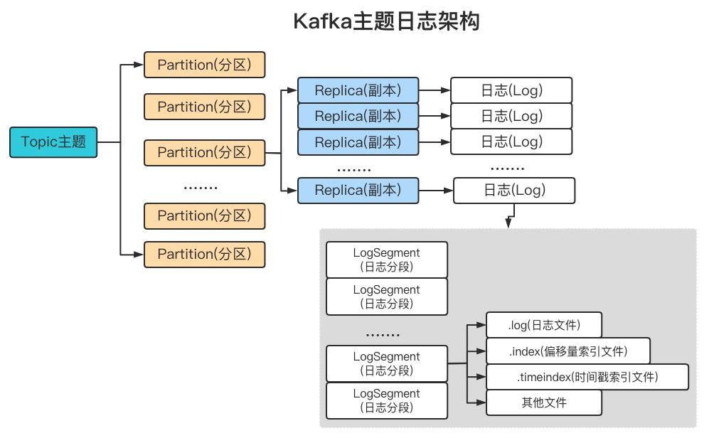
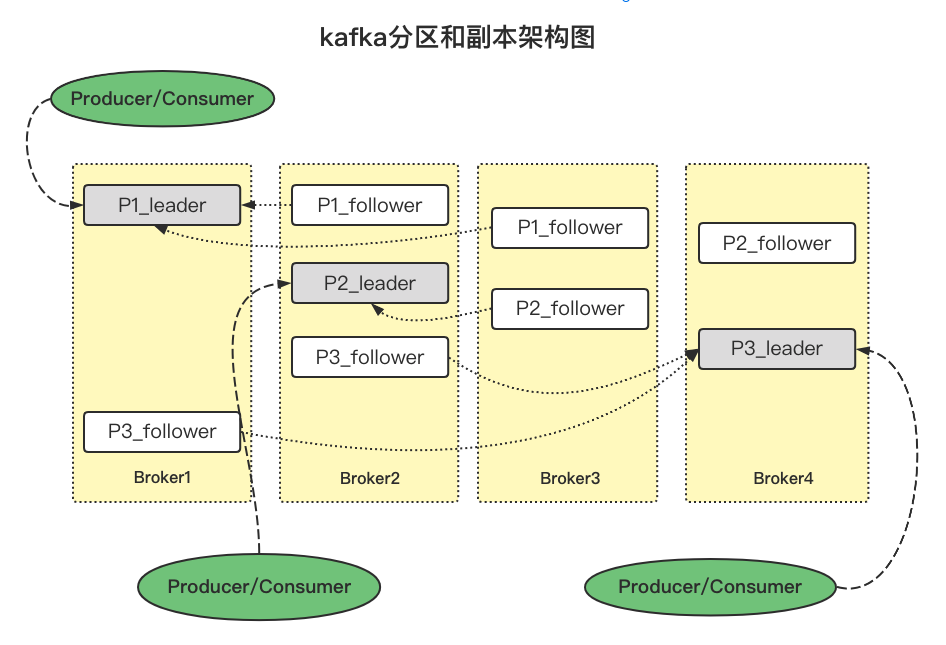
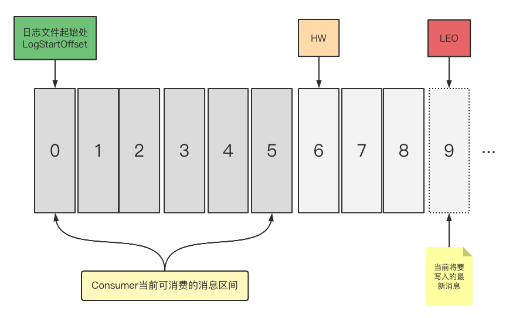

## kafka入门须知

1. ### kafka概述

   kafka是一款开源的消息引擎系统。常见的两种消息传输模型如下：

   - **点对点模型**
   - **发布/订阅模型**

   kafka同时支持这两种模型，是如何做到的？（通过消费者组实现）

   消息引擎系统在什么场景下使用？—`削峰填谷`。所谓的`削峰填谷`就是指缓冲上下游瞬发的流量，使其更加平滑。对于发送能力很强的上游系统，如果没有消息引擎的保护，下游系统可能会直接被压垮导致全链路服务雪崩，消息引擎可一直在很大程度上避免流量的震荡。消息引擎系统的另一大好处是发送方和接收方的松耦合，减少系统间不必要的交互（生产者、消费者模式）。

   1. #### kafka的体系架构

      一个典型的kafka体系架构包含若干Producer、若干Broker、若干Consumer，以及一个zookeeper集群。其中zookeeper负责集群元数据的管理、控制器选举等操作。Producer将消息发送到Broker，Broker负责将收到的消息存储到磁盘中，而Consumer负责从Broker订阅并消费消息。

      

      整个kafka体系结构中引入了3个术语：

      1. **Producer**：生产者，也就是发送消息的一方。生产者负责创建消息，然后将其投递到kafka中。
      2. **Consumer**：消费者，也就是接收消息的一方。消费者连接到kafka上并接收消息，从而进行相应的业务逻辑处理。
      3. **Broker**：服务节点代理。对于Kafka而言，Broker可以简单的看做一个独立的Kafka服务节点或Kafka实例。大多数情况下也可以将Broker看做一个Kafka服务器，前提是这台服务器上只部署了一个Kafka实例。一个或多个Broker组成一个Kafka集群。一般而言，习惯使用首字母小写的broker来表示服务代理节点。

      在kafka中，还有两个很重要的概念——主题(Topic)与分区（Partition）。kafka中的消息以主题为单位进行归类，生产者负责将消息发送到特定的主题（发送到kafka机全红的每一条消息都要指定一个主题），而消费者负责订阅主题并进行消费。

      主题是一个逻辑上的概念，还可以细分为多个分区，一个分区只属于单个主题，很多时候也会把分区成为主题分区（Topic-Partition）。同一个主题下的不同分区包含的消息是不同的，分区在存储层面上可以看做一个可追加的日志(Log)文件，消息在被追加到分区日志文件的时候都会分配一个特定的偏移量（offset）。

      offset是消息在分区中的唯一标识，是一个单调递增且不变的值。Kafka通过它来保证消息在分区内的顺序性，不过offset并不跨越分区，也就是说，Kafka保证的是分区有序而不是主题有序。

      

      如图所示kafka某主题中，分为4个分区，消息被顺序追加到每个分区日志文件的尾部。Kafka中的分区可以分布在不同的服务器(Broker)中，也就是说，一个主题可以横跨多个Broker，以此来提供比单个Broker更强大的性能。

      每一条消息在被发送到Broker之前，会根据分区规则选择存储到哪个具体的分区，如果分区规则设定的合理，所有的消息都可以均匀地分配到不同的分区中；如果一个主题只对应一个文件，那么这个文件所在的机器I/O将会成为这个主题的性能瓶颈，而分区解决了这个问题。在创建主题的时候可以通过指定的参数来设置分区的个数，也可以在主题创建完成之后去修改分区的数量，通过增加分区的数量可以实现水平扩展。

      不考虑多副本的情况，一个分区对应一个日志（Log）。为了防止Log过大，Kafka又引入了日志分段（LogSegment）的概念，将Log切分为多个LogSegment，相当于一个巨型文件被平均分配为多个相对较小的文件，这样也便于消息的维护和清理。事实上，Log和LogSegment也不是纯粹物理意义上的概念。Log在物理上只以文件夹的形式存储，而每个LogSegment对应于磁盘上的一个日志文件和两个索引文件，以及可能的其他文件（比如以".txnindex"为后缀的事务索引文件）。如下图描绘了主题、分区、副本、Log以及LogSegment之间的关系。

      

   2. #### 多副本机制

      Kafka为分区引入了多副本(Replica)机制，通过增加副本数量可以提升容灾能力。备份的思想就是把相同的数据拷贝到多台机器上，而这些相同的数据拷贝在Kafka中被称为副本(Replica)。

      同一个分区的不同副本中保存的是相同的消息（在同一时刻，副本之间并非完全一样），副本之间是"一主多从"的关系，其中Leader副本负责处理读写请求，follwoer副本只负责与Leader副本的消息同步。副本处于不同的broker中，当leader副本出现故障时，从follower副本中重新选举新的leader副本对外提供服务。Kafka通过多副本机制实现了故障的自动转移，当Kafka集群中的某个broker失效时仍能保证服务可用。

      我们知道一些其他的系统中的follower副本可以对外提供服务，比如mysql中的从库可以对外提供读操作，但是Kafka中的follower副本不像mysql的副本可以单独对外提供服务。

      ##### 为什么Kafka不像MySQL和Redis那样对外提供服务？

      - 首先，Redis和MySQL都支持主从读写分离，这与他们的使用场景有关。对于那种读操作很多而写操作相对不频繁的负载类型而言，采用读写分离是非常不错的方案——可以添加很多的follower横向扩展，提升读操作性能。反观Kafka，它的主要使用场景是消息引擎而不是以数据存储的方式对外提供服务，通常涉及频繁的生产消息和消费消息，这不属于典型的读多写少场景，因此读写分离方案不适合当前场景。
      - 第二，Kafka副本使用的是异步拉取，因此存在leader和follower之间的不一致性。如果要采用读写分离，则要处理副本lag引入的一致性问题。
      - 第三，主写从读模式是为了减轻leader节点的压力，将读请求的负载均衡到follower节点，如果kafka的分区相对均匀地分散到各个broker上，同样可以起到负载均衡的效果，没必要刻意实现主写从读增加代码实现的复杂程度。

      **如下是kafka分区和副本的架构图**：

      

      如上图所示，Kafka集群中有4个Broker，某个主题中有3个分区，且副本因子（即副本个数）也为3，如此每个分区便有1个leader副本和2个follower副本。生产者和消费者只与leader副本进行交互，而follower副本只负责消息的同步，很多时候follwoer副本中的消息相对leader副本而言会有一定的滞后。

      Kafka消费端也具备一定的容灾能力。Consumer使用(pull)模式从服务器端拉取数据，并且保存消费的具体位置，当消费者宕机后恢复上线时可以根据之前保存的消费位置重新拉取需要的消息进行消费，这样就不会造成消息丢失。

      分区中所有的副本统称为AR(Assigned Replicas)。所有与leader副本保持一定程度同步的副本（包括leader副本在内）组成ISR(In-Sync Replicas)，ISR集合是AR几何中的一个子集。消息会先发送到leader副本，然后follower副本才能从leader副本中拉取消息进行同步，同步期间follower副本相对于leader副本而言会有一定程度的滞后。

      “一定程度的同步”是指可忍受的滞后范围，这个参数可以配置，与leader副本同步滞后过多的副本（不包括leader副本）组成OSR（Out-of-Sync Replicas），由此可见，AR=ISR+OSR。在正常情况下，所有的follower副本都应该与leader副本保持一定程度的同步，即AR=ISR，OSR集合为空。

      leader副本负责维护和跟中ISR几何中所有follower副本的滞后状态，当follower副本“追上”leader副本时，leader副本就会将OSR集合转移至ISR集合。默认情况下，当leader副本发生故障时，只有在ISR集合中的副本才有资格被选举为新的leader，而在OSR几何中的副本则没有任何机会（也可以通过修改参数配置来改变）。

      ISR与KW和LEO也有紧密的关系。HW是High Watermark的缩写，俗称高水位，他标识了一个特定的消息偏移量（offset），消费者只能拉取到这个offset之前的消息。

      

      如上图所示，代表一个日志文件，这个日志文件中有9条消息，第一条消息的offset（LogStartOffset）为0，最后一条的offset为8，offset为9 的消息代表下一条将要写入的消息。日志文件的HW为6，表示消费者只能拉取到offset在0-5之间的消息，而offset为6的消息对消费者而言是不可见的。

      LEO是Log End Offset的缩写，它标识当前日志文件中下一条待写入消息的offset，上图中offset为9的位置即为当前日志文件的LEO，LEO的大小相当于当前日志分区中最后一条消息的offset值加1。分区ISR几何中的每个副本都会维护自身的LEO，而ISR集合中最小的LEO即为分区的HW，对消费者而言只能消费HW之前的消息。

   3. #### 分区机制

      虽然有了副本机制可以保证数据的高可用，但没有解决伸缩性（Scalability）问题。什么是伸缩性呢？拿副本来说，虽然现在有了领导者副本和追随者副本，但倘若领导者副本积累了太多的数据，以至于单台Broker机器无法容纳，此时应该怎么办呢？一个很自然的想法就是能否把数据分割成多分保存在不同的Broker中？这种机制就是所谓的分区。

2. ### kafka的生产者

   1. ##### 为什么要分区

   2. ##### 分区策略

      1. **轮询策略**
      2. **随机策略**
      3. **按消息键保存策略**

3. ### kafka的消费者

   1. 消费模型
   2. 消费者组
   3. 重平衡
      1. 消费者组重平衡流程
   4. 位移主题
      1. 位移提交

4. ### kafka的客户端

   1. kafka副本机制
   2. 副本角色